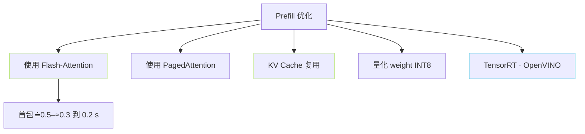
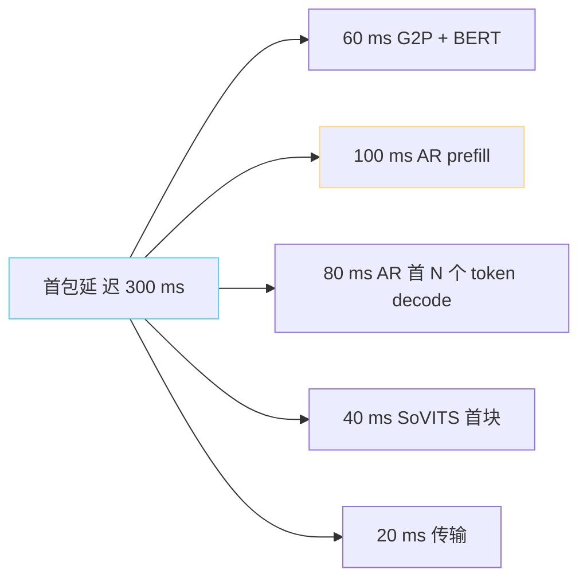

> [📎] 前置知识：Prefill vs Decode (LLM)、KV Cache 显存公式、 Flash-Attention、首包延迟、 batch=1 推理。

> **定位**：AR 推理两 阶 段：prefill · decode。prefill 是 首包延 迟 主 源。 本节拆 prefill 计算 显存预算 · 与 decode 区别 · 优化手段。

## 1. Prefill 与 Decode 区别


|项|Prefill|Decode|
|---|---|---|
|输入|T_prompt 个 token|1 个 token|
|FLOPs/step|× T_prompt|baseline|
|计算量|**主导**|少|
|运行次数|1|500–1500|
|是否使用 Flash-Attn|**是**|可|
|首包延迟贡献|**60–80%**|20–40%|

## 2. Prefill 显存公式

$$M_{KV} = 2 \cdot L \cdot H \cdot d_h \cdot T_{\text{prompt}} \cdot b \cdot s$$

其中：

- 2 表示 K + V。

- L 表示 Transformer 层数。

- H 表示 注意力头数。

- d_h 表示 每头维度。

- T_prompt 表示 prompt 长度。

- b 表示 batch size。

- s 表示 每元素字节数 (bf16=2, fp16=2, fp32=4)。

### v3/v4 例子

|参数|值|
|---|---|
|L|24|
|H|16|
|d_h|48 (768/16)|
|T_prompt|256|
|b|1|
|s|2 (bf16)|

$$M_{KV} = 2 \cdot 24 \cdot 16 \cdot 48 \cdot 256 \cdot 1 \cdot 2 = 18{,}874{,}368 \text{ bytes} \approx 18 \text{ MB}$$

## 3. Decode 中 KV Cache 增长

每生成 1 个 token KV Cache 增加：

$$\Delta M = 2 \cdot L \cdot H \cdot d_h \cdot 1 \cdot b \cdot s$$

v3/v4 例子：$2 cdot 24 cdot 16 cdot 48 cdot 2 = 73{,}728 text{ bytes} approx 72 text{ KB}$ / token。

生成 1500 token 增 $1500 cdot 72 text{ KB} approx 108 text{ MB}$。

## 4. 总显存预算

|阶段|显存|
|---|---|
|v3/v4 权重 (fp16)|≈ 1.2 GB|
|Prefill KV (T=256)|18 MB|
|Decode KV 增 (T=1500)|108 MB|
|activation|≈ 200 MB|
|**总**|**≈ 1.5 GB / 序列**|

多并 发 batch=8：$1.5 cdot 8 = 12 text{ GB}$。 表明 v3/v4 AR 推 理 可 以 在 24 GB 卡 跳 8 并。

## 5. Prefill 计算量估计

Prefill 计算量 $approx O(L cdot T_{text{prompt}}^2 cdot d)$。

例：T=256、L=24、d=768 → $\approx 24 \cdot 256^2 \cdot 768 \approx 1.2 \cdot 10^9$ FLOPs 。

4090 (165 TFLOPS bf16) 上需 $\approx 7 \text{ }\mu\text{s}$ 计算 (仅 attention、不含 FFN)。 加 FFN 与 launching overhead 总 为 $approx 30text{-}80 text{ ms}$。

## 6. 优化手段



### KV Cache 复用

同一 ref + 同一 prompt 多次推 理时、 prompt 部分的 KV 可 以 cache 。社区 hack：

```python
# 预计算 prompt KV
prompt_kv = model.prefill(prompt_tokens)
# 后 次 推 理复用
for target_text in batch_texts:
    result = model.decode_from_kv(prompt_kv, target_text)
```

## 7. 首包延迟分解



## 8. 工程判断

> [🔧] **Prefill 是首包上限**：Prefill 100 ms 以上 难 压到首包 < 200 ms。 费 动 丝 必 跳 Flash-Attention · TensorRT。 社区 推 荐 部 署 优 化 顺序：① Flash-Attn ② KV cache reuse ③ INT8 quant ④ TRT。

## 参考文献

1. Dao, T. (2023). _FlashAttention-2_. arXiv:2307.08691.

1. Kwon, W. et al. (2023). _Efficient Memory Management for LLM Serving with PagedAttention_. SOSP.

1. NVIDIA TensorRT-LLM docs.

1. GPT-SoVITS: `AR/modules/transformer.py::patched_mha_with_cache`.