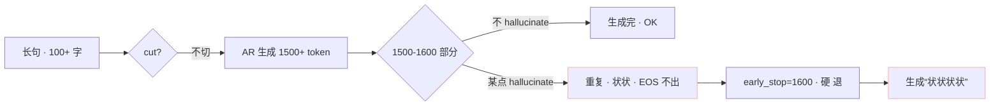
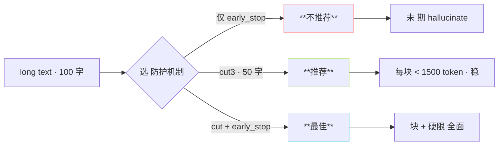

> [📎] 前置知识：EOS token、hallucination loop、early_stop 机制、semantic 帧率 25 Hz。

> **定位**：AR 生成透过两个机制 退出：EOS 预测 与 early_stop_num 硬上限。本节拆 两者 机 制、超长贯穿问题、 调参 。

## 1. EOS token 机制

```python
# AR/models/t2s_model.py 中伪代码
EOS = 1024    # vocab[1024]
for step in range(early_stop_num):
    logits = model(input_tokens, kv_cache)
    next_token = sample(logits[-1])
    if next_token == EOS:
        break
    input_tokens = torch.cat([input_tokens, next_token])
```

EOS 是 vocab 的末位 (1024 代 codebook + 1 EOS = 1025)。 AR 预测出 EOS 时即 为 「 句 末 」 、 退 出 。

## 2. EOS 表现与问题

|场景|EOS 预测|生成表现|
|---|---|---|
|正常|准 · 句末预测高概率 EOS|丝接句末退出|
|过拟合|**EOS 偏早**|句 末 被 截 · 句 间 不 连 贯|
|欠拟合|**EOS 偏晚**|生 成 越 长 · 后 期 hallucination|
|东词重复|EOS 未出|**状状 / 重复 同一 token**|

## 3. early_stop_num 硬上限

```python
for step in range(early_stop_num):    # early_stop_num=1600
    ...
    if next_token == EOS:
        break
```

默认 1600：

- 25 Hz semantic · 1600 token = **64 秒** 音频

- v3/v4 ctx=2048，1600 留 prompt · text 448 token

- v1/v2 ctx=1024，1600 **越** ctx·不推荐 v1/v2 高于 800

|early_stop_num|代价|
|---|---|
|500|句 超 20 s 会被截|
|1000|越 · 40 s 会被截|
|**1600 (default)**|**· 64 s**|
|2000+|越 ctx 报错 · OOM|

## 4. 超长贯穿问题



> [⚠️] **early_stop 不能救 hallucination**：early_stop 仅为 「硬退出」 · 不处 理 重 复 问 题。 需 用 cut 预 防 、 使 每 块 < 50 字。

## 5. early_stop 与 cut 的关系



## 6. 与采样超参的交互

|参数|对 EOS 影响|
|---|---|
|repetition_penalty=1.35|**防重复 · 促 EOS 出**|
|top_p=0.8|· 不明显影响|
|top_k=15|· 不明显影响|
|temperature=0.7|**高温 · EOS 偏晚 (该词温高)**|

> [💡] **rep_penalty 是 EOS 问题的首要调参点**：重复 状 状 问 题 可 以 调 rep_penalty 从 1.35 · 调 到 1.5 · 能 促 EOS 提 前 出。

## 7. EOS 预测诊断

```python
# 调试输出 EOS 概率
logits = model(input_tokens, kv_cache)
probs = F.softmax(logits[-1], dim=-1)
eos_prob = probs[EOS].item()
print(f'step {step}: EOS prob {eos_prob:.3f}')
```

社区 记录：EOS prob 随 token 序号增加· 句末预测是「骤始」出。运作 不 佳 主 要 不 是 「 EOS 调 低 」 · 是 「 不 走 到 EOS 」。

## 8. 工程判断

> [🔧] **不要动 early_stop_num**：1600 是 社 区 调 过的点。 需 饱 生成 64 s 越长 音 频 · 同 时 不 越 ctx。 推理 越 长 出 错 请 优 先 跳 cut · 不 是 调 early_stop。

## 参考文献

1. Brown, T. et al. (2020). _GPT-3_. NeurIPS. (EOS 体制)

1. GPT-SoVITS: `AR/models/t2s_model.py::infer_panel`.

1. 社区 issue tracker: 「状状 · 重复」讨论.