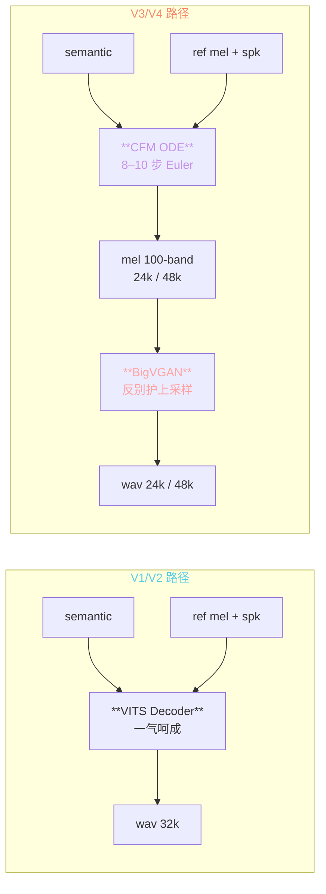
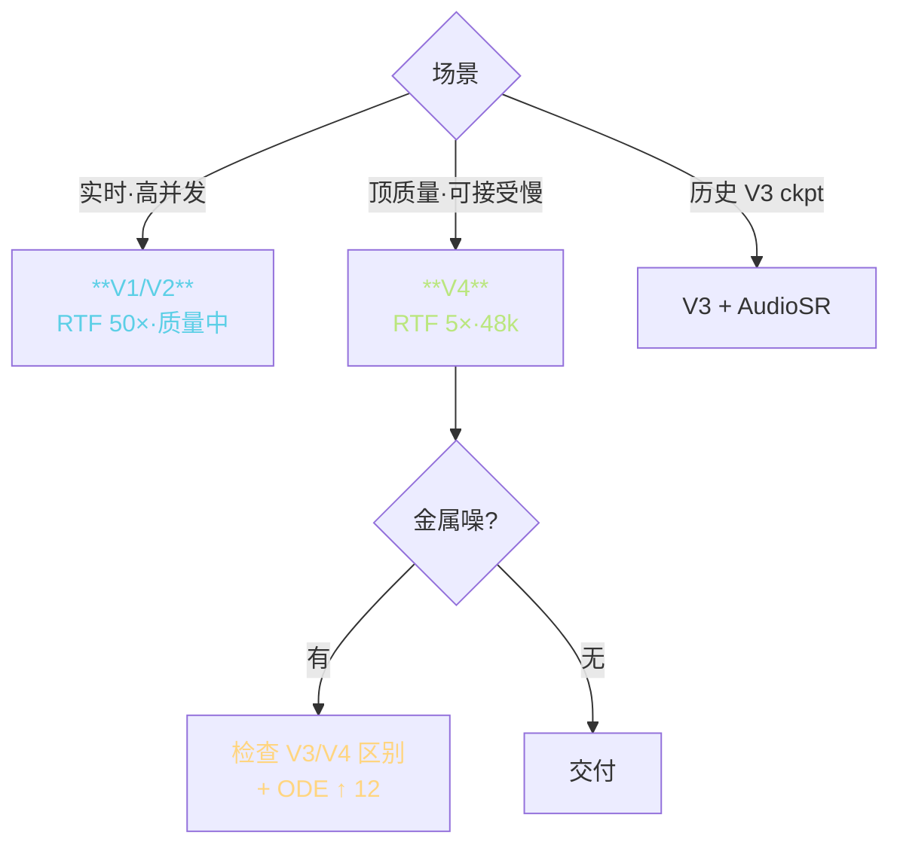

> 📎 **前置**：[[6.1 V1 - V2 SoVITS（VITS-based）|6.1 V1 - V2 SoVITS（VITS-based）]]；[[6.2 V3 - V4 SoVITS（CFM + BigVGAN）|6.2 V3 - V4 SoVITS（CFM + BigVGAN）]]；Classifier-Free Guidance；Euler / Midpoint ODE Solver；Consistency Model。

## 0. 定位

> 「semantic + ref → wav。」两条推理路径：V1/V2 一气呵成，V3/V4 经 CFM → mel → BigVGAN 三段。本节拆解两者的数据流、质量 / 速度取舍、CFG 作用、ODE 步数调优。

## 1. 两路径架构对比



## 2. V1/V2 直出路径

|项|值|说明|
|---|---|---|
|架构|VITS Decoder|posterior → flow → HiFi-GAN 一气呵成|
|推理步数|1 步|无 ODE / 扩散|
|采样率|32k|默认|
|质量 MOS|4.0|中高|
|RTF (A100)|**~50×**|极快|
|noise_scale|0.667|0 = 确定输出·1 = 高多样|

```python
# 推理调用简化
z, _, _ = posterior_encoder(ref_mel, ref_spk)
z = flow(z, reverse=True)
wav = decoder(z, spk_emb)  # 1 步出 wav
```

## 3. V3/V4 CFM + BigVGAN 路径

### CFM ODE 求解

Euler 法：

$$x_{t + \Delta t} = x_t + \Delta t \cdot v_\theta(x_t, t, c)$$

Midpoint / RK4 法更精准但每步多 1–2 次 forward。GPT-SoVITS 默认用 Euler。

|质量 / 步数|4 步|**8 步 (V3)**|**10 步 (V4)**|16 步|32 步|
|---|---|---|---|---|---|
|mel MSE|0.024|0.014|**0.011**|0.010|0.009|
|听感 MOS|3.6|4.2|**4.4**|4.5|4.5|
|RTF (A100)|~12×|~8×|**~5×**|~3×|~1.5×|

> [💡] **8–10 步是质量 / 速度拐点**：更多步边际收益递减（16 步 → 32 步 听感几乎听不出提升）。< 4 步 出现明显金属噪。

### Classifier-Free Guidance

$$\tilde{v}_\theta(x_t, t, c) = v_\theta(x_t, t, \emptyset) + w \cdot (v_\theta(x_t, t, c) - v_\theta(x_t, t, \emptyset))$$

|cfg=w|听感|适用|
|---|---|---|
|1.0|柔·偏模型先验|对话闲聊|
|1.5|软|情感对话|
|**2.0 默认**|**均衡**|**有声书**|
|2.5|偏准·偏 ref|新闻播报|
|3.0|语义准·音色明显 ref|严格克隆|
|> 4.0|**过饱·怎音**|不推荐|

> [🤔] **为什么 CFG 在 CFM 中也有效**：虽然 CFM 不是 score-based，但「条件梯度」的方向性放大在向量场上同样有效——把 unconditional baseline 减去后增强 conditional 信号。但过高 cfg 会放大 ref 中「非典型」频谱、出「怎音」。

### BigVGAN-v2

- mel → wav 上采样网络，含 anti-aliased upsampling（查表滤波抗镜像频率）

- V3：256× 上采样·100band·24k

- V4：512× 上采样·100band·**48k**·anti-aliased·修复金属噪

## 4. 两路径完整对比

|维度|V1/V2|V3|**V4**|
|---|---|---|---|
|架构|VITS|CFM + BigVGAN-24k|**CFM + BigVGAN-48k**|
|推理步数|1|8|**10**|
|采样率|32k|24k|**48k**|
|金属噪|无|**有**|**修复**|
|RTF (A100)|50×|~8×|**~5×**|
|显存（batch=1）|~4 GB|~8 GB|**~12 GB**|
|MOS|4.0|4.2|**4.4**|
|4090 单卡 batch 上限|16|8|**4**|

## 5. 推理调优路径



## 6. 常见问题

> [⚠️] **V3 24k 金属噪**：BigVGAN-v2 在 24kHz / 100band 上采样网络在 8–12kHz 高频段有谱失真。调 ODE 步数到 12–1614 只能缓解，根治需升 V4。

> [⚠️] **V4 48k batch 上限 4 @ 4090**：mmel 体积 2× + BigVGAN-48k 计算 4×，显存压力高。需 batch 多者选 V2/V2Pro。

> [💡] **CFM ODE 蹯馏是未来优化方向**：Consistency Model 可把 10 步蹯锅 1–2 步 student，推理加速 5×。社区 `cfm-distill` 分支已有原型。参 [[13.5 与端到端 Flow - Diffusion TTS 的未来融合|13.5 与端到端 Flow - Diffusion TTS 的未来融合]]。

## 7. 工程判断

> 🔧 **V1/V2 推理快但质量中；V3/V4 CFM ODE 是瀑布颈**：高并发场景选 V1/V2/V2Pro，质量优先选 V4。

> ⚠️ **V4 BigVGAN-48k 显存双倍与 V3**：4090 单卡 batch 上限 4。需 batch 高选 V2Pro 剈1。

> 💡 **CFM 蒸馏成 1–2 步 student 是未来优化方向**（Consistency Model）。可让 V4 RTF 从 5× 提到 25×。

> 🤔 **CFG 在 CFM 中仍有效但机制差异**：CFM 不是 score-based，但条件梯度的方向性放大在向量场上同样能增强条件信号。超过 4.0 会出现「怎音」。

## 8. 子页面

[[8.4.1 V1 - V2 推理路径（直出波形）|8.4.1 V1 - V2 推理路径（直出波形）]]

[[8.4.2 V3 - V4 推理路径（CFM → Mel → BigVGAN）|8.4.2 V3 - V4 推理路径（CFM → Mel → BigVGAN）]]

## 参考文献

1. 仓库 `GPT_SoVITS/TTS_infer_pack/`

1. Lipman, Y. et al. (2023). _Flow Matching for Generative Modeling_. ICLR.

1. Lee, S. et al. _BigVGAN-v2_. [https://github.com/NVIDIA/BigVGAN](https://github.com/NVIDIA/BigVGAN)

1. Song, Y. et al. (2023). _Consistency Models_. arXiv:2303.01469.

1. Ho, J. & Salimans, T. (2022). _Classifier-Free Diffusion Guidance_. NeurIPS Workshop.