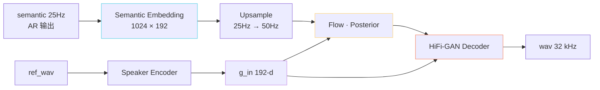
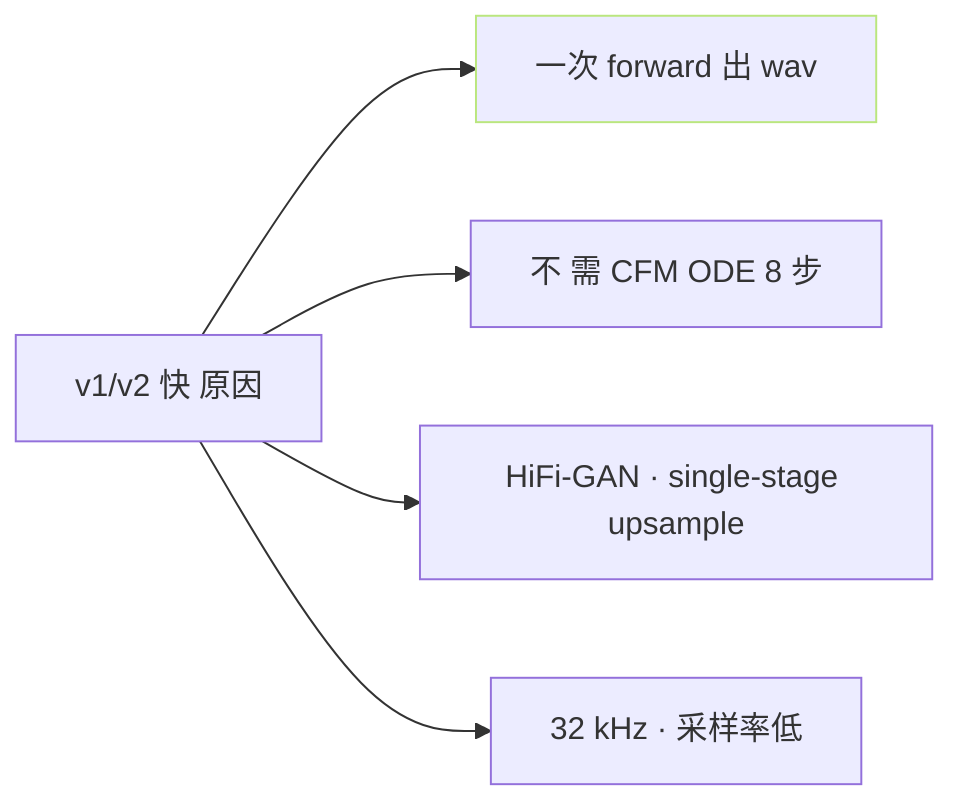

> [📎] 前置知识：VITS Decoder、semantic embedding、speaker embedding、HiFi-GAN 上采样、`noise_scale` 控多样性。

> **定位**：v1/v2 推理路径：semantic + ref_spk → VITS Decoder 一气呈成 32 kHz wav。本节拆 输入拼 接 · 各 模块·同步调参·与 v3/v4 区别。

## 1. 推理总图



## 2. 各模块输入输出

|模块|输入|输出|帧率|
|---|---|---|---|
|Semantic Embedding|semantic codes [T_s]|[T_s, 192]|25 Hz|
|Upsample|[T_s, 192]|[T_s×2, 192]|50 Hz|
|Speaker Encoder|ref mel [T_r, 80]|g_in [192]|全局|
|Flow|[T_s×2, 192] + g|z [T_s×2, 192]|50 Hz|
|HiFi-GAN|z + g|wav [T_s×2×320]|32 kHz|

T_s = AR 生成 semantic token 数。例 T_s=500 → wav 320000 采样 = 10 s @32 kHz。

## 3. 代码干干调用

```python
# GPT_SoVITS/TTS_infer_pack/TTS.py 伪代码
def infer_v1v2(semantic, ref_wav, ref_mel):
    g = self.spk_encoder(ref_mel)        # [B, 192]
    z_p, _, _ = self.posterior_encoder(...)
    z = self.flow(z_p, g, reverse=True)  # reverse for inference
    audio = self.decoder(z, g=g)         # HiFi-GAN
    return audio
```

## 4. noise_scale 调参

```python
noise_scale = 0.667    # 默认
```

|noise_scale|生成表现|
|---|---|
|0.0|完全确定· 单调|
|0.333|偏保守· 节奏均|
|**0.667 (default)**|**多样· 节奏自然**|
|1.0|崎 · 可能 hallucinate|
|> 1.0|坏 · 不推荐|

> [💡] **noise_scale = 0.667 是 VITS 论文默认**：VITS 论文取 0.667 是 sweet spot、GPT-SoVITS 不动。 需 「同一输入 多次不同输出」可以调高、 但 必 顾 上 限 · 越 1 会 hallucinate。

## 5. v1 vs v2 区别

|项|v1|v2|
|---|---|---|
|vocab size|1024|1024|
|BERT|chinese-roberta|chinese-roberta + en-roberta|
|多语种|中文 only|**中英日韩**|
|训练数据|2 kh|5 kh|
|SoVITS Decoder|VITS|VITS (架构同)|
|采样率|32 kHz|32 kHz|

> [💡] **v1 与 v2 架构相同·仅 BERT 与数据量改**：SoVITS Decoder 同一架构。 v2 是 v1 多语种扩展。

## 6. 实时倍率

|GPU|RTF (实时倍率)|首包延迟|
|---|---|---|
|RTX 4090|**~50×**|~150 ms|
|RTX 3090|~30×|~200 ms|
|V100|~20×|~250 ms|
|T4|~10×|~400 ms|
|CPU (i9-13900K)|~3×|~800 ms|

v1/v2 是 **高 速 实 时 场 景 首 选**。

## 7. 为何 v1/v2 快



v3/v4 需 CFM ODE ·8–10 步·每步都是一次 attention forward、是 v1/v2 的 8–10×计算量。

## 8. 常见问题

|现象|原因|修复|
|---|---|---|
|生成裂裂|noise_scale 越 1.0|调回 0.667|
|金属音|HiFi-GAN 过不足|v1/v2 本身的上限|
|高频丢失|32 kHz 上限 = 16 kHz Nyquist|需 v3/v4|
|音色未着|ref 质量问题|质检 ref|

## 9. 工程判断

> [🔧] **v1/v2 是 高 速 实 时 首 选**：实时交互·语音助手·直播、 需 首包 < 300 ms · RTF > 10× · 需 32 kHz 即可、 选 v1/v2。高质量场景 (有声书·动画) 需 v3/v4。

## 参考文献

1. Kim, J. et al. (2021). _VITS_. ICML.

1. Kong, J. et al. (2020). _HiFi-GAN_. NeurIPS.

1. GPT-SoVITS: `GPT_SoVITS/TTS_infer_pack/TTS.py::infer`.

1. GPT-SoVITS: `module/models.py::SynthesizerTrn`.