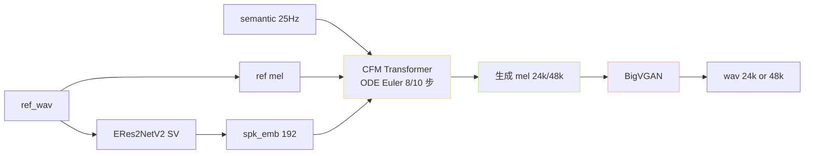
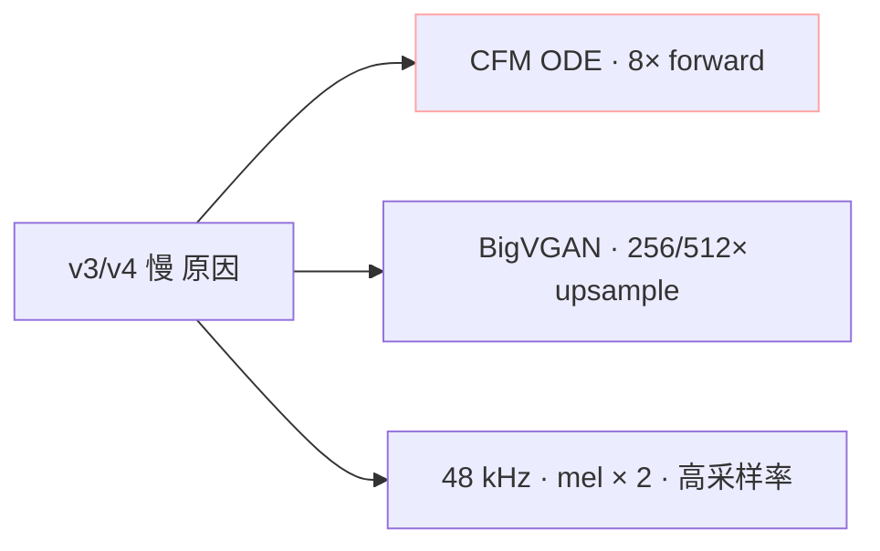
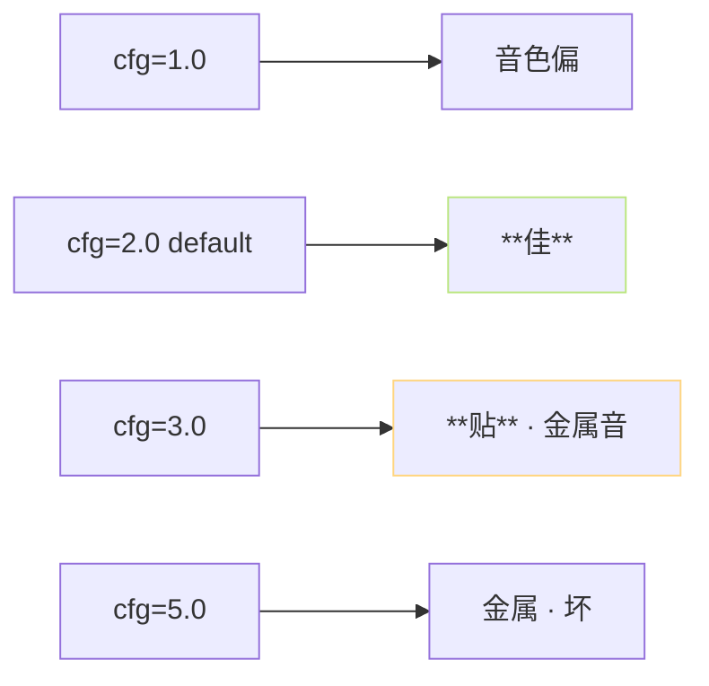
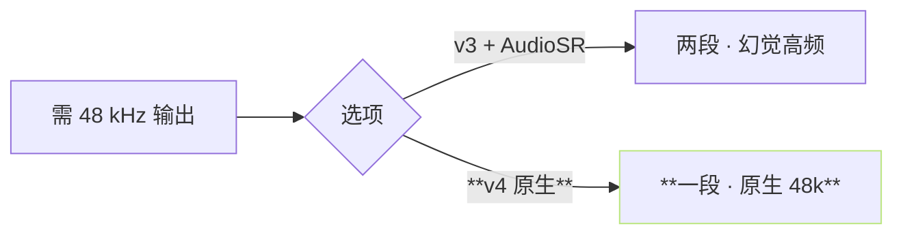

> [📎] 前置知识：CFM (Conditional Flow Matching)、ODE Euler 步 · cfg=2.0、Mel-Spectrogram (24k/48k)、BigVGAN 上采样。

> **定位**：v3/v4 推理路径：semantic → CFM · ODE 8/10 步 → mel → BigVGAN → wav 24k/48k。本节拆三段·与 v1/v2 对比·调参。

## 1. 推理总图



## 2. CFM ODE 推理公式

$$x_{t+\Delta t} = x_t + \Delta t \cdot v_\theta(x_t, t, c)$$

其中：

- 初始 $x_0 sim mathcal{N}(0, I)$。

- $c$ 表示 条件 = semantic + ref mel + spk_emb。

- $Delta t = 1/N$，$N$ = ODE 步数。

- v3：N = 8；v4：N = 10。

### Classifier-Free Guidance (cfg=2.0)

$$\tilde{v}_\theta = v_\theta(\emptyset) + w \cdot \big(v_\theta(c) - v_\theta(\emptyset)\big)$$

- $w = 2.0$：默认

- $w = 1.0$：不 guidance · 音色偏离

- $w = 3.0$：强 guidance · 音色贴但可能金属音

## 3. 三段详细

### 第一段：CFM (semantic + ref → mel)

```python
x = torch.randn_like(target_mel_shape)    # 初始 高斯
for i in range(N):    # N=8 (v3) or 10 (v4)
    t = i / N
    v = cfm_model(x, t, semantic, ref_mel, spk_emb)
    v_uncond = cfm_model(x, t, semantic, None, None)
    v_guided = v_uncond + 2.0 * (v - v_uncond)
    x = x + (1.0 / N) * v_guided
mel = x
```

### 第二段：mel 中转接

|版本|mel 采样率|n_mels|hop|
|---|---|---|---|
|v3|24 kHz|100|256|
|v4|48 kHz|100|512|

### 第三段：BigVGAN (mel → wav)

```python
wav = bigvgan(mel)    # one-shot upsample
```

- v3 BigVGAN: 256× upsample (24k mel → 24k wav)

- v4 BigVGAN: 512× upsample (48k mel → 48k wav)

## 4. v3 vs v4 区别

|项|v3|v4|
|---|---|---|
|CFM Transformer 层|12|12|
|ODE 步数|**8**|**10**|
|mel 采样率|24 kHz|**48 kHz**|
|BigVGAN upsample|256×|**512×**|
|RTF · 4090|~10×|~5×|
|首包延迟|~300 ms|~500 ms|
|金属音 · 高频|轻微|**无**|

## 5. 调参推荐

```python
# v3 默认
steps = 8
cfg = 2.0
noise_scale = 1.0    # CFM 初始高斯
# v4 默认
steps = 10
cfg = 2.0
```

|steps|质量|速度|
|---|---|---|
|4|坏 · 口型宗状|快 2×|
|**8 (v3)**|**佳**|baseline|
|**10 (v4)**|**佳**|baseline|
|16|轻微提 · 不明显|慢 2×|
|32|不提升|慢 4×|

> [💡] **steps 是 质量 与 速度 的 trade-off**：8 是 社 区 调 过 的 sweet spot。 需 更 快 可 跳 4 步 · 但 质量 会 坏。 需 更佳 不 推荐 跳 16、提 升 不 明 显。

## 6. 为什么 v3/v4 慢



CFM ODE 8 步 · 每 步 1 次 Transformer forward = 8× attention。 BigVGAN 仅 1 次、但 48k 采样率是 32k 的 1.5×。

## 7. cfg=2.0 与音色贴合度



> [⚠️] **cfg > 3.0 会金属音**：CFG 越强 · CFM 越 紧 贴 条 件 · 生成会 走 到 分 布 边 缘 出 现 金 属 音。 推荐 cfg 不超 3.0。

## 8. 常见问题

|现象|原因|修复|
|---|---|---|
|金属音|cfg 过高|调回 2.0|
|音色偏|cfg 过低|调高到 2.0|
|毛刺|steps 过少|调到 8/10|
|OOM|v4 · batch 过多|batch=1|

## 9. v3 + AudioSR vs v4 原生



v4 原生 48k 优于 v3 + AudioSR。参见 [[8.6 音频超分（Audio Super Resolution，可选）|8.6 音频超分（Audio Super Resolution，可选）]]。

## 10. 工程判断

> [🔧] **v3 轻量 高质 选 v4 原生 48k**：v3 是「快质量」· v4 是「高质量」。社区 默认 推 v4 为高质首选、 v3 仅 在 需 24 kHz 且 资 源 受 限 时 选。

## 参考文献

1. Lipman, Y. et al. (2023). _Flow Matching for Generative Modeling_. ICLR.

1. Le, M. et al. (2024). _Voicebox_. NeurIPS.

1. Lee, S. et al. (2023). _BigVGAN_. ICLR.

1. GPT-SoVITS: `GPT_SoVITS/module/models_v3.py::CFM`.