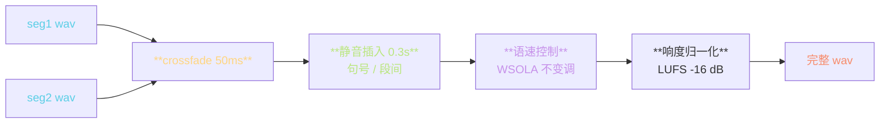
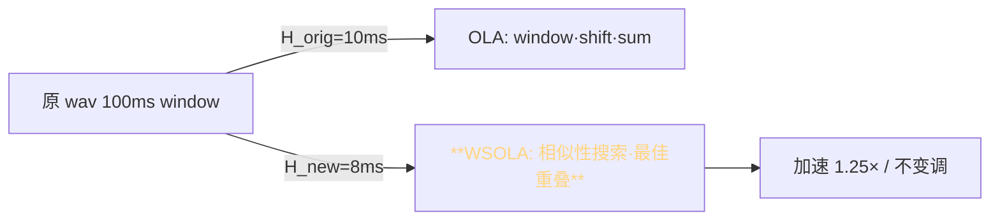

> 📎 **前置**：crossfade（交叉淡化）；WSOLA（Waveform Similarity OverLap-Add）；Phase Vocoder；resample。

## 0. 定位

> 「分段 wav → 完整自然的长音频。」长文本经过 [[8.1 参考音频处理（zero-shot - few-shot）|8.1 参考音频处理（zero-shot - few-shot）]] 拆成 N 段，AR + Decoder 各段独立生成，最后由本节的三个后处理拼成完整音频。看似简单，但「断裂感」「机器人感」「节奏崩」都源于这一步。

## 1. 整体后处理链



## 2. Crossfade 拼接

等功率 crossfade（equal-power）公式：

$$y[n] = \cos\!\left(\frac{\pi n}{2N}\right) \cdot x_1[n] + \sin\!\left(\frac{\pi n}{2N}\right) \cdot x_2[n]$$

其中 $N$ 是 crossfade 长度（采样点）。等功率保证总能量恒定，听感无「下沉」。

|crossfade 长度|听感|适用|
|---|---|---|
|< 20 ms|**断裂**（咔哒声）|不推荐|
|20–30 ms|轻微衔接|急促对话|
|**50 ms**|**自然平滑**|**默认**|
|100–200 ms|偏柔|有声书|
|> 300 ms|**节奏拖**|不推荐|

> [💡] **为何 50 ms 是默认**：人耳对 < 20 ms 的衔接感知为「咔哒」断裂；> 50 ms 后听感差异不明显。50 ms 在自然度与节奏间取最优。

## 3. 静音插入策略

```mermaid
flowchart LR
  CHK{标点类型}
  CHK -->|逗号 ，| S1[50–100 ms]
  CHK -->|句号 。!?| S2[**200–400 ms**]
  CHK -->|段落换行| S3[500–800 ms]
  CHK -->|引号 " " 内对话切换| S4[300–500 ms]

  style S2 fill:\#1d2433,stroke:\#BAE67E,color:#BAE67E
```

> [💡] **句末静音是「呼吸感」的关键**：真人说话句间有约 300 ms 自然停顿（呼吸 + 思考）。仓库默认 0.3 s 是恰好的中位值。

## 4. 语速控制：WSOLA 不变调变速



WSOLA 核心思想：在调整 hop 后，每个窗口在原始位置附近 ±Δ 搜索「与上一窗口最相似」的位置，避免相位失配。

$$y[n] = \sum_m w[n - mH'] \cdot x_{m^*}[n], \quad m^* = \arg\max_{k} \text{xcorr}(x_k, y_\text{tail})$$

|speed|听感|WSOLA 失真|
|---|---|---|
|0.7×|明显慢|极轻|
|0.85×|慢但自然|无|
|**1.0×**|**自然**|**无**|
|1.15×|快但自然|无|
|1.3×|明显快|**轻微金属感**|
|> 1.5×|**机器感**|明显失真|

> [⚠️] **语速 ≠ 缩放采样率**：缩放采样率会同时改变音调（chipmunk effect）。必须用 WSOLA / Phase Vocoder 时频分离的方式才能保持音调。

## 5. 响度归一化（可选）

LUFS（Loudness Units Full Scale）测量感知响度：

$$\text{LUFS} = -0.691 + 10 \log_{10}\!\left(\sum_i G_i \cdot \overline{x_i^2}\right)$$

- 流媒体平台标准：-16 LUFS（YouTube）/ -14 LUFS（Spotify）

- 仓库默认不做响度归一化（直接给原始响度）

- 拼接多段后建议统一过一遍 `pyloudnorm`

## 6. 工程判断

> 🔧 **crossfade 50ms + 静音 0.3s 是默认黄金值**：调之前先确认你的具体问题（断裂 / 拖沓 / 节奏），盲调容易适得其反。

> ⚠️ **段间不加 crossfade → 听感断裂**；加太长 → 节奏混乱。**永远不要把 crossfade 设为 0**——AR 段尾常有半个 phone 的尾音，直接拼接会出现「咔哒」。

> 💡 **语速控制有性能开销**：WSOLA 占 ~5% 推理时间，超长文本（> 5 min）累积可观。如果不调速，直接 `speed=1.0` 跳过 WSOLA 模块。

> 🤔 **未来：神经网络后处理**：传统 DSP 拼接在多说话人 / 多情感拼接时仍有不连续。神经 stitching 网络（如 Vocos 后接 smoothing） 是可能方向。

## 7. 子页面

[[8.5.1 Crossfade 拼接与静音插入|8.5.1 Crossfade 拼接与静音插入]]

[[8.5.2 语速控制实现（不改音调的变速）|8.5.2 语速控制实现（不改音调的变速）]]

## 参考文献

1. Verhelst, W. & Roelands, M. (1993). _An overlap-add technique based on waveform similarity (WSOLA)_. ICASSP.

1. 仓库 `inference_webui.py` 末尾后处理段

1. ITU-R BS.1770-4 (2015). _Loudness measurement_.

1. pyloudnorm: [https://github.com/csteinmetz1/pyloudnorm](https://github.com/csteinmetz1/pyloudnorm)