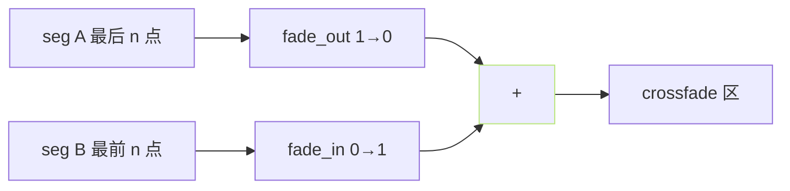
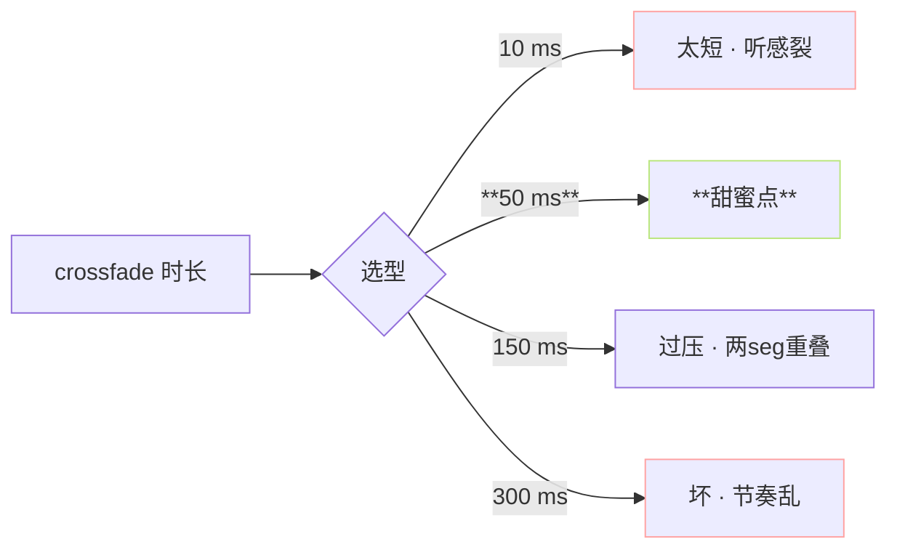
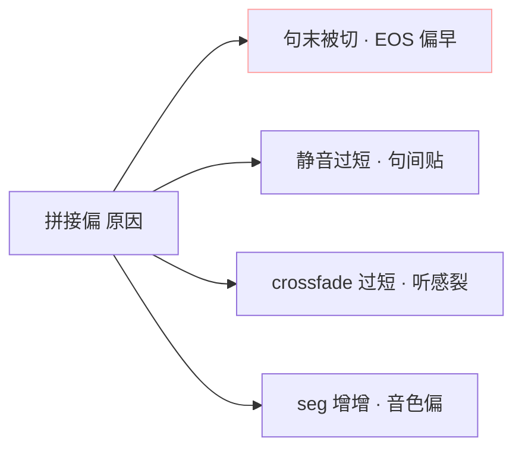

> [📎] 前置知识：Crossfade、cos/equal-power 深 · 静音插入、重叠相加 (overlap-add)、拼接偏。

> **定位**：L4 活动于「seg 拼接」后。本节拆 crossfade 函数 · 静音 插入 · 调参 · 常 见 问 题。

## 1. Crossfade 原理

```jsx
crossfade(a, b, n) =
  a[:n] * fade_out(n) + b[:n] * fade_in(n)
```



## 2. Equal-Power Crossfade

$$\text{fade\_out}(t) = \cos\left(\frac{\pi t}{2}\right), \quad \text{fade\_in}(t) = \sin\left(\frac{\pi t}{2}\right)$$

能量保持：$cos^2(theta) + sin^2(theta) = 1$、交点能量平稳、听感不断裂。

```python
def crossfade_equal_power(a, b, n):
    t = np.linspace(0, 1, n)
    fade_out = np.cos(np.pi * t / 2)
    fade_in  = np.sin(np.pi * t / 2)
    mixed = a[-n:] * fade_out + b[:n] * fade_in
    return np.concatenate([a[:-n], mixed, b[n:]])
```

## 3. 线性 Crossfade (不推荐)

$$\text{fade\_out}(t) = 1 - t, \quad \text{fade\_in}(t) = t$$

能量中点会「下凹」：$(1-t)^2 + t^2 = 1 - 2t + 2t^2$、在 $t=0.5$ 时 = 0.5、听感「凹」。

## 4. 调参推荐

|参数|默认值|调参范围|
|---|---|---|
|crossfade 时长|**50 ms**|20–150 ms|
|静音插入|**300 ms**|100–800 ms|
|淹出函数|equal-power|cos/sin|

```python
# inference_webui.py 伪代码
CROSSFADE_MS = 50
SILENCE_MS = 300

final = audio[0]
for seg in audio[1:]:
    silence = np.zeros(int(sr * SILENCE_MS / 1000))
    n = int(sr * CROSSFADE_MS / 1000)
    final = crossfade_equal_power(final, silence, n)
    final = crossfade_equal_power(final, seg, n)
```

## 5. 为何 crossfade 50 ms



## 6. 静音 300 ms 为何

社区听感 A/B 试验：

|静音|听感|
|---|---|
|0 ms|句间贴|
|100 ms|偏快|
|**300 ms (default)**|**自然**|
|500 ms|偏慢|
|1000 ms|间隔过|

## 7. 拼接偏问题



## 8. 常见问题

|现象|原因|修复|
|---|---|---|
|句间 听 裂|crossfade < 30 ms|调到2 50 ms|
|间隔 太大|静音 > 500 ms|调为 300 ms|
|重叠两 seg|crossfade 过长|调为 50 ms|
|首尾跨裂|未加 fade_in/out|加 fade 10 ms|

## 9. 工程判断

> [🔧] **默认 50 ms crossfade + 300 ms 静音**：社区调过的甜蜜点。调参 不 会 明显 提升 · 仅 在 场 景 需 更 快 节 奏 时 调 静 音 200 ms。

## 参考文献

1. GPT-SoVITS: `inference_webui.py::audio_postprocess`.

1. Equal-power crossfade theory. [https://www.dafx.de/paper-archive](https://www.dafx.de/paper-archive)