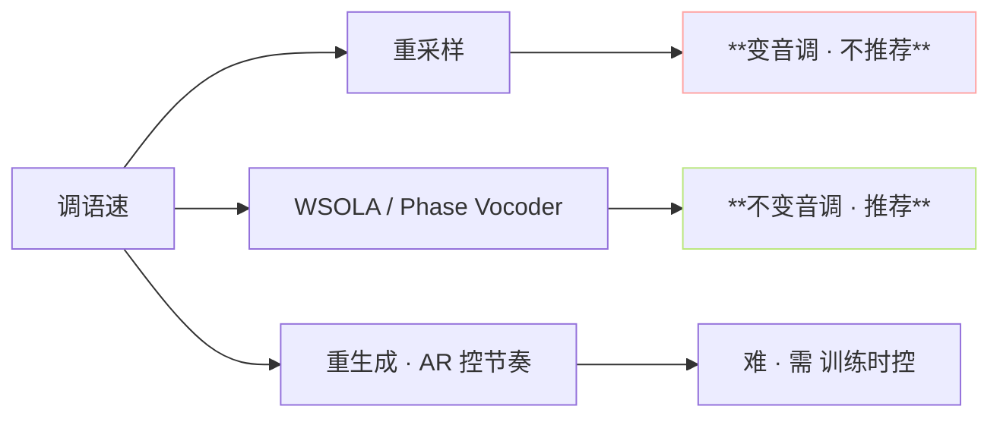
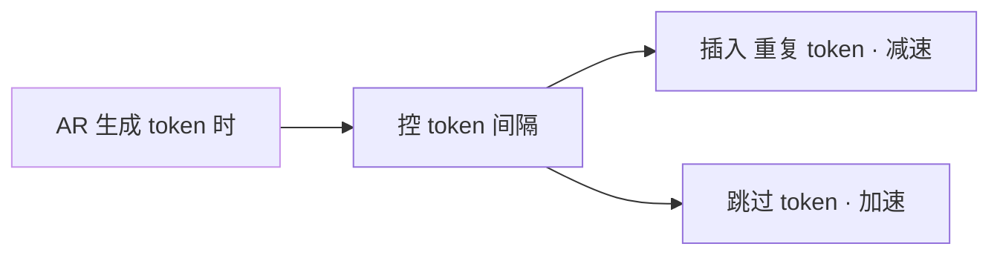

> [📎] 前置知识：WSOLA / Phase Vocoder、librosa.effects.time_stretch、重采样会变音调 · WSOLA 不会。

> **定位**：语速控制 = 「不变音调 · 仅变节奏」。本节拆 WSOLA 原理 · 调参 · 与 重采样 区别 · 实现。

## 1. 语速控制三选



## 2. 为何重采样会变音调

```python
# 错误用法
y_fast = y[::2]    # 抽帧 = 2× 加速
# 问题：采样率变·音调变 2×
```

采样率 sr × 2 · 频谱同样 × 2 · F0 从 200 Hz 上变到 400 Hz · 音色 变 “鱼 茴 鱼”。

## 3. WSOLA 原理

WSOLA = Waveform Similarity Overlap-Add。体现：


### 公式

$$y[n] = \sum_m w[n - m H'] \cdot x_m[n]$$

- $x_m$ = 原信号第 m 个帧。

- $H'$ = 调整后的 hop。

- $H'/H$ = 语速倍率。

- $w[n]$ = 窗 (一般 Hanning)。

## 4. 调参推荐

```python
import pyrubberband as pyrb
y_fast = pyrb.time_stretch(y, sr, 1.2)    # 1.2× 加速
y_slow = pyrb.time_stretch(y, sr, 0.8)    # 0.8× 减速
```

|倍率|听感|推荐|
|---|---|---|
|0.7×|明显慢|边缘|
|0.8×|慢|✅|
|**1.0×**|baseline|✅|
|1.2×|快|✅|
|1.3×|明显快|边缘|
|> 1.5×|机器感|❌|

> [⚠️] **超 ± 30% 会机器感**：WSOLA 上限 为 ± 30%、超过会出 重叠 伪 伪 · 听 感 机器。 需 更 大 调 跳 重生成路径。

## 5. 代码集成

```python
# inference_webui.py
speed = ui.get('speed', 1.0)
if abs(speed - 1.0) > 0.01:
    audio = librosa.effects.time_stretch(audio, rate=speed)
# librosa 内部用 Phase Vocoder、与 WSOLA 近似
```

## 6. WSOLA vs Phase Vocoder

|项|WSOLA|Phase Vocoder|
|---|---|---|
|域|时域|频域|
|语音质|佳 · 未抹谱|轻微金属|
|音乐质|一般|佳|
|计算|快|中|
|GPT-SoVITS 选|**WSOLA (librosa)**|可选|

## 7. AR 控节奏 · 另一路

不依赖后处理 · 在 AR 生成阶段控节奏：



社区未集成 · 需 手动补丁。

## 8. 常见问题

|现象|原因|修复|
|---|---|---|
|1.5× 机器感|WSOLA 上限|调为 1.3×|
|0.5× 抻抻|WSOLA 下限|调为 0.7×|
|音色变了|重采样 · 走了重采样|跳 WSOLA|
|节奏仍快|未集成后处理|加 librosa|

## 9. 工程判断

> [🔧] **语速控制默认 1.0· 调 0.8–1.3 佳**：超出范围需重生成。WSOLA 不变音调是唯一可以接受的后处理、 重采样 是 错 路。 社区 默认 librosa 内置 · 不 需 额 外 装。

## 参考文献

1. Verhelst, W. & Roelands, M. (1993). _WSOLA_. ICASSP.

1. Laroche, J. & Dolson, M. (1999). _Phase Vocoder_. IEEE Trans. Speech Audio.

1. librosa.effects.time_stretch. [https://librosa.org/doc/latest/generated/librosa.effects.time_stretch.html](https://librosa.org/doc/latest/generated/librosa.effects.time_stretch.html)

1. GPT-SoVITS: `inference_webui.py::audio_postprocess`.