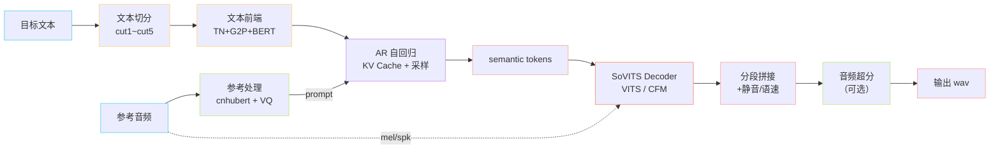

> 📎 **前置知识**：[[5. AR - T2S 模型（GPT 语义建模阶段）]]、[[6. SoVITS 解码器（声学生成阶段）]]；参考音频与 zero-shot 概念；理解 KV Cache 自回归推理。

## 0. 定位

> 「ref_audio + target_text → wav。」把训练好的两段网络组装成端到端推理链，本节定义切分、KV Cache、采样、拼接、超分等运行时关键节点与默认参数。

## 1. 端到端推理时序

## 2. 关键参数默认值

|参数|默认|作用|影响|
|---|---|---|---|
|`top_k`|15|AR 采样截断|多样性下限|
|`top_p`|0.8|AR nucleus|核心质量|
|`temperature`|0.7|AR 概率锐化|平滑/激进|
|`repetition_penalty`|1.35|AR 去重|防吞字/卡顿|
|`early_stop_num`|1600|AR 强停|防失控长生成|
|`noise_scale`|0.667|VITS Decoder|多样性|
|`cfg`|2.0|CFM Decoder（v3/v4）|条件强度|
|`diffusion_steps`|8 / 10|v3/v4 ODE 步数|质量/速度|

## 3. zero-shot vs few-shot

|模式|数据需求|优势|劣势|
|---|---|---|---|
|**zero-shot**|1 条 3–10s 参考音频|即开即用、无需训练|长文本稳定性、情感表达弱|
|**few-shot SFT**|1–5 分钟目标音色|音色更稳、可携带情感|需训练 30–60 分钟|

## 4. 工程判断

> 🔧 **文本切分必须**：AR 序列长度超过 2048 时 KV Cache 爆显存且容易吞字。`cut1~cut5` 把文本切到 ≤50 字一段，分段推理再拼接，是稳定性的根基。

> ⚠️ **温度组合的坑**：T=0.7、top_p=0.8、top_k=15、rep=1.35 是经过大量调参的「黄金组合」。盲改任一项可能引发跳读/吞字。详见 [[5.3 推理采样策略]]。

> 💡 **首包延迟优化**：流式推理（API v2 + chunk）可把首包延迟压到 200–500ms，关键是 AR 边解码边送 chunk 给 Decoder。

## 5. 子页面导航

[[8.1 参考音频处理（zero-shot - few-shot）]]

- v3/v4 推理流程: `GPT_SoVITS/TTS_infer_pack/`

[[8.6 音频超分（Audio Super Resolution，可选）]]

- 默认超参出处: `GPT_SoVITS/configs/`

## 参考文献

[[8.2 文本切分（cut 策略）]]

[[8.3 GPT 阶段：semantic token 生成]]

- 仓库 `inference_webui.py` / `api_v2.py`

[[8.4 SoVITS 阶段：波形生成]]

[[8.5 拼接 - 静音 - 语速控制]]