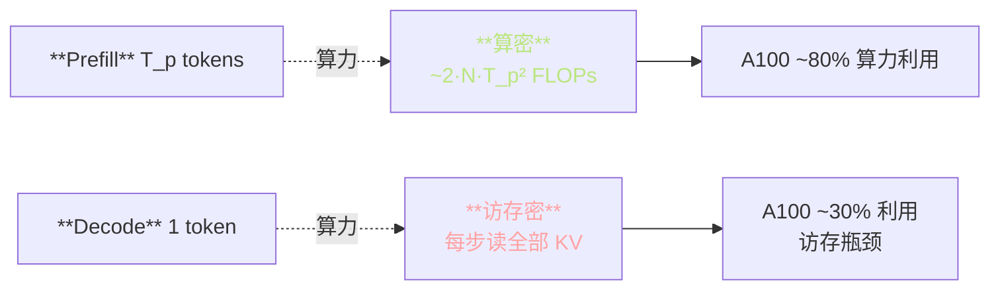
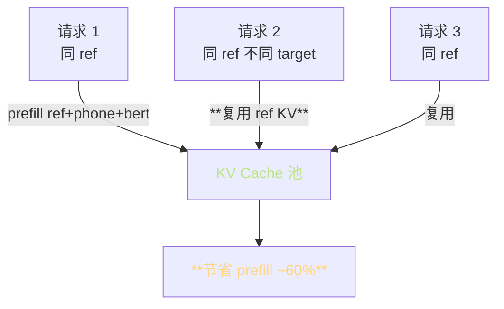

> 📎 **前置**：KV Cache；[[5.1 Text2SemanticDecoder 总结构|5.1 Text2SemanticDecoder 总结构]]；[[5.3 推理采样策略|5.3 推理采样策略]]；Flash-Attention；speculative decoding。

## 0. 定位

> 「semantic token 自回归生成的全过程。」推理 AR 阶段是首包延迟的主源：prefill prompt → 逐 token 解码（每次一次 forward + KV cache 增长）→ EOS / early_stop 终止。本节系统拆解时序、显存、采样、性能。

## 1. 推理时序详图

```mermaid
flowchart LR
  IN[phone + bert + prompt] --> PRE[**Prefill**<br/>一次性 forward<br/>O\(T_p²\)]
  PRE --> KV0[KV Cache 初始填充<br/>~19MB / 序列]
  KV0 --> DEC1[**Decode 步 1**<br/>1 token forward]
  DEC1 --> S1[采样<br/>top_k + top_p + temp]
  S1 --> KV1[KV +9KB]
  KV1 --> DEC2[Decode 步 2]
  DEC2 --> SN[...]
  SN --> CHK{EOS / early_stop}
  CHK -->|否| DEC2
  CHK -->|是| OUT[semantic 序列<br/>~25Hz 25–500 token]

  style PRE fill:\#1d2433,stroke:\#FFD580,color:#FFD580
  style KV0 fill:\#1d2433,stroke:\#BAE67E,color:#BAE67E
  style DEC1 fill:\#1d2433,stroke:\#C792EA,color:#C792EA
  style S1 fill:\#1d2433,stroke:\#C792EA,color:#C792EA
  style OUT fill:\#1d2433,stroke:\#F78C6C,color:#F78C6C
```

## 2. Prefill 显存预算（V4）

KV Cache 显存公式：

$$M_{KV} = 2 \cdot L \cdot H \cdot d_h \cdot T \cdot \text{dtype}$$

|参数|V2|V4|
|---|---|---|
|L（层数）|12|24|
|H（heads）|16|12|
|d_h（head dim）|32|64|
|T_prompt|~128|**~256**|
|dtype|BF16 (2B)|BF16 (2B)|
|**prefill KV**|~2.5 MB|**~19 MB**|
|**每 token 增量**|~3 KB|**~9 KB**|
|最大 ctx|1024|**2048**|
|满 ctx KV|~3 MB|**~36 MB**|

> [💡] **V4 KV 是 V2 的 ~10×**：层数 2× + d 1.5× + ctx 2× + heads 0.75×。但对推理总体显存影响有限——主显存还在 BigVGAN-48k + CFM 缓冲。

## 3. Prefill vs Decode 性能不对称



|阶段|瓶颈|优化方向|
|---|---|---|
|**Prefill**|算力|Flash-Attention-2 / TensorRT|
|**Decode**|访存|PagedAttention / KV 量化（INT8/FP8）|

## 4. 采样策略协同

```python
# 仓库 AR/models/t2s_model.py 简化
logits = transformer(input_ids, kv_cache)[:, -1]   # [B, vocab]
logits = logits / temperature                      # 温度
logits = apply_repetition_penalty(logits, prev_tokens, rep=1.35)
logits = top_k_filter(logits, k=15)
logits = top_p_filter(logits, p=0.8)
next_token = torch.multinomial(softmax(logits), 1)
```

> [💡] **顺序敏感**：rep_penalty 必须在 top_k/p 之前；否则 penalty 被高概率词遮蔽。详见 [[5.3 推理采样策略|5.3 推理采样策略]]。

## 5. EOS / early_stop 双重保险

|机制|触发条件|作用|
|---|---|---|
|**EOS token**|vocab[1024] 概率最高|**自然终止**|
|**early_stop_num**|已生成 token ≥ 1600|**硬上限·防 hallucination**|
|**ctx 满**|达到 2048|截断（不推荐到达）|

> [⚠️] **early_stop_num=1600 是经验最佳**：低于 1500 长句尾被截；高于 2000 模型有 ~5% 概率陷入循环重复。1600 在长句完整性与失控防御之间平衡。

## 6. KV Cache 复用优化



> [💡] **生产部署关键优化**：同一说话人多句合成时，ref 的 prompt KV 可缓存。社区 vLLM-style 实现把 prefill 时间从 200ms 降到 80ms。

## 7. 性能数据（V4·A100 FP16）

|阶段|耗时|占比|
|---|---|---|
|SSL + VQ（ref 处理）|~40 ms|5%|
|**AR Prefill**|**~180 ms**|**22%**|
|AR Decode（200 token）|~120 ms|15%|
|**CFM 10 步**|**~380 ms**|**47%**|
|BigVGAN-48k|~90 ms|11%|
|**总（7s 输出）**|**~810 ms**|RTF ~5×|

## 8. 工程判断

> 🔧 **Prefill 是首包延迟主源**：用 Flash-Attention-2 + TensorRT 把 prefill 从 180ms 压到 ~60ms 是常见做法。

> ⚠️ **early_stop_num 不能太低**：会截断长句尾，听感是「话没说完突然停」。1600 是经验最佳，调低请测试 100 句以上长句。

> 💡 **KV Cache 复用**：连续多段同 ref 推理时，prompt 部分的 KV 可缓存重用，节省 prefill 重复计算约 60%。是生产部署的标配优化。

> 🤔 **是否上 speculative decoding**：用小 draft model 加速大 LLM 的技巧对 GPT-SoVITS 330M AR 收益有限（draft 与 target 差距小），暂不推荐。Muyan 3B 路线下值得评估。

## 9. 子页面

[[8.3.1 prefill 阶段与显存预算|8.3.1 prefill 阶段与显存预算]]

[[8.3.2 EOS 提前结束与超长贯穿|8.3.2 EOS 提前结束与超长贯穿]]

## 参考文献

1. 仓库 `AR/modules/transformer.py` 中 `patched_mha_with_cache`

1. Dao, T. (2023). _FlashAttention-2_. arXiv:2307.08691.

1. Kwon, W. et al. (2023). _Efficient Memory Management for LLM Serving with PagedAttention_. SOSP.

1. Leviathan, Y. et al. (2023). _Speculative Decoding_. ICML.