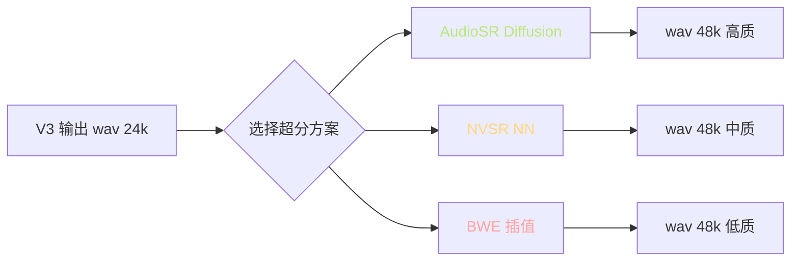
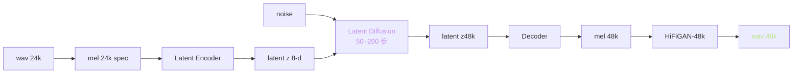
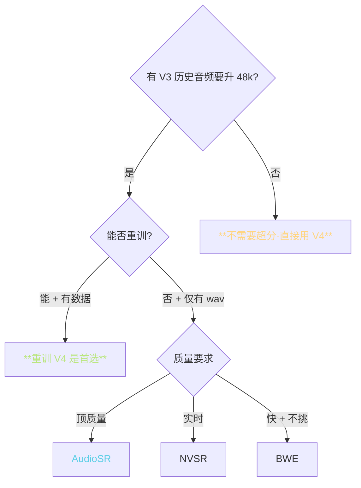

> 📎 **前置**：Audio Super Resolution（AudioSR / NVSR / BWE）；Bandwidth Extension（频带扩展）；Phase 重建；Latent Diffusion。

## 0. 定位

> 「24k → 48k 的可选后处理路径。」当历史 ckpt 是 V3（24k）但需要 48k 输出时，加一道 AudioSR / NVSR / BWE 超分作为补救。本节澄清三种方案的取舍、何时该用、何时直接换 V4。

## 1. 超分流程

## 2. 三种方案完整对比

|方案|类型|速度（A100）|质量 MOS|资源|幻觉风险|
|---|---|---|---|---|---|
|**AudioSR**|Latent Diffusion|~5× 实时（慢）|**4.5**|GPU ~8GB|**中**（可能生成不存在的高频）|
|**NVSR**|NN 一趟推理|**~50× 实时**|4.2|GPU ~4GB|低|
|**BWE / 线性插值**|DSP|**~500× 实时**|3.0|CPU|无|
|**直接 V4 重训**|—|—|**4.4**|—|无|

## 3. AudioSR 原理

> [⚠️] **AudioSR 的幻觉风险**：Latent Diffusion 训练时见过的高频纹理可能被「编造」进入输出。对人声场景偶发「不属于说话人的齿音 / 气声」。新闻播报 OK，专业配音慎用。

## 4. NVSR 原理

- NN 一趟推理（无迭代），结构类似 U-Net + skip

- 训练目标：mel domain L1 loss + STFT loss

- 适合实时场景，A100 ~50× 实时

- 质量略低于 AudioSR，但稳定无幻觉

## 5. BWE / 线性插值

传统 DSP 方法：把 0–12 kHz 谱按规则向 12–24 kHz 镜像 + 滤波。原理简单，但生成的「高频」实际只是低频的复制，听感是「闷沙沙」。

## 6. 决策树

## 7. 工程判断

> 🔧 **直接用 V4 比 V3 + 超分更省事且质量更高**：V4 原生 48k 没有上采样相位失真问题，质量 ~4.4 MOS；V3 + AudioSR ~4.5 MOS（差距甚小，但多一道 +200ms 推理 + 8GB 显存）。

> 💡 **仅当历史 ckpt 是 V3 不便重训时才用超分作为补救**：典型场景是大量已录制的 V3 音频要升级 48k 发布。

> ⚠️ **AudioSR 可能注入「不属于说话人的高频」**：因为 Latent Diffusion 是基于训练集统计先验。专业配音 / 商业播音慎用，新闻 / 有声书可接受。

> 🤔 **V4 + 超分到 96k**：理论上可行（如 AudioSR 96k），但人耳 16 kHz 以上灵敏度下降 40 dB，超过 48k 的提升人耳几乎听不出。不推荐。

## 参考文献

1. Liu, H. et al. (2023). _AudioSR: Versatile Audio Super-resolution at Scale_. arXiv:2309.07314.

1. Liu, H. et al. (2022). _Neural Vocoder is All You Need for Speech Super-resolution_ (NVSR). INTERSPEECH.

1. AudioSR demo: [https://audioldm.github.io/audiosr](https://audioldm.github.io/audiosr)

1. NVSR: [https://github.com/haoheliu/ssr_eval](https://github.com/haoheliu/ssr_eval)