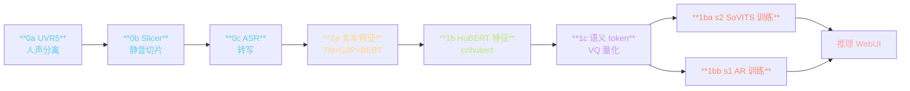
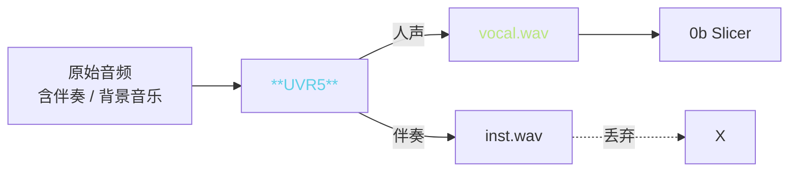
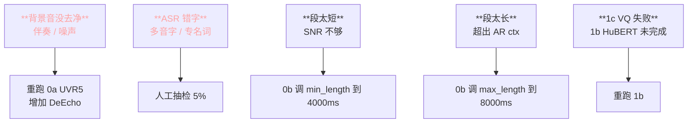

> 📎 **前置**：Gradio；[[7. 训练管线（端到端工作流）]]；UVR5（Ultimate Vocal Remover）；Slicer；FunASR / Faster-Whisper；cnhubert。

## 0. 定位

> 「一问一点一训。」训练 WebUI（`webui.py`）把从原始音频到可交付模型的全链路拆成 9 个 Tab，点按钮即可。是 GPT-SoVITS 社区赢得用户的核心资产——与命令行 TTS 工具相比，门槛远低。本节拆解每个 Tab 的职责、后台脚本、顺序依赖、常见坎。

## 1. Tab 全览与顺序



## 2. 各 Tab 详表

|Tab|功能|后台脚本|耗时（10 min 音频）|资源|
|---|---|---|---|---|
|**0a UVR5**|人声 / 伴奏分离|`tools/uvr5/`|~5 min|GPU ~6 GB|
|**0b Slicer**|按静音切片·限制每段 3–10 s|`tools/slicer2.py`|~1 min|CPU|
|**0c ASR**|FunASR / Faster-Whisper 转写|`tools/asr/`|~10 min|GPU ~3 GB|
|**1a 文本特征**|TN → G2P → BERT 抽|`prepare_datasets/1-get-text.py`|~3 min|GPU ~2 GB|
|**1b HuBERT 特征**|cnhubert 抽 768-d|`prepare_datasets/2-get-hubert-wav32k.py`|~8 min|GPU ~3 GB|
|**1c 语义 token**|VQ 量化 → 25Hz token|`prepare_datasets/3-get-semantic.py`|~3 min|GPU ~2 GB|
|**1ba s2 训练**|SoVITS（VITS / CFM）|`s2_train.py`|fine-tune ~30 min|GPU ≥12 GB|
|**1bb s1 训练**|AR / GPT|`s1_train.py`|fine-tune ~20 min|GPU ≥9 GB|

## 3. 0a UVR5 人声分离



可选模型：

|模型|适用|质量|速度|
|---|---|---|---|
|HP2_all_vocals|清晰人声|★★★★|快|
|HP5_only_main_vocal|背景音乐|★★★★★|中|
|**onnx_dereverb**|**去混响**|★★★★|中|
|**DeEcho-Aggressive**|**去回声**|★★★★★|慢|

> [💡] **串联使用**：常见公式：HP5 → onnx_dereverb → DeEcho-Aggressive。三道下来 SNR 可从 20 dB 提升到 35 dB。

## 4. 0b Slicer·静音切片

```python
# tools/slicer2.py 参数
threshold = -34   # dB 静音阈值
min_length = 4000 # ms 每段最短
min_interval = 300 # ms 最短静音间隔
hop_size = 10    # ms 扫描步长
max_sil_kept = 500 # ms 保留边界静音
```

> [⚠️] **每段限制 3–10 s**：过短 (<3s) 训练信号太少；过长 (>15s) 超出 AR ctx 1024 限制会报错。默认 4–10 s 是黄金区间。

## 5. 0c ASR 转写

|模型|语种|WER|速度|适用|
|---|---|---|---|---|
|FunASR Paraformer-zh|中文|4.5%|快·30×|**中文首选**|
|Faster-Whisper-large-v3|多语种|中 5.0% / 英 4.8%|中·10×|多语种首选|
|Whisper-base|多语种|中 10%|**快·40×**|低资源|

> [⚠️] **ASR 错误会传导到 1a**：多音字 / 专名词错在这里最容易出。默认抽 5% 人工检验。

## 6. 常见坎



## 7. 训练 Tab（1ba / 1bb）详参

|参数|默认|fine-tune 推荐|从零训推荐|
|---|---|---|---|
|batch_size|8|4–8|16+|
|total_epoch|15|15–25|50+|
|save_every_epoch|4|2|4|
|if_save_latest|True|True|True|
|precision|bf16-mixed|bf16-mixed|bf16-mixed|
|gpu_numbers|0|0|0,1,2,3|

## 8. 工程判断

> 🔧 **顺序不可跳**：0a → 0b → 0c → 1a → 1b → 1c → 1ba/1bb。跳步会在后面 Tab 报 FileNotFound。

> ⚠️ **0a UVR5 人声分离质量决定最终音色**：背景音乐没去净会被模型学走，输出听感是「说话人背景总有背景音」。UGC 源音频必过三道 UVR5。

> 💡 **ASR 文本错误需人工抽检 5%**：多音字、专名词、数字读法错误会传导到 1a G2P → 发音错误。弄 100 句抽 5–10 句检查是性价比最高的 QA 手段。

> 🤔 **未来：一键化与 WebUI 能力的平衡**：WebUI 赢在上手低，输于可复现性（参数在 UI 中丢失）。社区示例机 `kk-finetuner` 在 WebUI 上加了 JSON 导入 / 导出，是演进方向。

## 9. 子页面

[[9.1.1 0a UVR5（人声分离）]]

[[9.1.2 0b 语音切分（slicer）]]

[[9.1.3 0c ASR（FunASR - Faster-Whisper 转写）]]

[[9.1.4 1a 文本特征提取]]

[[9.1.5 1b HuBERT 特征提取]]

1. 仓库 `webui.py`

1. Gradio: [https://www.gradio.app](https://www.gradio.app)

1. UVR5: [https://github.com/Anjok07/ultimatevocalremovergui](https://github.com/Anjok07/ultimatevocalremovergui)

[[9.1.6 1c 语义 token 计算]]

1. FunASR: [https://github.com/modelscope/FunASR](https://github.com/modelscope/FunASR)

[[9.1.7 1ba - 1bb s2 与 s1 训练入口]]

1. Faster-Whisper: [https://github.com/SYSTRAN/faster-whisper](https://github.com/SYSTRAN/faster-whisper)

## 参考文献