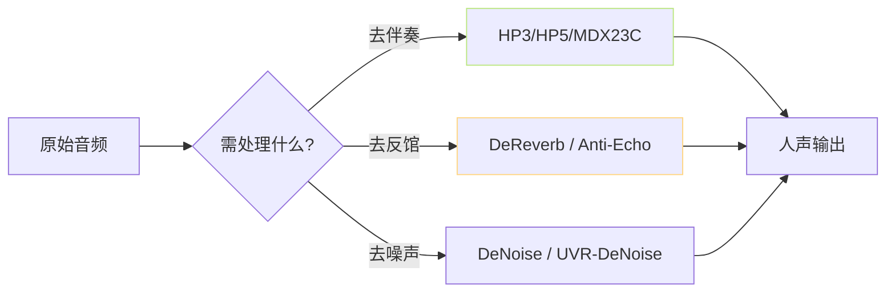

> [📎] 前置知识：UVR5 (Ultimate Vocal Remover 5)、Demucs v4、MDX-Net、 人声分离与反馆去除。

> **定位**：UVR5 是训练数据准备的第一道门。本节拆 模型选型、 人声/伴奏 · 反馆 两轮处理、 量检 · 常见错误。

## 1. UVR5 模型体系



## 2. 模型选型

|模型|场景|人声质量|速度|
|---|---|---|---|
|HP3_all_vocals|有伴奏 · 人声为主|⭐⭐⭐⭐|中|
|HP5_only_main_vocal|人声合哱需主人声|⭐⭐⭐|中|
|**MDX23C-InstVoc**|**现代首选**|**⭐⭐⭐⭐⭐**|慢|
|VR-DeEchoAggressive|反馆 · 回声|—|快|
|UVR-DeNoise|背景噪声|—|快|

## 3. 两轮处理社区推荐


## 4. WebUI 参数

|参数|默认|调参|
|---|---|---|
|agg (强度)|10|0–20; >15 会丢高频|
|format|wav|wav (不 选 mp3)|
|device|cuda|·|

## 5. 质量检查

```python
# 人声输出量检
from librosa import load
y, sr = load('vocal.wav', sr=16000)
rms = np.sqrt(np.mean(y**2))
if rms < 0.01:
    print('人声太小·检查 UVR5 输出')
```

## 6. 常见错误

|现象|原因|修复|
|---|---|---|
|人声重颂|HP3 · agg 过弱|跳 MDX23C|
|人声金属音|agg 过强|调低 agg|
|反馆未去|仅走轮1|加轮2 DeEcho|
|背景噪声|仅走 InstVoc|加 DeNoise|

## 7. 工程判断

> [🔧] **质量 > 速度**：UVR5 是预处理 一次性 · 后面 训练 多次 迭代。 需 拼 质量 不 拼 速度。 首选 MDX23C-InstVoc + DeEcho 两轮。

## 参考文献

1. UVR5 GitHub. [https://github.com/Anjok07/ultimatevocalremovergui](https://github.com/Anjok07/ultimatevocalremovergui)

1. Défossez, A. (2023). _Demucs v4_. ICASSP.

1. MDX-Net: [https://github.com/kuielab/mdx-net](https://github.com/kuielab/mdx-net)

1. GPT-SoVITS: `tools/uvr5/webui.py`.