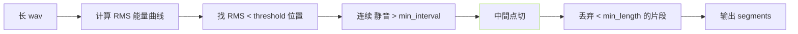

> [📎] 前置知识：slicer、VAD、RMS 静音检测、 最小间隔 与 最长片段。

> **定位**：slicer 把长音频切为 训练可用的 5–10 s 片段。本节拆 算法 · 调参 · 常见问题。

## 1. slicer2 算法



## 2. 参数表

|参数|默认|作用|
|---|---|---|
|threshold (dB)|-34|静音门限|
|min_length (ms)|4000|最短片段|
|min_interval (ms)|300|最短静音间隔|
|hop_size (ms)|10|RMS 窗|
|max_sil_kept (ms)|500|保留静音上限|

## 3. 例子

```python
from tools.slicer2 import Slicer
slicer = Slicer(
    sr=44100,
    threshold=-34,
    min_length=4000,
    min_interval=300,
    hop_size=10,
    max_sil_kept=500,
)
chunks = slicer.slice(audio)
for i, chunk in enumerate(chunks):
    sf.write(f'seg_{i}.wav', chunk, 44100)
```

## 4. 调参场景

|场景|调参|
|---|---|
|老人说话 · 间隔多|min_interval=500|
|说话快 · 间隔少|min_interval=200|
|背景噪声高|threshold=-25|
|克隆场景|min_length=3000 (3–10s 片段佳)|

## 5. 常见问题

|现象|原因|修复|
|---|---|---|
|切出片段太多 (10000+)|threshold 太低|提高到 -30|
|切出片段太少|min_interval 太长|调为 200|
|句子被裂|min_interval 太短|调为 500|
|片段越 15 s|原音无静音间隔|手切|

## 6. 工程判断

> [🔧] **默认不动· 如 需 · 调 threshold + min_interval**：社区 slicer 默认参数 是 调 过 的 sweet spot。 在输入特别场景 需 调 threshold。推荐 切后 手抽 5% 检 · 检 听 片段 质量。

## 参考文献

1. GPT-SoVITS: `tools/slicer2.py`.

1. openvpi/audio-slicer. [https://github.com/openvpi/audio-slicer](https://github.com/openvpi/audio-slicer)