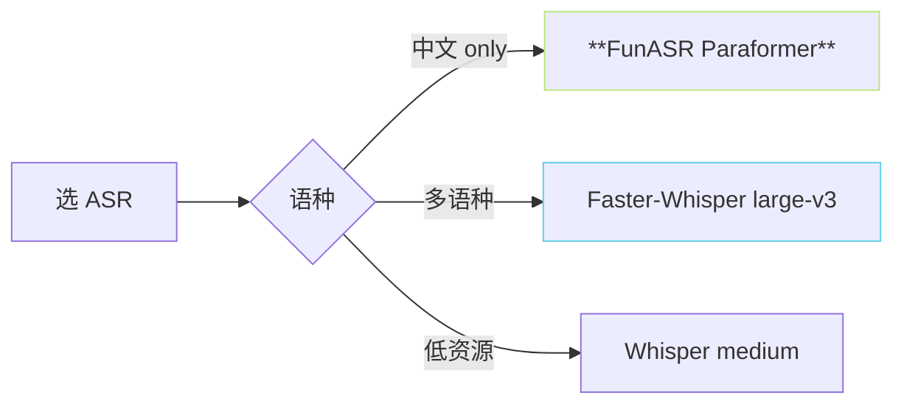

> [📎] 前置知识：Whisper 架构、Faster-Whisper (CTranslate2)、FunASR Paraformer、WER。

> **定位**：ASR 为每个片段生成训练文本。本节拆 两个主模型、 资源 · 质量 trade-off、量检、手补。

## 1. ASR 两主选

|模型|中文 WER|多语种|需显存|RTF|
|---|---|---|---|---|
|**FunASR Paraformer-large**|**3–5%**|中文 only|2 GB|0.05×|
|Faster-Whisper large-v3|6–8%|**100+**|4 GB|0.15×|
|Faster-Whisper medium|10–12%|100+|2 GB|0.08×|
|Whisper.cpp small|15%|100+|— (CPU)|0.5×|

## 2. 场景选型



## 3. 调用

```python
# FunASR 调用
from funasr import AutoModel
model = AutoModel(model='paraformer-zh', vad_model='fsmn-vad', punc_model='ct-punc')
result = model.generate(input='seg.wav')
text = result[0]['text']
```

```python
# Faster-Whisper 调用
from faster_whisper import WhisperModel
model = WhisperModel('large-v3', device='cuda', compute_type='float16')
segments, info = model.transcribe('seg.wav', language='zh')
text = ''.join(s.text for s in segments)
```

## 4. 量检与手补

```python
# 随机抽 5% 人手检
import random
samples = random.sample(file_list, len(file_list) // 20)
for f, text in samples:
    play(f)
    print(text)
    input('OK?')
```

## 5. 中文多音字问题

|多音字|社区 ASR 错率|
|---|---|
|“行” (háng vs xíng)|30%|
|“区” (qū vs ōu)|20%|
|“重” (zhòng vs chóng)|15%|

> [⚠️] **多音字错是隐形**：ASR 生成汉字字形 不 带拼音、 后面 G2P 需 重 新 推 错。 社区 报错 「发音错」 多为 多音字。需 手 检 。

## 6. 工程判断

> [🔧] **中文 FunASR + 手抽 5% 检**：FunASR 中文 WER 3% · 低于 Whisper。推荐 快 产 出 · 手 抽 检 · 重 点 检 多 音 字 · 严 重 错 手 改。

## 参考文献

1. Radford, A. et al. (2022). _Whisper_. OpenAI.

1. FunASR. [https://github.com/modelscope/FunASR](https://github.com/modelscope/FunASR)

1. Faster-Whisper. [https://github.com/SYSTRAN/faster-whisper](https://github.com/SYSTRAN/faster-whisper)

1. GPT-SoVITS: `tools/asr/`.