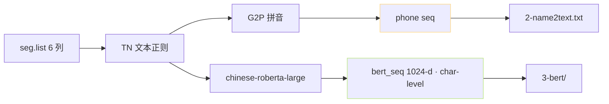

> [📎] 前置知识：Text Normalization (TN)、G2P、chinese-roberta-wwm-ext-large、phone seq 与 bert_seq 对齐。

> **定位**：1a 是文本特征提取 · 对应 `prepare_datasets/1-get-text.py`。本节拆 输入 · 中间产物 · 输出 · 调参。

## 1. 产物总图



## 2. 中间产物

|文件|内容|
|---|---|
|2-name2text.txt|`wavname\|text\|lang\|phones\|word2ph`|
|3-bert/{wavname}.pt|BERT 表示 · [T_char, 1024]|

## 3. TN 样例

```jsx
输入： 今天是 2024 年 1 月 1 号
TN 后： 今天是二零二四年一月一号
```

## 4. G2P 处理

```python
from text.chinese import g2p
phones = g2p('今天是二零二四年一月一号')
# ['j', 'in1', 't', 'ian1', 'sh', 'iii4', ...]
```

|语种|G2P 引擎|
|---|---|
|中文|**g2pW + pypinyin**|
|英文|g2p_en (CMUdict)|
|日文|pyopenjtalk|
|韩文|jamo|

## 5. BERT 提取

```python
from transformers import AutoModel, AutoTokenizer
tokenizer = AutoTokenizer.from_pretrained('chinese-roberta-wwm-ext-large')
model = AutoModel.from_pretrained('chinese-roberta-wwm-ext-large').cuda()
inputs = tokenizer(text, return_tensors='pt').to('cuda')
with torch.no_grad():
    res = model(**inputs, output_hidden_states=True)
bert_feat = torch.cat(res.hidden_states[-3:-2], dim=-1)[0]
# [T_char, 1024]
```

> [💡] **BERT 取倍数第 -3 层**：BERT 顶层偏任务 中 层 语义 · 取 第 -3 层 是 社区 限 过的 实验 点。

## 6. phone 与 bert 对齐 (word2ph)

```jsx
文本    ：今 天 是
phones ：j in1 t ian1 sh iii4
word2ph：2     2       2
```

word2ph 记录每个字对应几个 phone。训练时 BERT 按 word2ph expand 到 phone 长度。

## 7. 多 GPU 并行

```bash
python 1-get-text.py --i_part 0 --all_parts 4 &
python 1-get-text.py --i_part 1 --all_parts 4 &
python 1-get-text.py --i_part 2 --all_parts 4 &
python 1-get-text.py --i_part 3 --all_parts 4 &
wait
```

## 8. 常见错误

|错误|原因|修复|
|---|---|---|
|多音字拼错|g2pW 推错|手动 dict 补充|
|BERT OOM|长文本|切 · chunk 512|
|word2ph 不 同长|TN 后文 · 不 中|仔细看 TN 输出|

## 9. 工程判断

> [🔧] **1a 是错误传染点**：ASR 错 · G2P 错 · BERT 错 都会传到训练。 社区 调 试 推 荐 抽 5% 检 word2ph 是否 对 齐。多音字 需 手 补 dict。

## 参考文献

1. Cui, Y. et al. (2019). _Chinese RoBERTa_. EMNLP.

1. g2pW. [https://github.com/GitYCC/g2pW](https://github.com/GitYCC/g2pW)

1. GPT-SoVITS: `prepare_datasets/1-get-text.py`.