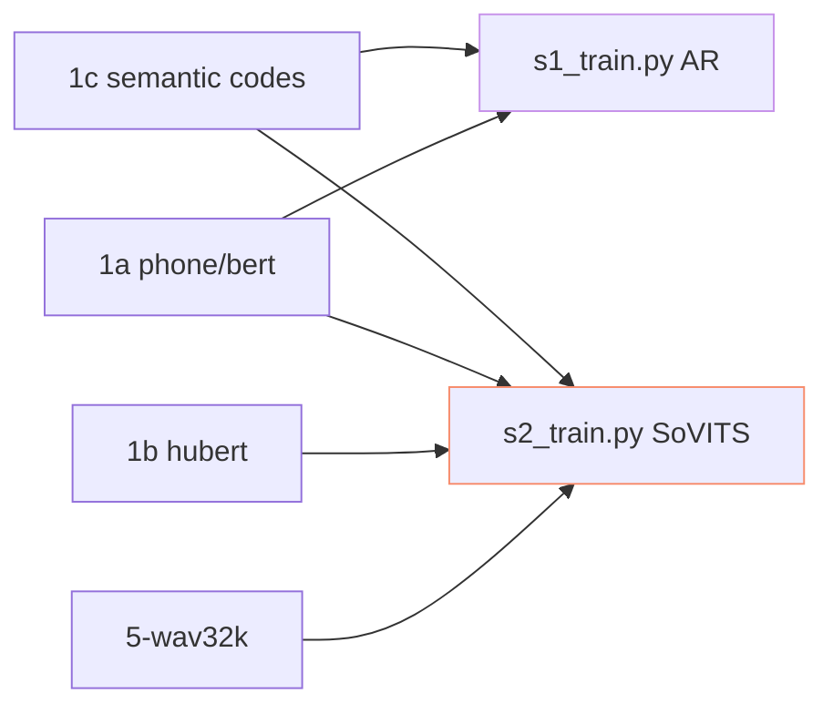

> [📎] 前置知识：s1_[train.py](http://train.py) (AR)、s2_[train.py](http://train.py) (SoVITS)、PyTorch Lightning Trainer · DDP、各 stage 独立训。

> **定位**：1ba/1bb 是训练入口 · 两阶段独立训。本节拆 调用脚本 · 参数表 · 顺序 · 多卡训。

## 1. 训练入口



## 2. 参数表

|项|1ba s2 (SoVITS)|1bb s1 (AR)|
|---|---|---|
|脚本|`s2_train.py`|`s1_train.py`|
|配置|`configs/s2.json`|`configs/s1.yaml`|
|预训 ckpt|s2G/s2D|s1.ckpt|
|默认 max_steps|40000|40000|
|默认 lr|1e-4 ExpDecay|1e-4 Warmup+Cosine|
|precision|bf16-mixed|bf16-mixed|

## 3. 调用

```bash
# s2 训练
python s2_train.py --config configs/s2.json

# s1 训练
python s1_train.py --config configs/s1.yaml
```

## 4. 多卡 DDP

```bash
# 4 卡 DDP
torchrun --nproc_per_node=4 s2_train.py --config configs/s2.json
torchrun --nproc_per_node=4 s1_train.py --config configs/s1.yaml
```

## 5. 训练顺序


但 GPT-SoVITS 社区提供预训 s2G · 可跳过 s2 训 · 直接 走 1c + s1 SFT。

## 6. 独立与联合

|场景|需训|
|---|---|
|仅克隆 · 多音色|**仅 s1 SFT**|
|重新训架构|s2 + s1|
|跳阶段使 s2Pro|s2 (Pro) + s1|
|快产出|**仅 s1 SFT · LoRA**|

## 7. 资源需求

|阶段|v1/v2|v3|v4|
|---|---|---|---|
|s2 训|8 GB|24 GB|40 GB|
|s1 训|4 GB|16 GB|16 GB|
|总训时 (1×A100)|2 day|3 day|4 day|

## 8. 常见错误

|现象|原因|修复|
|---|---|---|
|OOM|batch_size 太大|调 batch_size · 开 bf16|
|训练 hang|DDP NCCL 问题|find_unused_parameters=True|
|训练 loss NaN|fp16 + V100|跳 bf16-mixed|
|训练不动|预训 ckpt 未加载|检查 config 中 pretrained_path|

## 9. 工程判断

> [🔧] **1ba/1bb 是调 config 不调脚本**：s2_[train.py](http://train.py) / s1_[train.py](http://train.py) 本身不需改 · 需改的是对应 yaml/json。 跳 LoRA 需 社区 补 丁。

## 参考文献

1. PyTorch Lightning. [https://lightning.ai/docs/pytorch/stable/](https://lightning.ai/docs/pytorch/stable/)

1. GPT-SoVITS: `s1_train.py` / `s2_train.py`.

1. PyTorch DDP. [https://pytorch.org/docs/stable/notes/ddp.html](https://pytorch.org/docs/stable/notes/ddp.html)