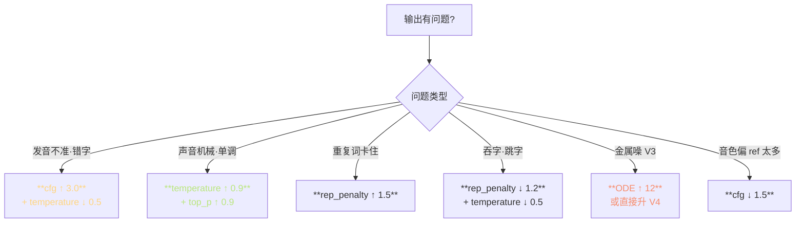
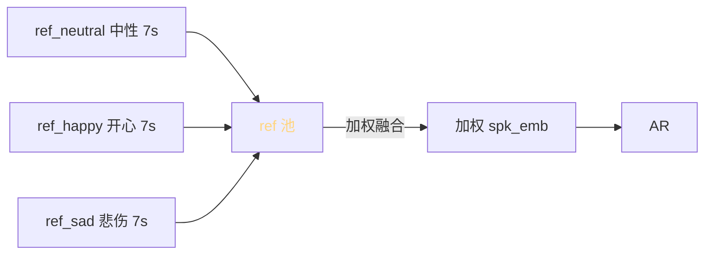

> 📎 **前置**：Gradio；[[8. 推理流程（Inference Pipeline）]]；采样参数语义；[[5.3 推理采样策略]]。

## 0. 定位

> 「点按钮听声音。」推理 WebUI（`GPT_SoVITS/inference_webui.py`）是 GPT-SoVITS 的默认交付物，集成了 ref 上传、多参数调整、多语种 G2P、多参考音频、情感槽位等全部推理时能力。本节系统拆解每个参数、其作用范围、调参方向。

## 1. 参数面板全表

|参数|默认|范围|作用|调高效应|调低效应|
|---|---|---|---|---|---|
|**top_k**|15|1–50|采样顶 K vocab|更多样|更确定 / 重复|
|**top_p**|0.8|0–1|核采样概率峰|更多样|更保守|
|**temperature**|0.7|0.1–1.5|logit 缩放|**随机·吞字**|**单调·重复**|
|**rep_penalty**|1.35|1.0–2.0|重复惩罚|避免重复|易循环|
|**speed**|1.0|0.5–2.0|WSOLA 语速|变快|变慢|
|**cfg** (V3/V4)|2.0|1.0–5.0|CFM Classifier-Free Guidance|**语义更准·偏 ref**|更软·更模型先验|
|**how_to_cut**|cut0|cut0–5|切分策略|不同标点切|—|
|**ref_text_lang**|自动|5 语种|ref 文本语种|—|—|
|**target_text_lang**|自动|5 语种|目标文本语种|—|—|
|**ODE_steps** (V3/V4)|10|4–32|CFM ODE 步数|**质量↑·推理慢**|金属噪 / 人工感|

## 2. 切分策略 cut0–cut5

|枚举|分隔符|用例|
|---|---|---|
|**cut0**|不切|短句 < 30 字|
|**cut1**|4 句一切|段落朗读|
|**cut2**|50 字一切|长文章默认|
|**cut3**|中文句号|**新闻播报**|
|**cut4**|英文句号|英文段落|
|**cut5**|所有标点|对话密集场景|

## 3. 调参决策树

## 4. 多参考音频与情感槽位

> [💡] **多参考音频是高级玩法**：V2Pro+ 支持输入多条同一说话人不同情感的 ref，模型在推理时加权合并 spk_emb。可获得「该说话人 + 该情感」的复合音色。

> [⚠️] **不同说话人 ref 拼接会出现音色融合**：A + B 两个不同人的 ref 会生成一个「介于两者之间的新人」。这是 zero-shot TTS 的固有限制，不是 bug。

## 5. ref 质量评估

|指标|下限|推荐|顶配|
|---|---|---|---|
|时长|3 s|**5–7 s**|7 s（不要超 10 s）|
|SNR|20 dB|30 dB|**> 35 dB**|
|采样率|16k|32k|**48k**|
|语调|—|中性|**中性·无情绪**|
|说话人|—|—|**单人·无背景**|

## 6. 常见误区

> [⚠️] **temperature 超过 1.2 会出现间歇性吞字**：高 temperature 让低概率 token 抬头，AR 偶发选错 token 导致 phoneme 序列跳变。

> [⚠️] **cfg 调到 3.0 以上会偶发音色突变**：CFM 在高 cfg 下过度向 ref 拉，可能放大 ref 中某些「非典型」频谱，听感「换了个人」。

> [💡] **默认参数是社区经验最佳**：调之前先检查 ref 质量。99% 的「输出不好」是 ref 问题，不是参数问题。

## 7. 工程判断

> 🔧 **生产部署不要暴露所有参数**：给用户的 UI 仅留 speed + 情感选择即可。其他参数由工程预设，避免「调坏」。

> 💡 **cfg (V3/V4) 调 1.5 → 软；调 3.0 → 语义更准但音色偏 ref**：根据具体场景找最佳点。新闻播报推 2.5；有声书推 2.0；情感对话推 1.8。

> 🤔 **多参考音频的未来**：FACodec 路线（NaturalSpeech 3）能显式分离音色 / 韵律 / 情感，比 GPT-SoVITS 的加权融合更精确。见 [[13.5 与端到端 Flow - Diffusion TTS 的未来融合]]。

## 8. 子页面

[[9.2.1 参数面板（top_k - top_p - temperature - speed）]]

[[9.2.2 多参考音频与情感槽位]]

## 参考文献

1. 仓库 `GPT_SoVITS/inference_webui.py`

1. Gradio: [https://gradio.app](https://gradio.app)