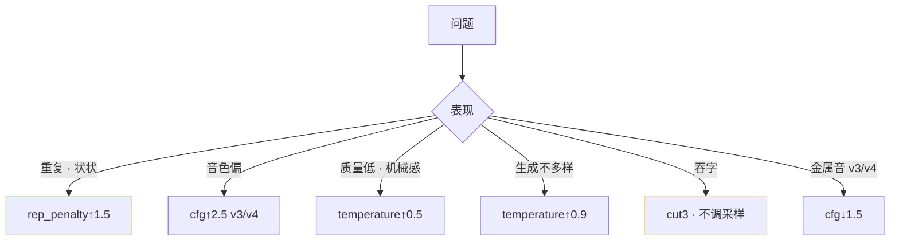

> [📎] 前置知识：top_k · top_p · temperature · repetition_penalty 采样超参、cfg (CFM)、speed (WSOLA)、how_to_cut。

> **定位**：推理 WebUI 参数面板 是 产品 底牌。本节拆 全参数 · 默认 · 调参 场景。

## 1. 全参数表

|参数|默认|范围|作用|调 何 场景|
|---|---|---|---|---|
|top_k|15|1–50|采样顶 K|·|
|top_p|0.8|0–1|采样概率峰|·|
|temperature|0.7|0.1–1.5|不确定性|高 · 多样 低 · 稳|
|repetition_penalty|1.35|1–2|防重复|重复调高到1.5|
|speed|1.0|0.5–2.0|WSOLA 语速|0.8–1.3 佳|
|cfg (v3/v4)|2.0|1–5|CFM guidance|音色偏调高|
|how_to_cut|cut0|0–5|切分策略|长文 cut3|
|ref_text_lang|中文|多语种|ref 语种|同 ref|
|target_text_lang|中文|多语种|目标语种|·|

## 2. 采样三件套


## 3. 默认走 sweet spot

```yaml
# 社区默认 · 甜蜜点
top_k: 15
top_p: 0.8
temperature: 0.7
repetition_penalty: 1.35
speed: 1.0
cfg: 2.0    # v3/v4
how_to_cut: cut3
```

## 4. 调参 · 场景驱动



## 5. 互动调参顺序

1. 先质检 ref (见 [[8.1.1 参考音频质量门槛（信噪比 - 时长）]])

1. 调 cut (默认 cut3 · 长文)

1. 调 cfg (v3/v4) / noise_scale (v1/v2)

1. 调 rep_penalty

1. 调 temperature

1. 最后 调 top_k / top_p (不推荐调)

## 6. 常见调参错误

|错误|后果|
|---|---|
|temperature > 1.2|间歇吞字|
|cfg > 3.5|金属音|
|top_k=1|生成单调 · 某 重复|
|rep_penalty > 1.8|不自然 · 跳变|
|speed > 1.5×|机器感|

## 7. 工程判断

> [🔧] **默认不动 · 需调 先检 ref**：社区默认 是 调 过 的 甜 蜜 点。 生成坏 90% 是 ref 问题、 不是调参。调 三 个 限 制：不 调 top_k · top_p · 仅 调 temperature · rep_penalty · cfg。

## 参考文献

1. Holtzman, A. et al. (2020). _Nucleus Sampling_. ICLR.

1. GPT-SoVITS: `inference_webui.py::infer`.