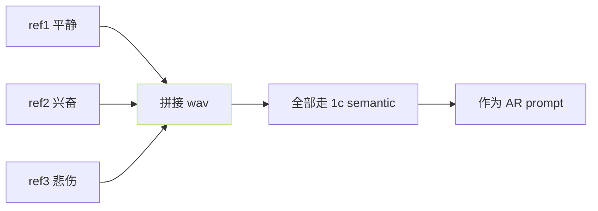
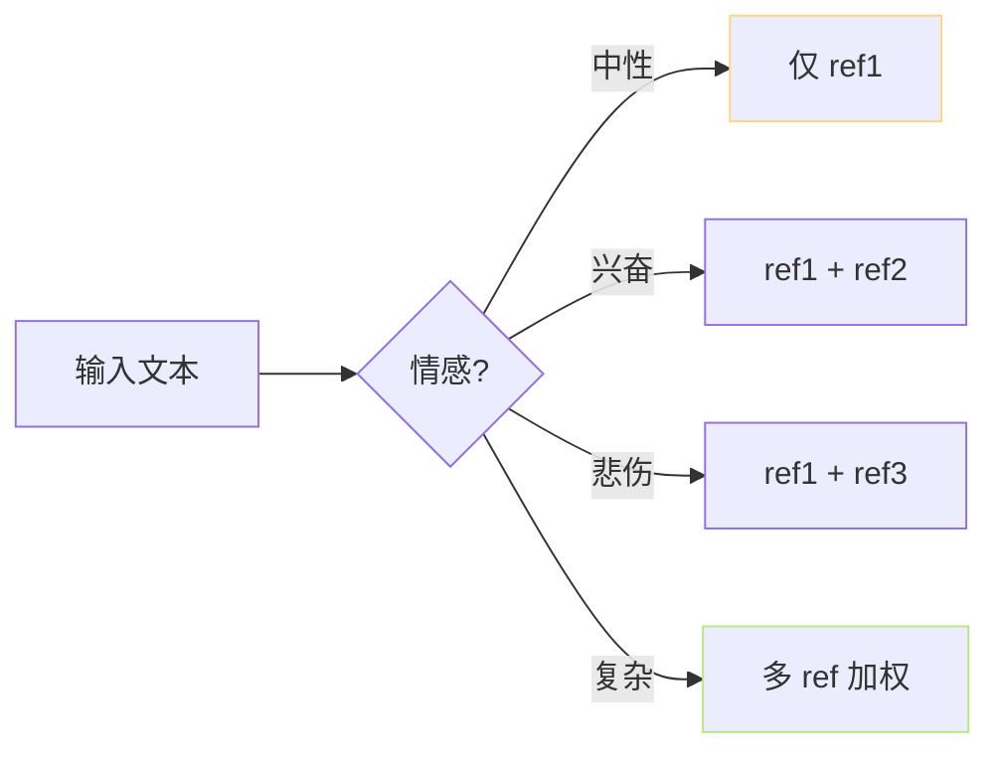

> [📎] 前置知识：多参考音频 (multi-reference)、 情感槽位、 prompt 拼接 与 加权 机制。

> **定位**：多参考音频 是 v2+ 增强 · 提升 表现力与稳定性。本节拆 机制 · 情感槽位 · 拼接 顺序 · 调参。

## 1. 为何需多参考

|问题|单 ref 限制|多 ref 加成|
|---|---|---|
|音色偏调|走不出|多 ref 拉平均|
|表现力单调|仅抳取 5s|多 ref 多情感|
|长文不稳|后段代谢偏|多 ref 稳住|

## 2. 拼接机制



社区 v2 现 能 拼 接 多参考 (上限 3–5 个)。拼接后作为一个 `prompt` 走 AR。

## 3. 情感槽位设计

|槽位|示例|限制|
|---|---|---|
|ref1|平静|需|
|ref2 (可选)|兴奋/高昊|不需|
|ref3 (可选)|悲伤/下压|不需|
|ref4 (可选)|语气词/接口|不需|



## 4. WebUI 调用

```python
# inference_webui.py · 伪代码
ref_audios = ['ref1.wav', 'ref2.wav', 'ref3.wav']
ref_texts  = ['平静文本', '兴奋文本', '悲伤文本']
# 拼接所有 semantic + bert
all_sem  = torch.cat([sem(r) for r in ref_audios], dim=-1)
all_bert = torch.cat([bert(t) for t in ref_texts],  dim=-1)
# 作为 prompt 走 AR
result = ar_model.generate(prompt=all_sem, bert=all_bert, text=target_text)
```

## 5. 拼接顺序

|顺序|作用|现象|
|---|---|---|
|中性 · 情感1 · 情感2|**社区推荐**|稳|
|情感2 · 中性 · 情感1|不推|后 面 ref 代 表 偏|
|随机|不推|不稳|

> [💡] **拼接顺序重要**：AR 是自回归 · 后面 ref 会 代 表 较 多 0选 位 。 由于 prompt 位 置 靠 近 生 成、 后面 ref 会被「优先」参考。

## 6. 调参与限制

|项|限制|调|
|---|---|---|
|总时长|≤5s×5 = 25s|超限 OOM|
|每个 ref|5–7 s|同单 ref|
|语种|一致|不能混语种|
|说话人|一致|不能多人|

## 7. 常见错误

|现象|原因|修复|
|---|---|---|
|音色变|多人 ref|仅同一说话人|
|OOM|ref 超 25 s|减 ref 个数|
|情感混乱|ref 梱子 差别太大|仅 2 ref|
|语种变|不同 ref 不 同 语种|一致|

## 8. 工程判断

> [🔧] **多 ref 是冷门加分 · 但需调**：社区 80% 用户 仅用 单 ref、多 ref 要求 社 区 限 过。 推荐 ref 表 达 多 · 能 提升 表现力 30%。 但 需 保 证 说话 人 语 种 一 致。

## 参考文献

1. GPT-SoVITS v2 changelog. [https://github.com/RVC-Boss/GPT-SoVITS/wiki](https://github.com/RVC-Boss/GPT-SoVITS/wiki)

1. GPT-SoVITS: `inference_webui.py::get_phones_and_bert`.