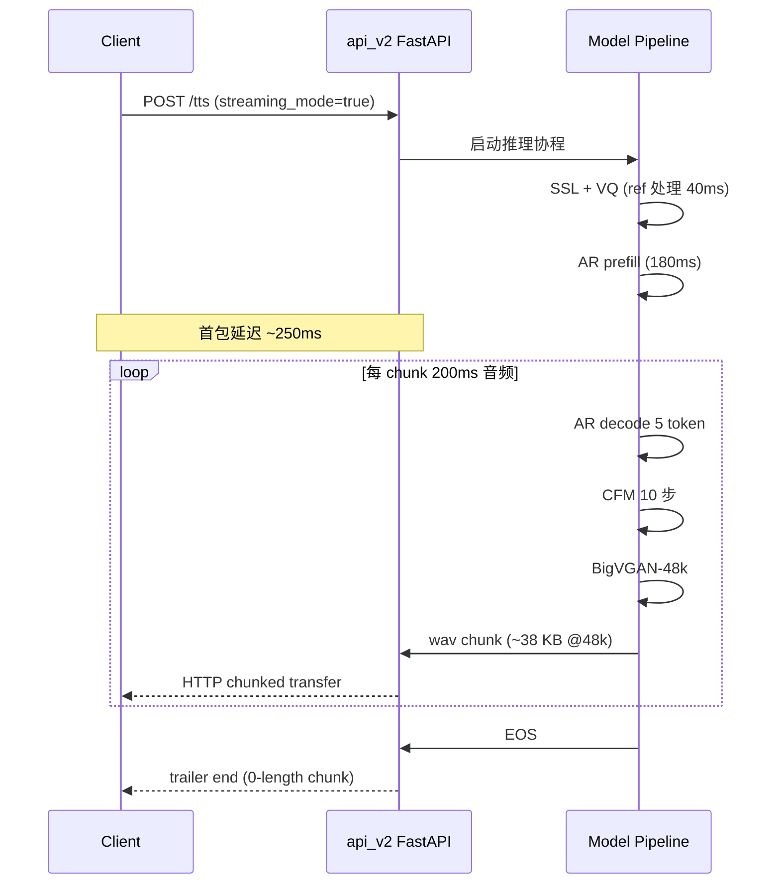
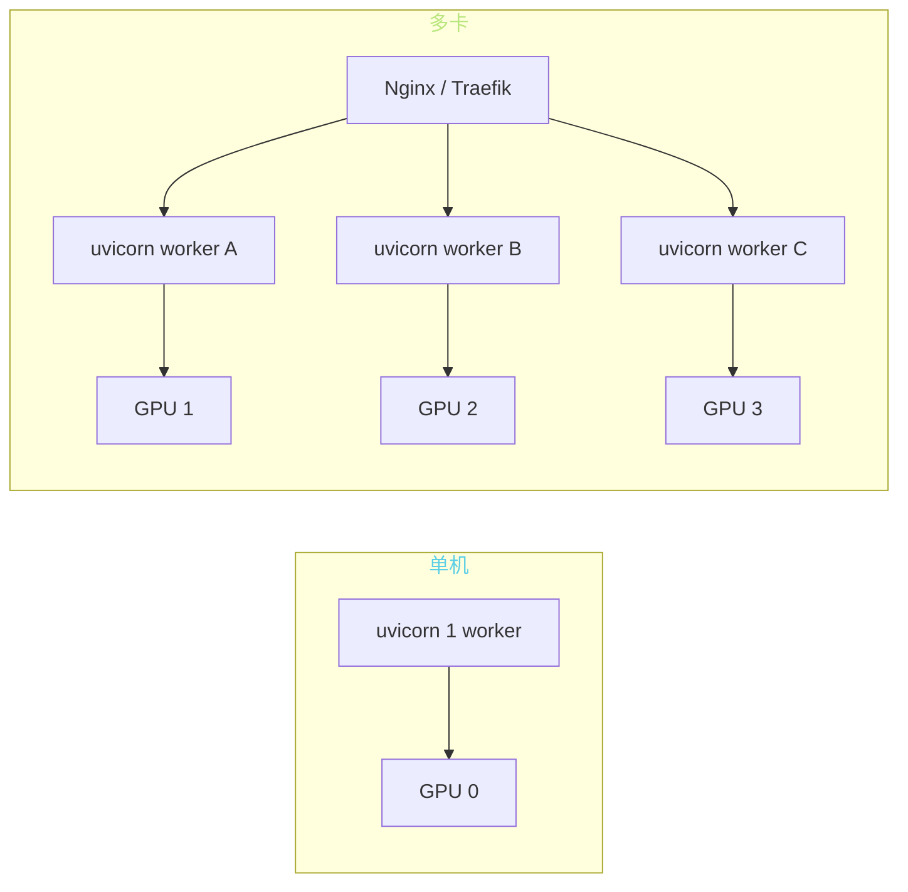

> 📎 **前置**：FastAPI；HTTP chunked transfer encoding；RESTful 设计；uvicorn / gunicorn；WebSocket。

## 0. 定位

> 「生产环境的入口。」`api.py` / `api_v2.py` 是服务部署的标准 HTTP API。WebUI 仅是调试玩具，真正面向客户端 / 微服务 / 移动 App 集成的入口在这里。本节系统拆解 v1 / v2 差异、端点设计、流式实现、部署模式。

## 1. v1 vs v2 完整对比

|项|[api.py](http://api.py) (v1)|**api_[v2.py](http://v2.py) (v2)**|
|---|---|---|
|HTTP 框架|Flask|**FastAPI**|
|ASGI 服务|—|uvicorn / hypercorn|
|端点设计|单 `/tts`|**RESTful 多端点**|
|**流式输出**|不支持|**chunked transfer**|
|**多参考音频**|不支持|**支持**|
|动态换模型|需重启|`**/set_*_weights**` **热切**|
|类型校验|手动|**Pydantic 自动**|
|OpenAPI 文档|无|`**/docs**` **自动生成**|
|异步并发|同步|**asyncio**|
|推荐使用|历史兼容|**首选**|

## 2. api_v2 端点详表

|端点|方法|作用|关键参数|
|---|---|---|---|
|`**/tts**`|POST/GET|主合成|text / ref_audio / cut / speed / cfg|
|`**/tts**` **(stream)**|POST|流式合成|`streaming_mode=true`|
|`/set_refer_audio`|POST|设默认 ref（连续多请求复用）|refer_wav_path|
|`/control`|POST|控制重启 / 释放|command: restart/exit|
|`/set_gpt_weights`|GET|**动态换 AR ckpt**|weights_path|
|`/set_sovits_weights`|GET|**动态换 SoVITS ckpt**|weights_path|
|`/docs`|GET|OpenAPI Swagger UI|—|

## 3. 主端点 `/tts` 请求示例

```bash
# 普通合成
curl -X POST http://localhost:9880/tts \
  -H 'Content-Type: application/json' \
  -d '{
    "text": "你好，世界。",
    "text_lang": "zh",
    "ref_audio_path": "/path/to/ref.wav",
    "prompt_text": "参考音频的转写文本",
    "prompt_lang": "zh",
    "top_k": 15,
    "top_p": 0.8,
    "temperature": 0.7,
    "speed_factor": 1.0,
    "streaming_mode": false
  }' --output result.wav
```

```bash
# 流式合成（chunked）
curl -X POST http://localhost:9880/tts \
  -H 'Content-Type: application/json' \
  -d '{"text":"...","streaming_mode":true}' \
  --output - | aplay -
```

## 4. 流式 / chunked 时序



## 5. 部署模式



|场景|推荐部署|QPS（V4）|
|---|---|---|
|开发 / 调试|uvicorn 1 worker|~1|
|**小流量生产**|uvicorn + asyncio 队列|**2–4**|
|中流量生产|多卡 + Nginx LB|~10/卡|
|高并发|Triton Inference Server|**~20/卡**|

## 6. 显存管理常见陷阱

> [⚠️] **单进程多 worker 各占显存 → GPU OOM**：FastAPI uvicorn workers 是进程级并发，每个 worker 加载一份模型 ~12 GB。1 卡只能 1 worker，否则 OOM。

> [💡] **推荐 1 worker + asyncio 队列**：单进程内用 asyncio.Queue 排队请求，模型仅加载一份，CPU/GPU 并行计算。QPS 取决于推理速度。

> [💡] **多卡部署用进程级 + Nginx**：每张卡跑一个 uvicorn 进程，前面挂 Nginx 反向代理负载均衡。简单可靠。

## 7. 全双工 / 双向交互

WebSocket 实现思路：

```python
@app.websocket('/ws/tts')
async def ws_tts(websocket: WebSocket):
    await websocket.accept()
    while True:
        msg = await websocket.receive_json()  # 接收文本
        async for chunk in tts_stream(msg['text']):
            await websocket.send_bytes(chunk)  # 推送音频
```

> [💡] **全双工（边收边发）需要 WebSocket**：HTTP chunked 是单向流式。仓库 `api_v3` 分支有实验性 WebSocket 实现，但官方未发布。

## 8. 监控指标

|指标|含义|报警阈值|
|---|---|---|
|**首包延迟 TTFB**|从请求到第一字节|> 1000 ms|
|**RTF**|音频时长 / 推理时长|< 3×|
|**GPU 利用率**|SM 占用|< 60% 或 > 95%|
|**显存峰值**|BigVGAN 段|> 14 GB|
|**P99 延迟**|—|> 5s|
|OOM 次数 / h|—|> 0|

## 9. 工程判断

> 🔧 **生产部署首选 api_[v2.py](http://v2.py) + FastAPI + uvicorn**：流式 + RESTful + 自动文档 + Pydantic 类型校验，是 2024+ 的标准选择。

> ⚠️ **单进程多 worker 会各占显存 → GPU OOM**：推荐 1 worker + asyncio 队列；多卡用进程级 + 反向代理。

> 💡 **全双工交互需要 WebSocket**：仓库 `api_v3` 分支有实验实现。HTTP chunked 仅适合单向流式（TTS 输出）。

> 🤔 **未来：Triton + TensorRT 部署**：把 AR + CFM + BigVGAN 三段都用 Triton ensemble + TensorRT 加速，单卡 QPS 可到 ~20。是大流量生产的合理目标，但 V4 需重写部分算子。

## 10. 子页面

[[9.3.1 端点设计（-tts - -control - -set_refer）|9.3.1 端点设计（-tts - -control - -set_refer）]]

[[9.3.2 流式 - Chunked 返回|9.3.2 流式 - Chunked 返回]]

## 参考文献

1. 仓库 `api.py` / `api_v2.py`

1. FastAPI: [https://fastapi.tiangolo.com](https://fastapi.tiangolo.com)

1. NVIDIA Triton Inference Server: [https://developer.nvidia.com/triton-inference-server](https://developer.nvidia.com/triton-inference-server)

1. HTTP/1.1 Chunked Transfer Encoding: RFC 7230 §4.1.