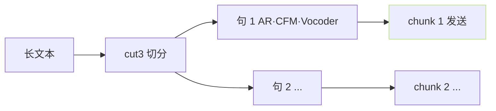
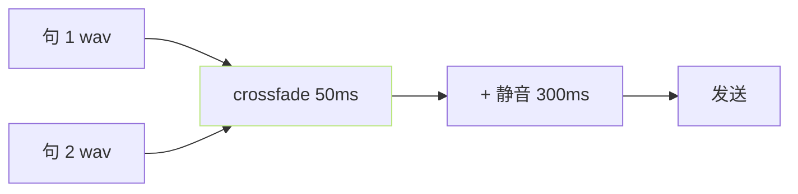

> [📎] 前置知识：Server-Sent Events (SSE)、Chunked Transfer Encoding、首包延迟 (TTFB)、送流帧与加缓。

> **定位**：流式推理是交互式产品的必需。本节拆 原理 · 实现 · 首包延迟 · 调优。

## 1. 流式原理



社区 以 句 为 单 位 边 生 成 边 发 送。

## 2. 两种技术选型

|技术|优|劣|推荐|
|---|---|---|---|
|**SSE**|HTTP/1.1 原生 · 简单|仅单向|**TTS 首选**|
|Chunked HTTP|不需 SSE 协议|需手拼头|API 需原生|
|WebSocket|双向|复杂 · 超限|不需|

## 3. 首包延迟 TTFB

```jsx
TTFB = ref_load + 1a + 1b + AR(首句) + CFM(首句) + Vocoder(首句) + 发送
```

|阶段|v1/v2 (4090)|v3/v4 (4090)|
|---|---|---|
|ref_load|50 ms|50 ms|
|1a/1b/AR prefill|100 ms|150 ms|
|AR 首句生成 (~50 token)|150 ms|200 ms|
|Decoder 首句|50 ms (VITS)|300 ms (CFM 8-step + BigVGAN)|
|**TTFB**|**~350 ms**|**~700 ms**|

## 4. 代码 (api_[v2.py](http://v2.py))

```python
from fastapi.responses import StreamingResponse
async def stream_tts(text, ref, ...):
    for chunk in cut_text(text, method='cut3'):
        wav = await infer_one_sentence(chunk, ref, ...)
        yield wav.tobytes()
        # 实现为 Python AsyncGenerator

@app.post('/tts')
async def tts_endpoint(req: TTSRequest):
    if req.streaming_mode:
        return StreamingResponse(
            stream_tts(**req.dict()),
            media_type='audio/wav',
        )
```

## 5. 发送帧选择

|粒度|TTFB|体验|
|---|---|---|
|**按句**|**中**|**社区首选**|
|按子句 (chunk)|低|拼接服务端纯压力高|
|按字|低|需 AR token-by-token 送 流|
|按帧 (raw PCM)|极低|需 vocoder 低 延 迟|

> [💡] **社区按句发送**：句是语义完整单位 · 拼接体验好。按字需 AR token 流 · 体验差 · 不推荐。

## 6. 加缓与拼接



见 [[8.5.1 Crossfade 拼接与静音插入|8.5.1 Crossfade 拼接与静音插入]] 与 [[8.5.2 语速控制实现（不改音调的变速）|8.5.2 语速控制实现（不改音调的变速）]]。

## 7. 调优

|调项|作用|
|---|---|
|预热 ref + ckpt|减首包 200 ms|
|cut3 (50字 上 限)|保 证 句 生 成 在 200 ms|
|多路预生成 句 2|提前趌入 上下一 句|
|压缩 ogg/aac|节省带宽|
|HTTP/2|多路复用|

## 8. 常见错误

|现象|原因|修复|
|---|---|---|
|首包 1500ms+|未预热|启动时预加载 ckpt|
|句间独独响|未 crossfade|加 50 ms cross + 300 ms 静 音|
|连接断|nginx timeout|proxy_buffering off + timeout=600s|
|OOM 多用户|KV cache 多人累加|限并发 · 队列|

## 9. 工程判断

> [🔧] **流式是交互式上限**：SSE + cut3 + crossfade 是 社 区 限 过 的 甜蜜点。v1/v2 TTFB 350 ms · v3/v4 700 ms 是作为同类产品中领先。跳 100 ms TTFB 需 TRT 量化 + KV cache 预热。

## 参考文献

1. MDN SSE. [https://developer.mozilla.org/en-US/docs/Web/API/Server-sent_events](https://developer.mozilla.org/en-US/docs/Web/API/Server-sent_events)

1. FastAPI StreamingResponse. [https://fastapi.tiangolo.com/advanced/custom-response/](https://fastapi.tiangolo.com/advanced/custom-response/)

1. GPT-SoVITS: `api_v2.py::stream_tts`.