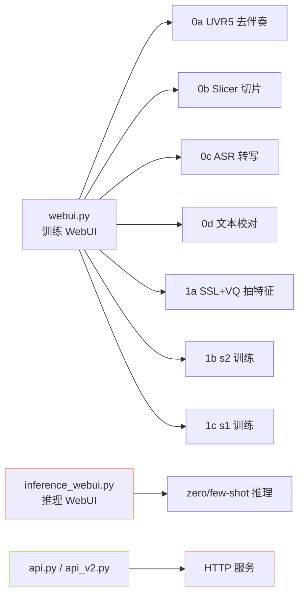

- Gradio: [https://www.gradio.app](https://www.gradio.app)

[[9.3 API 服务（api.py - api_v2.py）|9.3 API 服务（api.py - api_v2.py）]]

- UVR5: [https://github.com/Anjok07/ultimatevocalremovergui](https://github.com/Anjok07/ultimatevocalremovergui)

## 参考文献

- 仓库 `webui.py` / `inference_webui.py` / `api_v2.py`

[[9.2 推理 WebUI（inference_webui.py）|9.2 推理 WebUI（inference_webui.py）]]

> 📎 **前置知识**：已成功安装一键包；熟悉 Gradio；理解 ASR / UVR / Slicer 等数据预处理工具。

## 0. 定位

> 「让非工程师也能完成数据准备 → 训练 → 推理 → 上线 API 的全流程。」WebUI 把 CLI 工具封装成 0a~1c 八个 Tab，是 GPT-SoVITS 易用性护城河的关键。

## 1. WebUI 总览

## 2. 训练 WebUI 八 Tab

|Tab|工具|输入|产物|
|---|---|---|---|
|0a|UVR5 (MDX-Net)|原始 wav（含 BGM）|纯人声 wav|
|0b|Slicer|长 wav|静音切片 wav 列表|
|0c|ASR|wav 列表|`list` 文件 (path \|
|0d|文本校对|list|清洗后 list|
|1a|cnhubert + VQ|wav + list|`semantic.tsv`|
|1b|s2_[train.py](http://train.py)|semantic + mel|`s2G.pth` / `s2D.pth`|
|1c|s1_[train.py](http://train.py)|semantic + phoneme + BERT|`s1.ckpt`|

## 3. API 服务对比

|接口|框架|流式|并发|推荐场景|
|---|---|---|---|---|
|`api.py`|Flask|❌|低|demo / 脚本|
|`api_v2.py`|FastAPI + asyncio|✅ chunk 流式|高|生产|

## 4. 工程判断

> 🔧 **生产部署选 v2 API**：`api_v2.py` 支持流式、首包延迟 <500ms，且参数全面（`top_k` / `top_p` / `T` / `rep` / `cfg`）。`api.py` 仅适合本地 demo。

> ⚠️ **WebUI 多用户冲突**：单进程 Gradio 不支持并发训练，多人协作请用 jupyter 或 docker 隔离实例。

> 💡 **一键包的工程哲学**：把 Python + CUDA + 全部依赖 + WebUI 打包成 Windows `.exe`，让小白用户也能在 5 分钟内跑起来，是 GPT-SoVITS 生态爆发的关键加速器。

## 5. 子页面导航

[[9.1 训练 WebUI（0a–1c Tab）|9.1 训练 WebUI（0a–1c Tab）]]