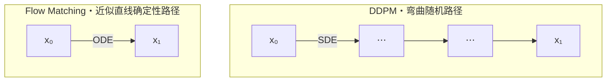
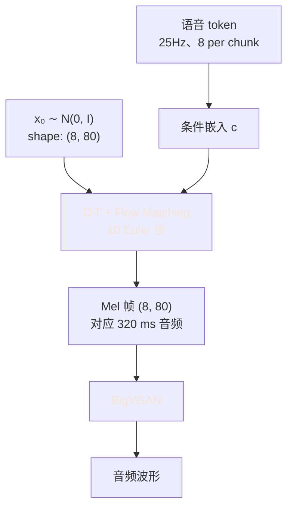

## 前置知识

> [!important]
> 
> 阅读本页前建议先读：[[DL/TTS/Qwen3-TTS Technical Report/Qwen3-TTS 模型组件架构细节/DiT（Diffusion Transformer）在语音合成中的应用详解/DiT（Diffusion Transformer）在语音合成中的应用详解|DiT（Diffusion Transformer）在语音合成中的应用详解]]。对常微分方程（ODE）有基础理解。

---

## 0. 定位

> 本页从**连续归一化流**的视角系统推导 Flow Matching（FM）的训练目标与推理算法，对比其与 DDPM 的区别，并给出 Qwen3-TTS 25Hz 解码管线中的具体使用方式。

---

## 1. 变量定义表

|**符号**|**含义**|
|---|---|
|$\mathbf{x}_1 \sim p_1$|数据分布样本（目标：Mel 帧分布）|
|$u_t(\mathbf{x})$|真实速度场（想要学习的目标）|
|$\mathbf{c}$|条件（Qwen3-TTS 中为语音 token 序列）|

---

## 2. 从 ODE 视角看生成建模

### 2.1 核心思想

定义一个**时间依赖的速度场** $v: \mathbb{R}^d \times [0,1] \to \mathbb{R}^d$，确定一条 ODE：

$$\frac{d\mathbf{x}_t}{dt} = v(\mathbf{x}_t, t), \quad \mathbf{x}_0 \sim p_0$$

若 $v$ 选得合适，从 $t=0$ 积分到 $t=1$，就能把先验分布 $p_0$ 传送到数据分布 $p_1$。

### 2.2 两种生成范式的对比

|**范式**|**动力**|**训练目标**|**采样方程**|DDPM|SDE（随机）|预测噪声 $\epsilon$|逆时 SDE，多步采样|
|---|---|---|---|---|---|---|---|
|**Flow Matching**|**ODE（确定）**|**预测速度场**|**确定性 ODE，步数更少**|Score-based|SDE|预测 score $\nabla \log p$|Langevin/逆 SDE|

---

## 3. Flow Matching 的基本目标

### 3.1 理想目标

若已知真实速度场 $u_t(\mathbf{x})$（在 $t$ 时刻致使 $p_t$ 的路径场），目标是用神经网络 $v_\theta$ 拟合：

$$\mathcal{L}_{\text{FM}}(\theta) = \mathbb{E}_{t \sim \mathcal{U}[0,1], \mathbf{x}_t \sim p_t} \left[ \| v_\theta(\mathbf{x}_t, t) - u_t(\mathbf{x}_t) \|_2^2 \right]$$

问题：$u_t(\mathbf{x})$ 和 $p_t$ 都是隐性对象，直接计算不可行。

### 3.2 Conditional Flow Matching（关键突破）

Lipman et al. (ICLR 2023) 证明：**条件路径上**的回归损失与边际损失有**相同的梯度**。即定义：

$$\mathcal{L}_{\text{CFM}}(\theta) = \mathbb{E}_{t, \mathbf{x}_1 \sim p_1, \mathbf{x}_t \sim p_t(\cdot | \mathbf{x}_1)} \left[ \| v_\theta(\mathbf{x}_t, t) - u_t(\mathbf{x}_t | \mathbf{x}_1) \|_2^2 \right]$$

其中 $u_t(\mathbf{x} | \mathbf{x}_1)$ 是**给定终点** $\mathbf{x}_1$ **的条件速度场**，可以显式写出。与边际损失同梯度，但可实计算。

---

## 4. 线性插值路径（最常用选择）

### 4.1 路径定义

定义线性插值：

$$\mathbf{x}_t = (1-t)\mathbf{x}_0 + t\mathbf{x}_1, \quad \mathbf{x}_0 \sim \mathcal{N}(0, \mathbf{I})$$

对 $t$ 求导，得到条件速度场：

$$u_t(\mathbf{x}_t | \mathbf{x}_1) = \mathbf{x}_1 - \mathbf{x}_0$$

> [!important]
> 
> **惊人地简单**：条件速度场就是目标 − 起点，与 $t$ 无关！这就是「**Rectified Flow**」的来源（Liu et al., 2023）：每条条件路径都是**直线**，不走弯路。

### 4.2 实用损失

代入后，FM 损失变为：

$$\mathcal{L}_{\text{CFM}}(\theta) = \mathbb{E}_{t, \mathbf{x}_0, \mathbf{x}_1} \left[ \| v_\theta((1-t)\mathbf{x}_0 + t\mathbf{x}_1, t, \mathbf{c}) - (\mathbf{x}_1 - \mathbf{x}_0) \|_2^2 \right]$$

每一步训练的算法：

1. 采样数据点 $\mathbf{x}_1$（Mel 帧）

1. 采样噪声 $\mathbf{x}_0 \sim \mathcal{N}(0, \mathbf{I})$

1. 采样时间 $t \sim \mathcal{U}[0,1]$

1. 构造插值 $\mathbf{x}_t = (1-t)\mathbf{x}_0 + t\mathbf{x}_1$

1. 计算损失 $\| v_\theta(\mathbf{x}_t, t, \mathbf{c}) - (\mathbf{x}_1 - \mathbf{x}_0) \|^2$

![[2026-04-18 09.59.05流式匹配.excalidraw|600]]

---

## 5. 推理：ODE 积分

### 5.1 Euler 法（最简单）

从 $t=0, \mathbf{x}_0 \sim \mathcal{N}(0, \mathbf{I})$ 开始，积分 $N$ 步：

$$\mathbf{x}_{t + \Delta t} = \mathbf{x}_t + v_\theta(\mathbf{x}_t, t, \mathbf{c}) \cdot \Delta t, \quad \Delta t = 1/N$$

$N$ 越大精度越高但越慢。线性插值条件下，$N=10$ **已经能给出与** $N=1000$ **相当的质量**，这是 FM 相对 DDPM 的核心效率优势。

### 5.2 高阶积分（选配）

可用 Heun 法、RK4 或自适应步长积分器。在 Qwen3-TTS 中通常采用步数 10–20 的 Euler 法，开销极低。

### 5.3 Classifier-Free Guidance（CFG）

$$v_{\text{cfg}}(\mathbf{x}, t, \mathbf{c}) = (1+w) \cdot v_\theta(\mathbf{x}, t, \mathbf{c}) - w \cdot v_\theta(\mathbf{x}, t, \emptyset)$$

$w$ 为引导强度。有助于提升条件跟随质量，代价是每步计算量翻倍。在 Qwen3-TTS 中为了延迟考虑通常 $w$ 取较小值或不开启 CFG。

---

## 6. 为什么 FM 比 DDPM 高效？

### 6.1 路径曲直比较



- DDPM 的学习路径由 SDE 决定，弯曲且随机，需要**50–1000 步**才能走准。

- FM 的路径接近直线，**10–20 步**即可到达数据分布。

### 6.2 数学直觉

ODE 的误差累积为 $O(\Delta t^p)$（$p$ 为积分器阶数）。SDE 的误差累积为 $O(\sqrt{\Delta t})$。直线路径同时满足：

- 每点的真实速度容易学习（方向稳定）

- 线性 Euler 法在直线上即是精确解

---

## 7. Qwen3-TTS 中的具体应用

### 7.1 解码流程



### 7.2 Chunk-wise 注意力与 FM 的结合

DiT 中的逐步积分与滑动窗口注意力共同作用：

- **每个 chunk 的 10 步 Euler 积分**独立进行（batched over $t$）

- **Chunk 间依赖通过滑动窗口注意力**传递

- 实测解码延迟仅 15ms（见主页表格）

---

## 8. 最小 PyTorch 实现

```python
import torch
import torch.nn as nn

class FlowMatchingDiT(nn.Module):
    """极简 Flow Matching + Transformer 骨干。"""
    def __init__(self, dim: int = 80, hidden: int = 512, n_layers: int = 6):
        super().__init__()
        self.in_proj = nn.Linear(dim, hidden)
        self.time_embed = nn.Sequential(
            nn.Linear(1, hidden), nn.SiLU(), nn.Linear(hidden, hidden)
        )
        layer = nn.TransformerEncoderLayer(hidden, nhead=8, batch_first=True)
        self.blocks = nn.TransformerEncoder(layer, num_layers=n_layers)
        self.out_proj = nn.Linear(hidden, dim)

    def forward(self, x_t, t, cond):
        # x_t: (B, T, dim), t: (B,), cond: (B, T, hidden)
        h = self.in_proj(x_t) + self.time_embed(t.view(-1, 1)).unsqueeze(1) + cond
        h = self.blocks(h)
        return self.out_proj(h)                      # 预测速度 v


def train_step(model, x_1, cond):
    B, T, D = x_1.shape
    t = torch.rand(B, device=x_1.device)             # t ~ U[0,1]
    x_0 = torch.randn_like(x_1)                      # x_0 ~ N(0, I)
    x_t = (1 - t.view(B, 1, 1)) * x_0 + t.view(B, 1, 1) * x_1
    target_v = x_1 - x_0                             # 条件速度场
    pred_v = model(x_t, t, cond)
    return ((pred_v - target_v) ** 2).mean()         # MSE 损失


@torch.no_grad()
def sample(model, cond, shape, n_steps: int = 10):
    x = torch.randn(shape, device=cond.device)       # 从噪声开始
    dt = 1.0 / n_steps
    for i in range(n_steps):
        t = torch.full((shape[0],), i * dt, device=cond.device)
        v = model(x, t, cond)
        x = x + v * dt                               # Euler 步
    return x                                         # 生成的 Mel
```

> [!important]
> 
> **实现注意**：生产级实现需要更复杂的时间嵌入（sinusoidal + MLP）、AdaLN-Zero、分块因果注意力、EMA、混合精度等。上面的代码仅为数学感知用。

---

## 9. Rectified Flow：进一步直化路径

Liu et al. (2023) 的 **Reflow** 手法：

1. 用 FM 训练出模型 $v_\theta^{(1)}$

1. 用该模型采样大量成对 $(\mathbf{x}_0, \mathbf{x}_1)$

1. 在这些成对上重新训练 $v_\theta^{(2)}$，路径更直

1. 可单步或 2 步采样

Stable Diffusion 3 的 **Scaling Rectified Flow Transformers** (Esser et al., 2024) 即属于此类方法。Qwen3-TTS 报告未明言是否用 Reflow，但 10 步采样的效率表现暗示采用了类似直化策略。

---

## 10. 关键结论与设计价值

> [!important]
> 
> **Flow Matching 在 Qwen3-TTS 中的价值**
> 
> 1. **步数少**：10 步达到 DDPM 的 50–100 步的质量，解码延迟从 ~50ms 降到 ~15ms
> 
> 1. **路径确定**：生成质量方差小，更稳定
> 
> 1. **可与 Transformer 深度整合**：DiT 的扩展性与 FM 的高效性形成组合拳
> 
> 1. **简单的训练目标**：MSE 损失，无需预定频率调度和众多超参

---

## 延伸阅读

- [[DL/TTS/Qwen3-TTS Technical Report/Qwen3-TTS 模型组件架构细节/DiT（Diffusion Transformer）在语音合成中的应用详解/DiT（Diffusion Transformer）在语音合成中的应用详解|DiT（Diffusion Transformer）在语音合成中的应用详解]]：架构主页

- [[Qwen3-TTS 流式效率与部署]]：FM 在 25Hz 管线中的延迟贡献

---

## 参考文献

1. Lipman, Y. et al. _Flow Matching for Generative Modeling_. ICLR 2023. arXiv:2210.02747.

1. Liu, X. et al. _Rectified Flow: A Marginal Preserving Approach to Optimal Transport_. NeurIPS 2023.

1. Esser, P. et al. _Scaling Rectified Flow Transformers for High-Resolution Image Synthesis_ (SD3). 2024.

1. Peebles & Xie. _Scalable Diffusion Models with Transformers_ (DiT). ICCV 2023.

1. Ho et al. _Denoising Diffusion Probabilistic Models_. NeurIPS 2020 (DDPM 基础).