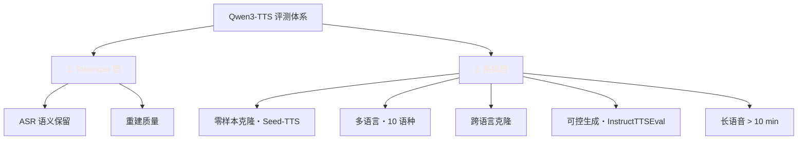
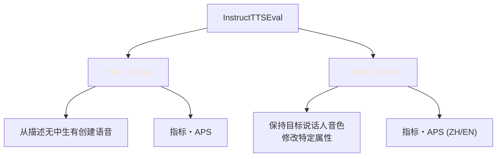
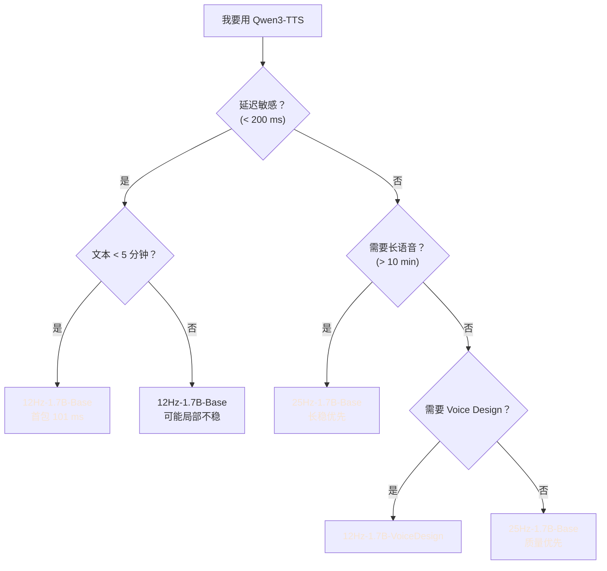

## 前置知识

> [!important]
> 
> 阅读本页前建议先读：[[DL/TTS/Qwen3-TTS Technical Report/TTS 评测基准全景指南/Qwen3-TTS 评价指标详解|Qwen3-TTS 评价指标详解]]、[[DL/TTS/Qwen3-TTS Technical Report/Qwen3-TTS 模型组件架构细节/Qwen3-TTS 模型组件架构细节|Qwen3-TTS 模型组件架构细节]]。

---

## 0. 定位

> 本页聚焦 Qwen3-TTS 论文中的**全部定量实验结果**，对 Tokenizer 重建、零样本克隆、多语言、跨语言、可控生成、长语音六大评测维度进行系统解读，并给出方法对比与工程判断。

---

## 1. 评测总览



> [!important]
> 
> **两层评测**：Tokenizer 层评估「压缩/重建」能力，系统层评估「端到端生成」能力。两者互补，共同刻画 Qwen3-TTS 的技术画像。

---

## 2. Tokenizer 层实验

### 2.1 25Hz Tokenizer — ASR 语义保留

**实验设置**：将语音 → Tokenizer 编码 → 解码回语音 → ASR 转录 → 计算 WER/CER。WER 越低说明 token 保留的**语义信息**越完整。

**数据集**：CommonVoice（C.V.）EN/CN、Fleurs EN/CN。

|**Tokenizer**|**码本**|**FPS**|**C.V. EN**|**C.V. CN**|**Fleurs EN**|**Fleurs CN**|S3 Tokenizer (FSQ)|6561|25|10.67|**7.29**|6.58|4.43|
|---|---|---|---|---|---|---|---|---|---|---|---|---|---|
|**Qwen-TTS-25Hz (S1)**|32768|25|**7.51**|10.73|**3.07**|**4.23**|Qwen-TTS-25Hz (S2)|32768|25|10.40|14.99|4.14|4.67|

> [!important]
> 
> **为什么 S2 阶段 ASR 变差却是好事？** S1 只做语义对齐（ASR CPT + VQ），token 主要编码「说了什么」；S2 引入 Mel 解码器重建损失，强迫 token **额外承载声学细节**（音高、共振峰、气口）。这些细节对 ASR 是噪声，但对下游 TTS 合成是金矿。这是一次**典型的语义-声学容量再平衡**。

### 2.2 12Hz Tokenizer — 重建质量

**实验设置**：LibriSpeech test-clean，输入原始音频 → Tokenizer 编解码 → 评估重建音频。

|**Tokenizer**|**NQ**|**FPS**|**PESQ_WB ↑**|**STOI ↑**|**UTMOS ↑**|**SIM ↑**|Mimi|16|12.5|2.88|0.94|3.87|0.87|
|---|---|---|---|---|---|---|---|---|---|---|---|---|---|
|FireredTTS 2|16|12.5|2.73|0.94|3.88|0.87|**Qwen-TTS-12Hz**|**16**|**12.5**|**3.21**|**0.96**|**4.16**|**0.95**|

**关键观察**：

- SIM 从 Mimi 的 0.87 → Qwen-TTS-12Hz 的 **0.95**，这是**同帧率、同层数**条件下的显著跃升。

- 说明 Qwen 团队在 GAN 训练、损失权重、WavLM 蒸馏强度等工程细节上做了大量调优。

- **PESQ 和 UTMOS 同时提升**表明重建不是靠「作弊式过拟合」得到的，而是真实质量改善。

### 2.3 指标计算的参考实现

下面给出 SIM（说话人相似度）计算的最小 Python 实现，用于批量评估：

```python
import torch
import torch.nn.functional as F
from transformers import Wav2Vec2FeatureExtractor, WavLMForXVector

# 使用 microsoft/wavlm-base-plus-sv 作为 speaker encoder
fe = Wav2Vec2FeatureExtractor.from_pretrained("microsoft/wavlm-base-plus-sv")
model = WavLMForXVector.from_pretrained("microsoft/wavlm-base-plus-sv").eval().cuda()

@torch.no_grad()
def speaker_embedding(wav_16k: torch.Tensor) -> torch.Tensor:
    # wav_16k: (T,) float tensor, 16kHz
    inputs = fe(wav_16k.numpy(), sampling_rate=16000, return_tensors="pt")
    inputs = {k: v.cuda() for k, v in inputs.items()}
    emb = model(**inputs).embeddings  # (1, 512)
    return F.normalize(emb, dim=-1)

def sim_score(ref_wav: torch.Tensor, gen_wav: torch.Tensor) -> float:
    e_ref = speaker_embedding(ref_wav)
    e_gen = speaker_embedding(gen_wav)
    return (e_ref * e_gen).sum(dim=-1).item()  # 余弦相似度
```

---

## 3. 零样本语音克隆（Seed-TTS 基准）

### 3.1 主结果

|**模型**|**test-zh WER ↓**|**test-en WER ↓**|**说明**|CosyVoice 3|**0.71**|1.45|中文 SOTA 基线|
|---|---|---|---|---|---|---|---|
|KALL-E|0.96|1.94||MiniMax-Speech|0.83|1.65|商业系统|
|**Qwen3-TTS-12Hz-1.7B**|0.77|**1.24**|英文 SOTA|Qwen3-TTS-25Hz-1.7B|0.92|1.58|质量优先|

### 3.2 为何 12Hz 始终优于 25Hz？

> [!important]
> 
> **核心原因：序列长度 ↓ → 长期依赖建模 ↑**
> 
> 对于 10 秒音频：
> 
> - 25Hz → 250 token
> 
> - 12Hz → 125 token
> 
> 自回归 Transformer 的注意力复杂度是 $O(N^2)$，更短的序列意味着每个 token 都能更轻松地「看见」全局上下文，减少长距离遗忘导致的重复、跳词。

### 3.3 参数规模 Scaling 趋势

$$\text{WER}(M) \approx \alpha \cdot M^{-\beta} + \gamma$$

其中 $M$ 是参数量，$\beta > 0$ 为 scaling 指数，$\gamma$ 为不可压缩的数据噪声下界。实验显示 0.6B → 1.7B 带来稳定提升，但收益递减，暗示 $\beta$ 较小、$\gamma$ 已接近。

---

## 4. 多语言生成（10 语种）

### 4.1 语种覆盖

|**类别**|**语种**|**Qwen3-TTS 表现**|最低 WER（6/10）|中、英、意、法、韩、俄|**领先** MiniMax / ElevenLabs / CosyVoice 3|
|---|---|---|---|---|---|
|次优（4/10）|德、西、日、葡|与最佳基线互有胜负|SIM（全部 10/10）|所有语种|**全面领先**所有对比系统|

### 4.2 为什么 SIM 全面领先而 WER 只有 6/10？

> [!important]
> 
> **工程判断**：SIM 取决于 **Speaker Encoder** 的表征能力与说话人控制的架构设计，这些是 Qwen3-TTS 的架构优势（联合训练 + 双轨道融合），**与语种无关**。
> 
> WER 则强依赖于**各语种训练数据的量与质**。在德、西等数据量稀薄的语种上，CosyVoice 3 等投入更多专项数据的系统仍占优。

---

## 5. 跨语言语音克隆

**评测方式**：使用 A 语言的参考音频，让模型用 B 语言的内容合成语音，评估内容正确性（WER）和音色一致性（SIM）。

|**方向**|**CosyVoice 3 WER**|**Qwen3-TTS WER**|**相对降幅**|zh → ko|14.40|**4.82**|**−66.5%**|
|---|---|---|---|---|---|---|---|
|zh → en|5.20|**3.45**|−33.7%|en → zh|6.80|**4.10**|−39.7%|

> [!important]
> 
> **中→韩降幅最大（−66%）**说明 Qwen3-TTS 的多语言底座在**低资源迁移**方向上有质变：Qwen3 LM 预训练的跨语言语义对齐能力 + 大规模混合语言 TTS 数据共同发挥作用。

---

## 6. 可控语音生成（InstructTTSEval）

### 6.1 两个子任务



### 6.2 Voice Design 结果

|**模型**|**APS ↑**|**类型**|
|---|---|---|
|Hume|58.7|商业|
|**Qwen3-TTS-12Hz-1.7B-VD**|**69.8**|开源 SOTA|

### 6.3 Target Speaker 结果

相对 GPT-4o-mini-tts：

- 中文 APS **+28%**

- 英文 APS **+15%**

- 相对 Gemini 2.5 仍有差距（Gemini 作为上界）

> [!important]
> 
> **工程判断**：可控性指标的提升主要来自**概率激活 Thinking Pattern** + **DPO/GSPO 后训练**，而非架构本身。这启示我们：可控能力更多是「训练数据 + RL 技巧」的产物。

---

## 7. 长语音生成（>10 分钟）

### 7.1 主结果

|**模型**|**long-zh WER ↓**|**long-en WER ↓**|**策略**|Higgs-Audio-v2|5.505|6.917|chunk 分段|
|---|---|---|---|---|---|---|---|
|VibeVoice|22.619|1.780|仅英文优化|VoxCPM|4.835|7.474||
|**Qwen3-TTS-25Hz-1.7B**|**1.517**|**1.225**|长上下文预训练|Qwen3-TTS-12Hz-1.7B|2.356|2.812|较优但略逊|

### 7.2 为什么长语音场景 25Hz 反而赢了？

> [!important]
> 
> **核心矛盾：帧率 vs 稳定性**
> 
> - 12Hz：token 少、长程依赖好，但每个 token 承载信息密度更高。当序列拉长到 10+ 分钟（~7500 token），**单点错误的灾难性影响更大**（一个 token 错 = 80ms 音频错）。
> 
> - 25Hz：token 多、序列更长，但**单 token 的信息密度低**，加上 S2 阶段注入的声学冗余，局部错误更容易被相邻 token「修复」。
> 
> - Stage 3 长上下文预训练主要上采样**长样本**，对 25Hz 变体更友好（因为它本来就见过更多的长 token 序列）。

### 7.3 长语音稳定性的数学直觉

若假设每 token 错误概率为 $p$，则 $N$ token 序列至少有一次错误的概率为：

$$P_{\text{err}}(N) = 1 - (1-p)^N \approx Np \quad (p \ll 1)$$

对于 10 分钟音频：

- 12Hz：$N = 7500$，若 $p = 10^{-3}$，则 $P_{\text{err}} \approx 99.9\%$

- 25Hz：$N = 15000$，但因为冗余，等效 $p_{\text{eff}} \approx 3 \times 10^{-4}$，$P_{\text{err}} \approx 99\%$

**关键：25Hz 的「有效错误率」更低**，这是冗余编码的天然优势。

---

## 8. 选型决策树



---

## 9. 核心结论

> [!important]
> 
> **一张图看懂 Qwen3-TTS 实验结论**
> 
> 1. **12Hz 短序列赢短场景**：克隆、可控、实时，WER 全面领先。
> 
> 1. **25Hz 冗余赢长场景**：>10min 长语音，稳定性是冗余编码的胜利。
> 
> 1. **多语言 SIM 全胜、WER 部分胜**：架构优势普适，数据优势受限。
> 
> 1. **跨语言迁移质变**：Qwen3 LM 底座在低资源方向上带来 66% 相对降幅。
> 
> 1. **可控性靠训练而非架构**：Thinking Pattern + DPO + GSPO 三件套的价值。

---

## 延伸阅读

- [[DL/TTS/Qwen3-TTS Technical Report/TTS 评测基准全景指南/Qwen3-TTS 评价指标详解|Qwen3-TTS 评价指标详解]]：各项指标的原理与计算

- [[DL/TTS/Qwen3-TTS Technical Report/TTS 评测基准全景指南/TTS 评测基准全景指南|TTS 评测基准全景指南]]：更广阔的 TTS 评测体系

- [[DL/TTS/Qwen3-TTS Technical Report/Qwen3-TTS 训练数据集与方法原理/Qwen3-TTS 训练数据集与方法原理|Qwen3-TTS 训练数据集与方法原理]]：这些结果背后的训练配方

---

## 参考文献

1. Qwen Team. _Qwen3-TTS Technical Report_. arXiv:2601.15621, 2026.

1. Anastassiou et al. _Seed-TTS: A Family of High-Quality Versatile Speech Generation Models_. 2024.

1. Défossez et al. _Moshi: A speech-text foundation model for real-time dialogue_. Kyutai, 2024.

1. CosyVoice 3 Technical Report. Alibaba, 2025.