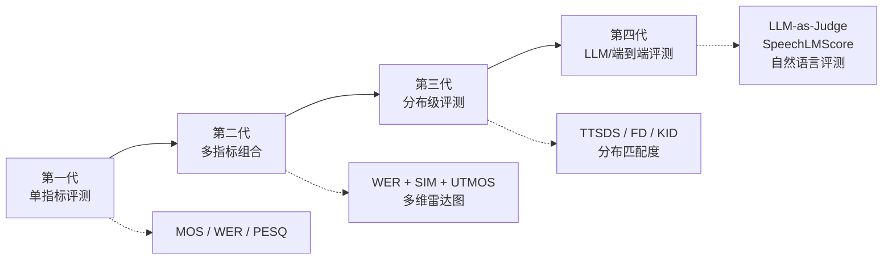
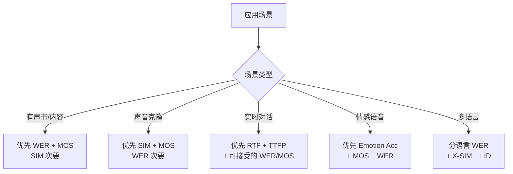

TTS 评测体系正在经历范式转变——从单一指标到多维度聚合，从人工评测到 LLM-as-Judge，从样本级评分到分布级质量度量。本页梳理评测领域的前沿趋势、新兴方法论与仍未解决的开放挑战。

---

## 1. 评测范式演进



---

## 2. LLM-as-Judge：大模型评测语音

### 2.1 核心思想

> [!important]
> 
> **LLM-as-Judge** 将语音理解大模型（如 Qwen2-Audio、GPT-4o、Gemini）作为评测器，用自然语言描述语音质量，取代传统数值指标。

**典型流程**：

1. 将合成语音输入多模态 LLM

1. LLM 输出自然语言评价（"这段语音清晰自然，但语速偏快，情感表达略显平淡"）

1. 结构化提取评分或直接用于 A/B 偏好判断

### 2.2 方法分类

|**方法**|**模型**|**输入**|**输出**|**优势**|
|---|---|---|---|---|
|**直接评分**|GPT-4o / Gemini|音频 + 评分 Prompt|1-5 分|简单易用|
|**A/B 偏好**|GPT-4o / Qwen2-Audio|两段音频 + 比较 Prompt|偏好判断|更稳定，减少尺度偏差|
|**自然语言描述**|Qwen2-Audio / SALMONN|音频 + "请描述语音质量"|文本描述|可解释性强|
|**多维度评估**|UltraEval-Audio|音频 + 多维 Prompt|各维度评分|细粒度诊断|

### 2.3 SpeechLMScore

> [!important]
> 
> **SpeechLMScore** 利用语音语言模型的困惑度（perplexity）评估语音自然度——合成语音越自然，语音 LM 的困惑度越低。

$\text{SpeechLMScore} = -\frac{1}{T} \sum_{t=1}^{T} \log P(x_t | x_{<t})$

其中 $x_t$ 是语音 token，$P$ 来自预训练的语音语言模型。

**特点**：

- 完全无参考

- 不需要 ASR 或 MOS 标签

- 可捕捉韵律/流畅度等 WER 无法检测的问题

- 但对内容准确性不敏感

### 2.4 LLM-as-Judge Python 示例

```Python
import openai
import base64

def llm_judge_tts(
    audio_path: str,
    reference_text: str,
    model: str = "gpt-4o-audio-preview"
) -> dict:
    """使用 GPT-4o 评测 TTS 语音质量"""
    with open(audio_path, "rb") as f:
        audio_b64 = base64.b64encode(f.read()).decode()
    
    prompt = f"""请评估以下合成语音的质量。目标文本为："{reference_text}"

请从以下 5 个维度进行 1-5 分评分，并给出简短理由：
1. 内容准确性：合成内容是否与目标文本一致
2. 自然度：语音是否自然流畅
3. 音质：是否有噪声/失真
4. 韵律：语调、节奏是否恰当
5. 整体质量：综合评价

请以 JSON 格式返回。"""
    
    response = openai.chat.completions.create(
        model=model,
        messages=[{
            "role": "user",
            "content": [
                {"type": "text", "text": prompt},
                {
                    "type": "input_audio",
                    "input_audio": {
                        "data": audio_b64,
                        "format": "wav"
                    }
                }
            ]
        }],
        response_format={"type": "json_object"}
    )
    
    return response.choices[0].message.content
```

---

## 3. 分布级评测方法

### 3.1 为什么需要分布级评测？

> [!important]
> 
> 传统指标（WER、SIM、UTMOS）是**样本级**的——对每条语音独立评分再取平均。但这忽略了**分布级**的问题：模型生成的语音分布是否覆盖了人类语音的多样性？

例如：一个模型所有样本 UTMOS 都是 3.8（平均 3.8），另一个模型有些 4.5 有些 3.0（平均也是 3.8）。样本级平均无法区分这两种情况。

### 3.2 TTSDS（Text-to-Speech Distribution Score）

TTSDS2（arXiv: 2506.19441）将 TTS 评测建模为分布匹配问题：

$\text{TTSDS} = f(\text{FD}_{\text{prosody}}, \text{FD}_{\text{speaker}}, \text{FD}_{\text{environment}}, \text{FD}_{\text{noise}})$

**核心步骤**：

1. 从参考语音集提取多维特征分布

1. 从合成语音集提取相同特征分布

1. 计算各维度的 Fréchet Distance (FD)

1. 综合加权得到 TTSDS Score

### 3.3 Fréchet 距离系列

|**指标**|**特征提取器**|**评测维度**|**类比**|
|---|---|---|---|
|**Fréchet Audio Distance (FAD)**|VGGish|音频整体分布|类似 CV 中的 FID|
|**Fréchet Speech Distance (FSD)**|WavLM / HuBERT|语音特征分布|语音专用 FAD|
|**Fréchet DeepSpeech Distance (FDSD)**|DeepSpeech|内容分布|侧重语言内容|
|**Kernel Inception Distance (KID)**|多种|分布差异（无偏）|KID 在小样本下比 FD 更稳定|

### 3.4 FD 计算示例

```Python
import numpy as np
from scipy.linalg import sqrtm

def frechet_distance(
    mu1: np.ndarray, sigma1: np.ndarray,
    mu2: np.ndarray, sigma2: np.ndarray
) -> float:
    """计算两个高斯分布之间的 Fréchet Distance"""
    diff = mu1 - mu2
    covmean = sqrtm(sigma1 @ sigma2)
    
    # 处理数值问题
    if np.iscomplexobj(covmean):
        covmean = covmean.real
    
    fd = diff @ diff + np.trace(sigma1 + sigma2 - 2 * covmean)
    return float(fd)

def compute_fad(
    real_embeddings: np.ndarray,   # (N, D)
    fake_embeddings: np.ndarray,   # (M, D)
) -> float:
    """计算 Fréchet Audio Distance"""
    mu_real = real_embeddings.mean(axis=0)
    sigma_real = np.cov(real_embeddings, rowvar=False)
    
    mu_fake = fake_embeddings.mean(axis=0)
    sigma_fake = np.cov(fake_embeddings, rowvar=False)
    
    return frechet_distance(mu_real, sigma_real, mu_fake, sigma_fake)
```

---

## 4. VERSA：统一评测框架

> [!important]
> 
> **VERSA**（Versatile Evaluation of Speech and Audio）是 ESPnet 团队推出的统一语音评测框架，集成了 50+ 指标。

**支持的指标类别**：

- 信号级：PESQ, STOI, SI-SDR, ViSQOL

- 无参考 MOS：UTMOS, DNSMOS, NISQA

- 说话人：SIM (多种编码器)

- 内容：WER (多种 ASR)

- 分布级：FAD, FSD, KID

- 韵律：F0 metrics, duration metrics

- LLM 评测：GPT-4o, Qwen2-Audio

```Python
# VERSA 使用示例
from versa import EvalManager

manager = EvalManager(
    metrics=[
        "pesq", "utmos", "wer_whisper", 
        "sim_wavlm", "fad_vggish", "f0_rmse"
    ]
)

results = manager.evaluate(
    gen_dir="./generated",
    ref_dir="./reference",     # 可选
    metadata="./metadata.json"
)

# 输出多维度报告
results.to_report("evaluation_report.html")
```

---

## 5. QualiSpeech：语音质量推理

> [!important]
> 
> **QualiSpeech**（2025）提出了一个新范式：不仅评分，还要求模型**用自然语言解释**为什么给出这个分数——实现语音质量推理。

评测维度：

- **Quality Score**：1-5 分 MOS 预测

- **Quality Description**：自然语言描述质量问题

- **Quality Reasoning**：解释质量评分的依据

---

## 6. 人机对齐：指标与人类感知的 Gap

### 6.1 已知的对齐问题

|**指标**|**与 MOS 相关性**|**已知盲区**|
|---|---|---|
|WER|中等（~0.6）|WER=0 不等于自然；无法检测韵律/情感问题|
|SIM|低-中（~0.4）|高 SIM 可能伴随低自然度；不同编码器结果差异大|
|UTMOS|较高（~0.8）|在非英语上泛化差；对特定失真不敏感|
|PESQ|高（~0.85）|需要参考音频；对合成语音的评分尺度与自然语音不同|
|DNSMOS|中-高（~0.7）|主要针对降噪场景设计，对 TTS 特有问题不敏感|

### 6.2 WER-SIM Trade-off

> [!important]
> 
> **关键发现**（来自 Seed-TTS Eval 论文）：WER 和 SIM 之间存在显著的 trade-off——过度优化说话人相似度（SIM↑）会牺牲内容准确性（WER↑），反之亦然。

这是因为：

- 高 SIM 要求模型忠实复制参考音频的声学特征，包括口音/语速

- 这可能导致发音不清或漏词（WER↑）

- 优化 WER 需要更清晰的发音，可能偏离参考说话人的自然风格

最优解在 Pareto 前沿上，需要根据应用场景选择平衡点。

### 6.3 指标组合策略



---

## 7. 开放挑战与未解问题

### 7.1 标准化问题

> [!important]
> 
> **TTS 评测缺乏统一标准**——不同论文使用不同 ASR 后端、不同 SIM 编码器、不同测试集，导致结果不可直接比较。

- 缺少像 NLP 中 GLUE/SuperGLUE 那样的统一 Benchmark

- Seed-TTS Eval 最接近标准化，但仅覆盖 EN/ZH

- UltraEval-Audio 试图做统一框架，但仍在早期

### 7.2 长语音评测

当前评测集以 5-15 秒短句为主，但实际应用（有声书、播客）需要长语音（>1 分钟）评测：

- 长距离韵律一致性

- 段落间的情感连贯性

- 疲劳度和重复度

### 7.3 交互式语音评测

新一代对话式 TTS（GPT-4o、Moshi）需要评测：

- Turn-taking 时机准确性

- 对话上下文一致性

- 实时响应延迟

- 打断处理能力

### 7.4 多模态一致性

语音+文本+视觉的多模态生成需要评测：

- 唇形同步（Lip-sync）精度

- 情感-文本一致性

- 场景-语调匹配度

### 7.5 公平性与偏见

- 不同性别/年龄/口音的合成质量是否均等？

- 低资源语言的评测覆盖是否充分？

- 评测工具本身是否有偏见（如 UTMOS 对某些口音评分偏低）？

---

## 8. 未来方向预判

> [!important]
> 
> **2025-2026 TTS 评测趋势预判**
> 
> 1. **LLM-as-Judge 主流化** — 多模态 LLM 评测将从辅助手段变为标准工具
> 
> 1. **分布级指标标准化** — TTSDS/FAD 等将被纳入标准 Benchmark
> 
> 1. **统一评测基准出现** — 类似 MMLU/HELM 的 TTS 统一排行榜
> 
> 1. **交互式语音评测** — 评测对话式 TTS 的 turn-taking 和上下文能力
> 
> 1. **安全评测内嵌化** — 深伪检测和水印验证成为 TTS 发布的必要环节
> 
> 1. **端到端评测 Agent** — 自动化评测 Pipeline，从推理到报告全自动

---

## 9. 评测方法选型速查

|**评测需求**|**推荐方法**|**详见页面**|
|---|---|---|
|快速原型验证|WER + UTMOS（自动化）|[[DL/TTS/TTS 评测基准全景指南/5-客观评价指标体系详解]]|
|论文发表|WER + SIM + UTMOS + MOS|[[DL/TTS/TTS 评测基准全景指南/2-主观评价方法详解]] + [[5]]|
|产品上线|AB Test + 安全评测|[[DL/TTS/TTS 评测基准全景指南/9-可控语音生成与安全评测]]|
|多语言场景|分语言 WER + X-SIM + LID|[[DL/TTS/TTS 评测基准全景指南/8-多语言与跨语言TTS评测]]|
|Codec 开发|PESQ + ViSQOL + FAD|[[DL/TTS/TTS 评测基准全景指南/6-语音编解码器与Tokenizer评测]]|
|深度分析|TTSDS + LLM-as-Judge + VERSA|本页|

---

## 10. 相关页面

- [[DL/TTS/TTS 评测基准全景指南/5-客观评价指标体系详解]] — 传统客观指标详细参考

- [[DL/TTS/TTS 评测基准全景指南/7-前沿TTS模型Benchmark横评]] — 当前模型横向对比数据

- [[DL/TTS/TTS 评测基准全景指南/9-可控语音生成与安全评测]] — 安全与可控性评测

- [[DL/TTS/TTS 评测基准全景指南/3-评测框架与工具链]] — 评测框架工程实现