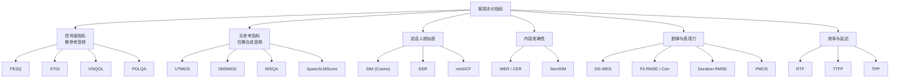

# 5-客观评价指标体系详解

TTS 客观评价指标按**是否需要参考音频**和**评估维度**可系统分为六大类。本页在 [[Qwen3-TTS 评价指标详解]] 基础上进一步扩展，覆盖信号级、无参考、说话人、内容、韵律、效率全维度。

> 🔗 基础指标说明见 [[Qwen3-TTS 评价指标详解]]，本页侧重**横向对比**、**适用场景**和**工程实现细节**。

---

## 指标体系总览



---

## 一、信号级指标（需参考音频）

信号级指标通过对比合成语音与参考语音的波形/频谱差异来衡量重建质量，**仅适用于存在配对参考音频的场景**（如 Tokenizer 重建评测）。

### 1.1 PESQ（ITU-T P.862）

📌**感知语音质量评价** — 最经典的客观语音质量指标

- **标准**：ITU-T P.862 / P.862.2（宽带扩展）
- **分数范围**：−0.5 ~ 4.5（宽带），越高越好
- **采样率要求**：窄带 8kHz / 宽带 16kHz
- **Python 库**：`pip install pesq`


**原理简述**：

1. 时间对齐参考与退化语音
2. 通过心理声学模型映射到内部表征域
3. 计算表征差异（感知扰动），加权聚合

**局限性**：

- 仅支持 ≤16kHz，**不适用于** 24kHz/48kHz 高采样率场景
- 对非线性失真（如 GAN 生成的伪影）敏感度不足
- 不评估韵律或自然度，仅关注频谱失真

```python
from pesq import pesq
import librosa

ref, _ = librosa.load("ref.wav", sr=16000)
gen, _ = librosa.load("gen.wav", sr=16000)
min_len = min(len(ref), len(gen))
score = pesq(16000, ref[:min_len], gen[:min_len], "wb")
print(f"PESQ-WB: {score:.3f}")  # 典型 TTS: 2.5-3.5
```

### 1.2 STOI（Short-Time Objective Intelligibility）


📌**短时客观可懂度** — 衡量语音是否能被正确听懂

- **分数范围**：0 ~ 1，越高越好
- **典型阈值**：>0.9 表示高可懂度
- **Python 库**：`pip install pystoi`


**原理**：计算参考与退化语音短时时频包络的归一化互相关，反映信息传递完整性。

**变体**：

- **STOI**：原始版本，386ms 分析窗
- **ESTOI（Extended STOI）**：改进版，对非线性处理更鲁棒

```python
from pystoi import stoi
score = stoi(ref, gen, 16000, extended=False)
print(f"STOI: {score:.4f}")  # 典型 TTS: 0.90-0.97
```

### 1.3 ViSQOL（Virtual Speech Quality Objective Listener）


🆕**Google 提出的视觉化语音质量评估**

- **标准**：基于频谱图的 NSIM（Neurogram Similarity）
- **分数范围**：1 ~ 5（MOS-LQO 量表）
- **优势**：支持 **宽频段**（包括 48kHz），比 PESQ 更现代
- **GitHub**：[google/visqol](https://github.com/google/visqol)


**原理**：

1. 将音频转为 Gammatone 频谱图
2. 在时频 patch 上计算 NSIM（类似 SSIM 在图像中的角色）
3. 对所有 patch 聚合得到最终分数

**适用场景**：

- 高采样率音频评测（24kHz/48kHz）
- 音频编解码器质量评估（SoundStream、EnCodec 论文均采用）
- 流媒体音频质量监控

### 1.4 POLQA（ITU-T P.863）

📌**PESQ 的正式继任者**

- **标准**：ITU-T P.863
- **分数范围**：1 ~ 5（MOS-LQO）
- **优势**：支持超宽带（48kHz）、对时间拉伸/压缩更鲁棒
- **限制**：**商业授权**，需购买 OPTICOM 许可证


**PESQ vs ViSQOL vs POLQA 对比**：

| **维度** | **PESQ** | **ViSQOL** | **POLQA** |
| --- | --- | --- | --- |
| 标准 | ITU-T P.862 | Google 开源 | ITU-T P.863 |
| 最高采样率 | 16kHz | 48kHz | 48kHz |
| 分数范围 | −0.5 ~ 4.5 | 1 ~ 5 | 1 ~ 5 |
| 开源 | ✅ (pip) | ✅ (GitHub) | ❌ 商业 |
| 主要用途 | 经典 TTS/VoIP | 编解码器/高采样率 | 电信级认证 |
| TTS 论文常见度 | ⭐⭐⭐⭐⭐ | ⭐⭐⭐ | ⭐⭐ |

---

## 二、无参考指标（仅需合成音频）

无参考指标不需要配对的参考音频，基于深度学习模型直接预测合成语音质量，适合**大规模自动评测**。

### 2.1 UTMOS（UTokyo-SaruLab MOS Prediction）


⭐**当前 TTS 论文中最广泛使用的自动 MOS 预测模型**

- **骨干网络**：wav2vec 2.0 / HuBERT + 回归头
- **训练数据**：VoiceMOS Challenge 2022 数据集
- **分数范围**：1.0 ~ 5.0
- **与人工 MOS 相关性**：Pearson r ≈ 0.91（系统级）


**两种调用方式**：

```python
# 方式一：torch hub (推荐)
import torch, torchaudio
predictor = torch.hub.load(
    "tarepan/SpeechMOS:v1.2.0",
    "utmos22_strong", trust_repo=True
)
wav, sr = torchaudio.load("gen.wav")
if sr != 16000:
    wav = torchaudio.transforms.Resample(sr, 16000)(wav)
score = predictor(wav, sr=16000).item()
print(f"UTMOS: {score:.3f}")  # 优秀 TTS: >4.0

# 方式二：speechmos 库
import speechmos
predictor = speechmos.UTMOS(device="cuda")
score = predictor.predict("gen.wav")
```

### 2.2 DNSMOS（Deep Noise Suppression MOS）


📌**Microsoft 提出的多维度 MOS 预测**

- **维度**：SIG（语音质量）、BAK（背景噪声）、OVRL（整体质量）
- **特色**：针对**噪声场景**优化，适合评估降噪后语音
- **API**：Azure Speech Services 提供在线 API
- **论文**：DNSMOS P.835


**三个子维度**：

- **SIG**（1-5）：语音信号本身的质量
- **BAK**（1-5）：背景噪声的干扰程度
- **OVRL**（1-5）：整体感知质量

**适用场景**：

- 含噪声场景的 TTS 评测
- 语音增强/降噪系统评测
- 实际部署环境的质量监控

```python
# 使用 Azure REST API
import requests, base64

def compute_dnsmos(audio_path, subscription_key):
    with open(audio_path, "rb") as f:
        audio_b64 = base64.b64encode(f.read()).decode()
    resp = requests.post(
        "https://speech.microsoft.com/api/dnsmos",
        headers={"Ocp-Apim-Subscription-Key": subscription_key},
        json={"audio": audio_b64}
    )
    result = resp.json()
    return result  # {"sig": 4.2, "bak": 4.5, "ovrl": 4.1}
```

### 2.3 NISQA（Non-Intrusive Speech Quality Assessment）


📌**TU Berlin 提出的多维度无参考语音质量评估**

- **骨干网络**：CNN + Self-Attention Pool
- **维度**：MOS + Noisiness + Coloration + Discontinuity + Loudness
- **GitHub**：[gabrielmittag/NISQA](https://github.com/gabrielmittag/NISQA)
- **优势**：细粒度诊断语音质量问题的具体来源


**五个评估维度**：

| **维度** | **含义** | **典型 TTS 问题** |
| --- | --- | --- |
| MOS | 整体质量 | 综合评分 |
| Noisiness | 噪声水平 | GAN 伪影、背景噪声 |
| Coloration | 着色失真 | 频谱平坦度异常 |
| Discontinuity | 不连续性 | 拼接痕迹、卡顿 |
| Loudness | 响度异常 | 音量突变、削波 |

### 2.4 SpeechLMScore

- **来源**：利用预训练语音语言模型（如 HuBERT-Large）的伪困惑度作为质量指标
- **原理**：自然语音在语音 LM 上的困惑度更低；合成语音越自然，困惑度越接近真实语音
- **优势**：完全无监督，无需任何 MOS 标注数据
- **局限**：对说话人身份不敏感

### 无参考指标对比

| **指标** | **UTMOS** | **DNSMOS** | **NISQA** | **SpeechLMScore** |
| --- | --- | --- | --- | --- |
| 多维度 | ❌ 仅整体 | ✅ SIG/BAK/OVRL | ✅ 5 维度 | ❌ 仅整体 |
| 开源 | ✅ | ⚠️ API | ✅ | ✅ |
| 噪声场景 | 一般 | ⭐⭐⭐⭐⭐ | ⭐⭐⭐⭐ | 一般 |
| TTS 论文常见度 | ⭐⭐⭐⭐⭐ | ⭐⭐⭐ | ⭐⭐ | ⭐ |
| 诊断能力 | 低 | 中 | 高 | 低 |

---

## 三、说话人相似度指标

### 3.1 SIM（Speaker Similarity / Cosine Similarity）

当前零样本 TTS 评测的**核心指标**。

**计算流程**：

1. 使用说话人编码器提取参考语音和合成语音的 embedding
2. 计算两个 embedding 的余弦相似度

**常用说话人编码器**：

| **编码器** | **来源** | **维度** | **使用场景** |
| --- | --- | --- | --- |
| WavLM-TDNN | Seed-TTS-Eval 官方 | 512 | 零样本 TTS 标准评测 |
| ECAPA-TDNN | SpeechBrain | 192 | 工业级说话人验证 |
| Resemblyzer (GE2E) | CorentinJ | 256 | 快速原型验证 |
| CAM++ | 阿里 FunASR | 512 | 中文说话人识别 |
| ERes2NetV2 | 阿里达摩院 | 192 | 中文说话人验证 |


⚠️**重要**：不同编码器计算的 SIM **不可直接比较**。论文对比时需统一编码器。Seed-TTS-Eval 使用 WavLM-TDNN 是当前业界共识。


### 3.2 EER（Equal Error Rate）

- **定义**：FAR（误接受率）= FRR（误拒绝率）时的错误率
- **用途**：评估说话人验证系统整体性能
- **在 TTS 中的应用**：当合成语音与参考说话人的 EER 越低，说明音色克隆越成功
- **典型值**：优秀零样本 TTS < 5%

### 3.3 minDCF（Minimum Detection Cost Function）

- **定义**：加权误接受/误拒绝成本的最小值
- **用途**：比 EER 更精细的说话人验证度量
- **在 TTS 中的应用**：VoxCeleb SRC 挑战赛标准指标

---

## 四、内容准确性指标

### 4.1 WER / CER

**评测流程**：合成语音 → ASR 转录 → 与原文对比 → 编辑距离

**常用 ASR 后端**：

| **ASR 模型** | **语言** | **使用方** | **备注** |
| --- | --- | --- | --- |
| Whisper-large-v3 | 多语言（EN 为主） | Seed-TTS-Eval / 多数论文 | 业界标准 |
| Faster-Whisper-large-v3 | 多语言 | F5-TTS | CTranslate2 加速版 |
| Paraformer-zh | 中文 | Seed-TTS-Eval | 中文标准 ASR |
| SenseVoice-Large | 中/英/日/韩/粤 | CosyVoice 3 | FunASR 新一代 |


💡**WER 的陷阱**

- ASR 模型本身的错误会引入**评测偏差**。同一条合成语音用不同 ASR 可能得到不同 WER
- 中文应使用 CER（字错误率）而非 WER（词错误率）
- 文本预处理（标点、大小写、数字归一化）对 WER 影响显著


### 4.2 SemSIM（Semantic Similarity）

- **新兴指标**：使用语义嵌入（如 HuBERT 的中间层特征）计算合成语音与参考语音的语义相似度
- **优势**：不依赖 ASR 转录，避免 ASR 偏差
- **局限**：尚未标准化，不同实现的可比性差

---

## 五、韵律与表现力指标

### 5.1 DS-WED（Discretized Speech Weighted Edit Distance）


✨**ProsodyEval (2025) 提出的韵律多样性指标**

- **原理**：将语音离散化为 token 序列，计算 TTS 输出与真实语音之间的加权编辑距离
- **创新**：在离散 token 空间中度量韵律差异，避免连续特征的对齐问题
- **与人工 PMOS 相关性**：显著优于传统声学指标（F0 RMSE 等）


### 5.2 F0 相关指标

- **F0 RMSE**：基频均方根误差，衡量音高轮廓的匹配程度
- **F0 Correlation**：基频相关系数，衡量音高变化趋势的一致性
- **VUV Error**：有声/无声帧分类错误率

```python
import parselmouth
import numpy as np

def compute_f0_metrics(ref_path, gen_path):
    ref_snd = parselmouth.Sound(ref_path)
    gen_snd = parselmouth.Sound(gen_path)

    ref_pitch = ref_snd.to_pitch(time_step=0.01)
    gen_pitch = gen_snd.to_pitch(time_step=0.01)

    ref_f0 = ref_pitch.selected_array["frequency"]
    gen_f0 = gen_pitch.selected_array["frequency"]

    # 只比较双方均有声的帧
    min_len = min(len(ref_f0), len(gen_f0))
    ref_f0, gen_f0 = ref_f0[:min_len], gen_f0[:min_len]
    voiced = (ref_f0 > 0) & (gen_f0 > 0)

    if voiced.sum() == 0:
        return {"f0_rmse": float("nan"), "f0_corr": float("nan")}

    rmse = np.sqrt(np.mean((ref_f0[voiced] - gen_f0[voiced])**2))
    corr = np.corrcoef(ref_f0[voiced], gen_f0[voiced])[0, 1]
    return {"f0_rmse": rmse, "f0_corr": corr}
```

### 5.3 Duration 指标

- **Duration RMSE**：音素/词级时长预测的均方根误差
- **Speaking Rate Variance**：语速变化方差，衡量韵律节奏的丰富性

### 5.4 PMOS（Prosody MOS）

- **来源**：ProsodyEval 定义的专用韵律 MOS
- **与标准 MOS 的区别**：听者仅关注**韵律自然度**（音高、节奏、重音），不评价音质
- **量表**：1-5 分，与标准 MOS 相同

---

## 六、效率与延迟指标

### 6.1 RTF（Real-Time Factor）

$RTF = \frac{\text{合成耗时}}{\text{音频时长}}$

- RTF < 1：可实时流式输出
- **典型值**：Qwen3-TTS-12Hz-1.7B → RTF = 0.313

### 6.2 TTFP（Time To First Packet）

首包延迟 = LM 首 token 延迟 + Decoder 首包解码时间

- **交互式场景**关键指标，决定用户感知的响应速度
- **典型值**：Qwen3-TTS-12Hz-0.6B → 97ms

### 6.3 TPP（Time Per Packet）

后续每个音频包的生成耗时，决定流式输出的平滑度。

### 6.4 Throughput（吞吐量）

- **定义**：单位时间内合成的音频秒数
- **公式**：$Throughput = frac{1}{RTF}$（单请求）或 $Throughput = frac{BatchSize}{RTF}$（批处理）

---

## 指标选型指南

| **评测场景** | **必选指标** | **推荐指标** | **可选指标** |
| --- | --- | --- | --- |
| 零样本克隆 | WER/CER + SIM | UTMOS | EER, DNSMOS |
| Tokenizer 重建 | PESQ + STOI + SIM | UTMOS + WER | ViSQOL |
| 整体质量对比 | MOS（人工） | CMOS + UTMOS | NISQA 多维度 |
| 韵律多样性 | PMOS（人工） | DS-WED | F0 RMSE/Corr |
| 实时部署 | RTF + TTFP | TPP | Throughput |
| 论文发表 | WER + SIM + MOS | CMOS + UTMOS + PESQ | 全部 |
