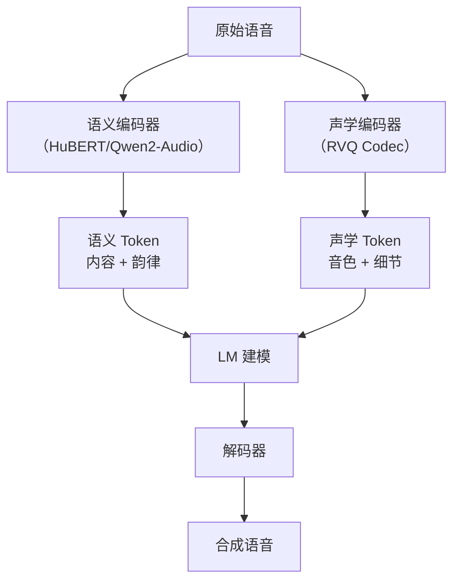

语音编解码器（Speech Codec）和 Tokenizer 是现代 TTS 系统的**基础组件**——将连续波形压缩为离散 token，再由解码器重建。本页系统梳理主流 Codec 的评测方法、对比维度与最新进展。

---

## 一、Codec 在 TTS 中的角色
![[DrCodec 在 TTS 中的角色.excalidraw|800]]


> [!important]
> 
> **核心矛盾**：Tokenizer 需要在**信息压缩率**和**重建质量**之间取得平衡。帧率越低、码本越小，LM 建模越容易；但信息损失越大，重建质量越差。

---

## 二、主流语音编解码器一览

|**Codec**|**发布方**|**年份**|**量化方式**|**采样率**|**帧率**|**码本**|**开源**|
|---|---|---|---|---|---|---|---|
|**SoundStream**|Google|2021|RVQ|24kHz|50Hz|1024×N|❌|
|**EnCodec**|Meta|2022|RVQ|24/48kHz|75Hz|1024×N|✅|
|**DAC**|Descript|2023|RVQ + FSQ|16/24/44.1kHz|86Hz|1024×N|✅|
|**Mimi**|Kyutai (Moshi)|2024|RVQ（语义+声学分离）|24kHz|12.5Hz|2048×8|✅|
|**X-Codec**|学术界|2024|RVQ + 语义条件|16kHz|50Hz|1024×N|✅|
|**BiCodec**|学术界|2024|语义+声学双流|16kHz|50Hz|—|✅|
|**H-Codec 2.0**|QuarkAudio|2025|分层 RVQ（16层）|48kHz|25Hz|1024×16|✅|
|**Qwen-TTS 12Hz**|阿里 Qwen|2025|FSQ (8192×4)|24kHz|12Hz|8192×4|—|
|**Qwen-TTS 25Hz**|阿里 Qwen|2025|Qwen2-Audio 编码|24kHz|25Hz|—|—|

---

## 三、RVQ（Residual Vector Quantization）原理

### 3.1 核心思想

RVQ 将量化过程分解为多个层（codebook），每层处理前一层的残差：

$r_0 = x$

$q_i = \text{VQ}(r_{i-1})$

$r_i = r_{i-1} - q_i$

$\hat{x} = \sum_{i=1}^{N_q} q_i$

其中 $N_q$ 为量化层数，每增加一层可减少残差、提升重建精度。

### 3.2 比特率计算

$\text{Bitrate} = \text{帧率} \times N_q \times \log_2(\text{码本大小})$

**示例**：EnCodec 75Hz × 8层 × 10bit = **6 kbps**

### 3.3 量化丢弃（Quantizer Dropout）

SoundStream 提出的训练技巧——随机丢弃部分 RVQ 层，使单个模型支持**可变比特率**。

```Python
# 量化丢弃伪代码
def rvq_forward(x, codebooks, dropout_rate=0.5):
    residual = x
    quantized = 0
    for i, cb in enumerate(codebooks):
        if training and i > 0 and random() < dropout_rate:
            break  # 随机截断
        q = cb.quantize(residual)
        quantized += q
        residual = residual - q
    return quantized
```

### 3.4 FSQ（Finite Scalar Quantization）

> [!important]
> 
> **Qwen3-TTS 12Hz 采用的量化方式**
> 
> - **原理**：将每个维度独立量化到有限个离散值，避免码本坍塌问题
> 
> - **优势**：无需 EMA 更新码本，训练更稳定
> 
> - **配置**：8192 × 4 层（每层 8192 个离散值）
> 
> - **论文**：Mentzer et al., "Finite Scalar Quantization" (NeurIPS 2023)

---

## 四、Codec 评测维度

### 4.1 重建质量指标

|**指标**|**类型**|**测量内容**|**典型好值**|
|---|---|---|---|
|PESQ|有参考|感知语音质量|> 3.0|
|STOI|有参考|可懂度|> 0.93|
|ViSQOL|有参考|宽频段质量|> 4.0|
|UTMOS|无参考|自然度 MOS|> 4.0|
|SPK-SIM|有参考|说话人保持度|> 0.90|
|WER|ASR 辅助|语义保留度|< 3%|
|Mel Loss|有参考|频谱重建误差|越低越好|
|STFT Loss|有参考|多分辨率频谱误差|越低越好|

### 4.2 信息保留评测

评测 Tokenizer 是否保留了足够的**语义信息**供下游 LM 学习：


**Qwen3-TTS 论文 Table 1 数据**（ASR WER 评测）：

|**Tokenizer**|**帧率**|**C.V. EN ↓**|**C.V. ZH ↓**|**Fleurs EN ↓**|**Fleurs ZH ↓**|
|---|---|---|---|---|---|
|Mimi|12.5Hz|6.66|12.85|4.08|10.87|
|FireredTTS 2|25Hz|7.05|5.53|5.06|5.28|
|**Qwen-TTS 12Hz**|12Hz|**4.42**|**3.95**|**3.22**|**3.99**|
|Qwen-TTS 25Hz S1|25Hz|3.78|3.35|2.93|3.35|

### 4.3 重建质量评测

**LibriSpeech test-clean 上的 Tokenizer 重建结果**（Qwen3-TTS 论文 Table 2）：

|**Tokenizer**|**帧率**|**PESQ ↑**|**STOI ↑**|**UTMOS ↑**|**SIM ↑**|
|---|---|---|---|---|---|
|Mimi|12.5Hz|2.88|0.94|3.87|0.87|
|FireredTTS 2|25Hz|2.73|0.93|3.88|0.88|
|**Qwen-TTS 12Hz**|12Hz|**3.21**|**0.96**|**4.16**|**0.95**|
|Qwen-TTS 25Hz S1|25Hz|3.05|0.95|4.09|0.94|

### 4.4 多域评测（语音/音乐/通用音频）

最新的 H-Codec 2.0 引入了跨域评测维度：

|**Codec**|**语音 Mel Loss ↓**|**音乐 STFT Loss ↓**|**通用 Mel Loss ↓**|
|---|---|---|---|
|EnCodec|0.5832|0.2107|0.6141|
|DAC|0.6436|0.1973|0.5892|
|X-Codec|0.5120|0.1804|0.5437|
|**H-Codec 2.0 Large**|**0.3221**|**0.1526**|**0.3845**|

---

## 五、语义 vs 声学 Token 分离

### 5.1 设计理念

现代 Codec 趋势是将**语义信息**和**声学信息**分离编码：



### 5.2 代表方案对比

|**方案**|**语义编码**|**声学编码**|**融合方式**|
|---|---|---|---|
|VALL-E|EnCodec 第1层|EnCodec 后续层|AR + NAR|
|Mimi|HuBERT 蒸馏到 RVQ-1|RVQ 2-8|端到端|
|X-Codec|HuBERT 条件注入|RVQ 全部|条件融合|
|Qwen-TTS 25Hz|Qwen2-Audio 编码|BigVGAN 解码|两阶段训练|
|Qwen-TTS 12Hz|FSQ 端到端|融入同一编码|单阶段|

---

## 六、帧率与信息压缩 Trade-off

> [!important]
> 
> **帧率选择的核心权衡**
> 
> - **低帧率**（12-12.5Hz）：序列更短 → LM 训练/推理更快 → 长音频建模更容易 → 但重建损失更大
> 
> - **高帧率**（50-86Hz）：信息更丰富 → 重建更精细 → 但序列极长 → LM 建模困难
> 
> - **折中帧率**（25Hz）：平衡信息量与序列长度

**10 秒音频的 token 序列长度对比**：

|**帧率**|**代表方案**|**Token 数**|**相对 EnCodec**|
|---|---|---|---|
|86Hz|DAC|860|1.15×|
|75Hz|EnCodec|750|1.00×|
|50Hz|SoundStream|500|0.67×|
|25Hz|Qwen-TTS 25Hz / H-Codec|250|0.33×|
|12.5Hz|Mimi|125|0.17×|
|**12Hz**|**Qwen-TTS 12Hz**|**120**|**0.16×**|

---

## 七、Codec 训练损失函数

现代 Codec 训练通常使用**多损失函数组合**：

### 7.1 重建损失

- **Mel Loss**：Mel 频谱图上的 L1 距离

- **Multi-Resolution STFT Loss**：多个 STFT 分辨率下的频谱/相位损失

- **时域 L1 Loss**：波形级别的绝对误差

### 7.2 对抗损失

- **Multi-Period Discriminator (MPD)**：HiFi-GAN 提出，多周期判别器

- **Multi-Scale Discriminator (MSD)**：多尺度时域判别器

- **Multi-Scale STFT Discriminator (MS-STFD)**：DAC 提出，频域判别器

### 7.3 量化损失

- **Commitment Loss**：$|x - text{sg}(q)|^2$（鼓励编码器输出靠近码本）

- **Codebook Loss**：$|text{sg}(x) - q|^2$（推动码本靠近编码器输出）

```Python
# 典型 Codec 训练损失组合
def codec_loss(ref, gen, disc, quantize_info):
    # 重建损失
    mel_loss = mel_spectrogram_loss(ref, gen)
    stft_loss = multi_resolution_stft_loss(ref, gen)
    
    # 对抗损失
    disc_real = disc(ref)
    disc_fake = disc(gen)
    gen_adv_loss = generator_adversarial_loss(disc_fake)
    feat_match_loss = feature_matching_loss(disc_real, disc_fake)
    
    # 量化损失
    commit_loss = quantize_info["commitment_loss"]
    
    # 加权组合
    total = (
        45.0 * mel_loss +
        1.0 * stft_loss +
        1.0 * gen_adv_loss +
        2.0 * feat_match_loss +
        1.0 * commit_loss
    )
    return total
```

---

## 八、评测实战：Codec 对比流程

```Python
import torch
import torchaudio
from pesq import pesq
from pystoi import stoi
import numpy as np

def evaluate_codec(codec_model, test_files, sr=16000):
    """评测 Codec 的重建质量"""
    results = []
    
    for fpath in test_files:
        # 加载原始音频
        wav, orig_sr = torchaudio.load(fpath)
        if orig_sr != sr:
            wav = torchaudio.transforms.Resample(orig_sr, sr)(wav)
        
        # 编码 → 量化 → 解码
        with torch.no_grad():
            tokens = codec_model.encode(wav)
            recon = codec_model.decode(tokens)
        
        ref = wav.squeeze().numpy()
        gen = recon.squeeze().numpy()
        min_len = min(len(ref), len(gen))
        ref, gen = ref[:min_len], gen[:min_len]
        
        # 计算指标
        pesq_score = pesq(sr, ref, gen, "wb")
        stoi_score = stoi(ref, gen, sr)
        
        results.append({
            "file": fpath,
            "pesq": pesq_score,
            "stoi": stoi_score,
            "n_tokens": tokens.shape[-1],  # token 序列长度
        })
    
    # 汇总
    avg_pesq = np.mean([r["pesq"] for r in results])
    avg_stoi = np.mean([r["stoi"] for r in results])
    avg_tokens = np.mean([r["n_tokens"] for r in results])
    
    print(f"PESQ: {avg_pesq:.3f} | STOI: {avg_stoi:.4f}")
    print(f"Avg tokens per utterance: {avg_tokens:.0f}")
    return results
```

---

## 九、Codec 选型指南

|**场景**|**推荐方案**|**理由**|
|---|---|---|
|通用 TTS 研究|EnCodec / DAC|开源成熟，社区支持好|
|低帧率 TTS（长音频）|Mimi / Qwen-TTS 12Hz 方案|极短序列，LM 建模高效|
|高保真重建|H-Codec 2.0 / DAC|48kHz 支持，多域适用|
|语义-声学分离|X-Codec / BiCodec|显式分离，灵活组合|
|实时通信|SoundStream / Mimi|低延迟流式编解码|