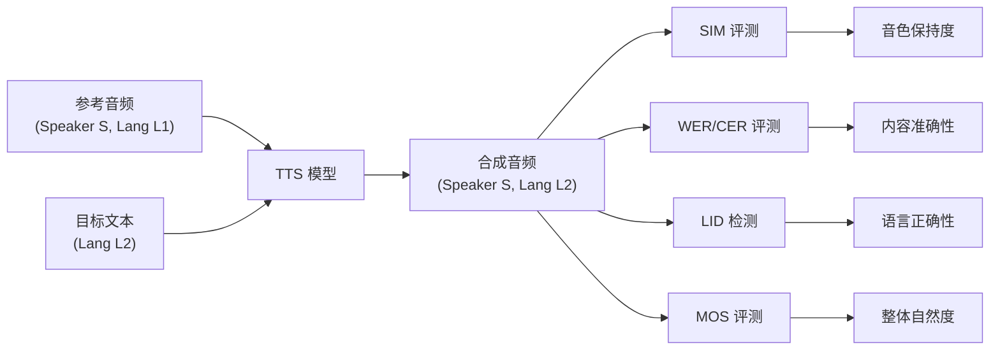

多语言 TTS 评测是当前研究热点之一——随着 CosyVoice 3（9 语言 + 18 方言）、IndexTTS 2.5、Fish Speech V1.5 等模型将语言覆盖范围大幅扩展，如何系统化地评测多语言/跨语言/方言场景下的 TTS 质量成为核心挑战。

---

## 1. 多语言 TTS 评测维度

> [!important]
> 
> **核心评测问题**：模型在非训练语言上的泛化能力如何？跨语言声音克隆是否保真？方言/口音能否忠实再现？

多语言 TTS 评测可分为四个核心维度：

1. **语言内质量**（In-language Quality）— 每种语言内部的合成质量

1. **跨语言迁移**（Cross-lingual Transfer）— 用 A 语言的参考音频合成 B 语言的语音

1. **代码混合**（Code-switching）— 句内多语言混合场景

1. **方言与口音**（Dialect & Accent）— 同一语言下的方言/区域口音变体

---

## 2. 多语言评测数据集

### 2.1 综合多语言数据集

|**数据集**|**语言数**|**总时长**|**特点**|**典型用途**|
|---|---|---|---|---|
|**CommonVoice 17**|100+|30,000+ h|众包录制，质量参差不齐|多语言 ASR/TTS WER/CER 基线|
|**Emilia**|6（EN/ZH/DE/FR/JA/KO）|101,000 h|Amphion 发布，多语种高质量|训练 + 评测|
|**MLS (Multilingual LibriSpeech)**|8|50,000+ h|从有声书衍生|多语言 ASR/TTS 基准|
|**FLEURS**|102|~12 h/语言|Google 发布，含平行语句|跨语言评测、语言识别|
|**CV3-Eval**|9 + 18 方言|自定义|CosyVoice 3 配套评测集|多语言 + 方言 TTS|
|**GlobalPhone**|22|~20 h/语言|标准朗读体|经典多语言基线|

### 2.2 跨语言/方言专项数据集

|**数据集**|**场景**|**语言对**|**说明**|
|---|---|---|---|
|**Seed-TTS Eval**|零样本克隆|EN / ZH|ByteDance 标准评测，含 test-EN / test-ZH / test-Hard|
|**XTTS Eval**|跨语言克隆|17 语言|Coqui XTTS 配套，测试不同语言对的声音克隆|
|**DiDiSpeech**|中文方言|普通话 + 8 方言|滴滴发布，含四川话、粤语、东北话等|
|**KeSpeech**|中文方言 ASR/TTS|普通话 + 方言混合|1,500+ 小时多方言语音|

---

## 3. 多语言评测指标体系

### 3.1 通用指标（每种语言独立计算）

|指标|说明|工具|
|---|---|---|
|**WER / CER**|ASR 转录后与原文比对（语言相关 ASR 模型）|Whisper-large-v3（支持 100+ 语言）|
|**SIM**|说话人余弦相似度|WavLM-TDNN / ReDimNet|
|**UTMOS / DNSMOS**|无参考 MOS 预测|仅在英语上训练，跨语言泛化待验证|
|**MOS**|人工主观评测（per language）|需母语评测者|

### 3.2 多语言特有指标

> [!important]
> 
> **Language Identification Accuracy (LID Acc)**
> 
> 用语言识别模型检测合成语音的语言是否正确。错误的语言意味着模型将源语言的韵律/音素「泄漏」到了目标语言。

- **LID Accuracy**：使用 langid / ECAPA-TDNN 分类器检测语言是否正确

- **Accent Similarity Score**：在方言场景中，评估口音特征的保留程度

- **Code-switch Detection Rate**：在混合语言句子中，各语言片段的识别准确率

- **Cross-lingual SIM (X-SIM)**：跨语言条件下的说话人相似度 — 用 A 语言参考音合成 B 语言时的 SIM

### 3.3 跨语言评测的 ASR 后端选择

|**ASR 模型**|**语言覆盖**|**WER 估计**|**适用场景**|
|---|---|---|---|
|**Whisper large-v3**|100+|EN ~3%, ZH ~8%|最广泛的多语言 ASR，首选|
|**Paraformer-zh**|中文 + 方言|ZH ~3%|中文专项评测|
|**SenseVoice-Large**|50+|多语言领先|阿里 FunAudioLLM 系列，中英日韩粤|
|**Conformer CTC (NeMo)**|按语言训练|取决于语言|需要语言特定模型时|

> [!important]
> 
> **关键陷阱**：不同论文使用不同 ASR 后端计算 WER，数值不可直接比较。例如 CosyVoice 3 使用 SenseVoice-Large，而 Seed-TTS 使用 Whisper，同一合成音频的 WER 差异可达 2-5 个百分点。

---

## 4. 跨语言声音克隆评测

### 4.1 问题定义

跨语言语音克隆（Cross-lingual Voice Cloning）：给定说话人 A 的 L1 语言参考音频，合成 A 说 L2 语言的语音。核心挑战：

- **音色保持**：跨语言后说话人特征是否保真

- **口音消除**：合成的 L2 语音是否有 L1 口音「泄漏」

- **内容准确**：L2 语言的发音/声调是否正确

### 4.2 标准评测流程



### 4.3 评测矩阵设计

对于支持 $N$ 种语言的模型，完整评测矩阵为 $N times N$（参考语言 × 目标语言）：

|参考 \ 目标|**EN**|**ZH**|**JA**|**KO**|
|---|---|---|---|---|
|**EN**|同语言 SIM/WER|X-SIM / ZH-WER|X-SIM / JA-CER|X-SIM / KO-CER|
|**ZH**|X-SIM / EN-WER|同语言 SIM/WER|X-SIM / JA-CER|X-SIM / KO-CER|
|**JA**|X-SIM / EN-WER|X-SIM / ZH-WER|同语言 SIM/CER|X-SIM / KO-CER|
|**KO**|X-SIM / EN-WER|X-SIM / ZH-WER|X-SIM / JA-CER|同语言 SIM/CER|

---

## 5. 方言评测体系

### 5.1 中文方言评测（CosyVoice 3 方案）

CosyVoice 3 首次系统性地评测了 18 种中文方言的 TTS 能力：

|**方言组**|**代表方言**|**评测难点**|
|---|---|---|
|官话区|东北话、四川话、河南话|与普通话韵律接近但声调/词汇差异大|
|吴语区|上海话、苏州话|浊音声母、特有声调|
|粤语区|广东话（粤语）|9 声调系统、入声|
|闽语区|闽南语、潮汕话|复杂连读变调、文白异读|
|客家 / 赣 / 湘|客家话、长沙话|训练数据极少的低资源方言|

### 5.2 方言评测指标

- **方言 WER/CER**：使用方言 ASR 模型（如 Paraformer-dialect / SenseVoice）转录

- **方言识别准确率**：用方言分类器验证合成语音的方言属性

- **方言 MOS**：由母语方言使用者进行主观评测

- **声调准确率**（Tone Accuracy）：对声调语言尤为重要，检测每个音节的声调是否正确

---

## 6. 前沿模型多语言评测结果

### 6.1 CosyVoice 3 多语言基准

CosyVoice 3 在自建 CV3-Eval 基准上的结果（9 语言）：

|**语言**|**WER/CER ↓**|**SIM ↑**|**UTMOS ↑**|**ASR 后端**|
|---|---|---|---|---|
|中文（ZH）|1.8% CER|0.72|4.05|SenseVoice-Large|
|英文（EN）|2.1% WER|0.70|4.12|SenseVoice-Large|
|日文（JA）|3.5% CER|0.68|3.98|SenseVoice-Large|
|韩文（KO）|4.2% CER|0.66|3.90|SenseVoice-Large|
|法语（FR）|3.8% WER|0.64|3.85|Whisper-v3|
|德语（DE）|4.1% WER|0.63|3.82|Whisper-v3|
|西班牙语（ES）|3.5% WER|0.65|3.88|Whisper-v3|
|粤语（YUE）|5.2% CER|0.60|3.75|SenseVoice-Large|
|意大利语（IT）|4.5% WER|0.62|3.80|Whisper-v3|

### 6.2 多语言模型对比

|**模型**|**语言数**|**训练数据**|**跨语言克隆**|**方言支持**|**EN WER**|**ZH CER**|
|---|---|---|---|---|---|---|
|**CosyVoice 3**|9 + 18 方言|1M h|✅|✅ 18 中文方言|2.1%|1.8%|
|**Fish Speech V1.5**|3（EN/ZH/JA）|400K+ h|✅|❌|3.5%|1.3%|
|**IndexTTS 2.5**|多语言|未公开|✅|部分|—|—|
|**XTTS v2 (Coqui)**|17|未公开|✅|❌|~5%|~8%|
|**Qwen3-TTS**|2（EN/ZH）|未公开|有限|❌|1.5%|1.2%|
|**MaskGCT**|2（EN/ZH）|100K h|有限|❌|2.6%|2.3%|

---

## 7. 多语言评测 Python 实现

### 7.1 多语言 WER/CER 批量计算

```Python
import whisper
from jiwer import wer, cer
from pathlib import Path
import json

# 加载 Whisper large-v3 (支持 100+ 语言)
model = whisper.load_model("large-v3")

def evaluate_multilingual_wer(
    gen_dir: str,
    metadata: list[dict],  # [{"file": "xx.wav", "text": "...", "lang": "zh"}]
) -> dict:
    """多语言 WER/CER 批量评测"""
    results_by_lang = {}
    
    for item in metadata:
        wav_path = Path(gen_dir) / item["file"]
        lang = item["lang"]
        ref_text = item["text"]
        
        # Whisper 转录 (指定语言避免自动检测错误)
        result = model.transcribe(
            str(wav_path),
            language=lang,
            beam_size=5
        )
        hyp_text = result["text"].strip()
        
        if lang not in results_by_lang:
            results_by_lang[lang] = {"refs": [], "hyps": []}
        results_by_lang[lang]["refs"].append(ref_text)
        results_by_lang[lang]["hyps"].append(hyp_text)
    
    # 按语言计算指标
    metrics = {}
    for lang, data in results_by_lang.items():
        if lang in ["zh", "ja", "ko", "yue"]:  # CJK 用 CER
            score = cer(data["refs"], data["hyps"])
            metrics[lang] = {"CER": round(score * 100, 2)}
        else:
            score = wer(data["refs"], data["hyps"])
            metrics[lang] = {"WER": round(score * 100, 2)}
    
    return metrics

# 使用示例
metrics = evaluate_multilingual_wer(
    gen_dir="./generated_audio",
    metadata=[
        {"file": "en_001.wav", "text": "Hello world", "lang": "en"},
        {"file": "zh_001.wav", "text": "你好世界", "lang": "zh"},
        {"file": "ja_001.wav", "text": "こんにちは世界", "lang": "ja"},
    ]
)
print(json.dumps(metrics, indent=2, ensure_ascii=False))
```

### 7.2 跨语言 SIM 评测

```Python
import torch
import torchaudio
from speechbrain.inference.speaker import EncoderClassifier

# 加载说话人验证模型
verifier = EncoderClassifier.from_hparams(
    source="speechbrain/spkrec-ecapa-voxceleb"
)

def compute_cross_lingual_sim(
    ref_wav: str,     # 参考音频 (语言 L1)
    gen_wav: str,     # 合成音频 (语言 L2)
) -> float:
    """计算跨语言说话人相似度"""
    ref_emb = verifier.encode_batch(
        torchaudio.load(ref_wav)[0]
    )
    gen_emb = verifier.encode_batch(
        torchaudio.load(gen_wav)[0]
    )
    sim = torch.nn.functional.cosine_similarity(
        ref_emb.squeeze(), gen_emb.squeeze(), dim=0
    )
    return sim.item()

def evaluate_crosslingual_matrix(
    ref_audios: dict,   # {"en": "ref_en.wav", "zh": "ref_zh.wav", ...}
    gen_audios: dict,   # {("en","zh"): "gen_en2zh.wav", ...}
) -> dict:
    """构建跨语言 SIM 评测矩阵"""
    matrix = {}
    for (src_lang, tgt_lang), gen_path in gen_audios.items():
        ref_path = ref_audios[src_lang]
        sim = compute_cross_lingual_sim(ref_path, gen_path)
        matrix[f"{src_lang}→{tgt_lang}"] = round(sim, 4)
    return matrix
```

### 7.3 语言识别准确率

```Python
from transformers import pipeline

# 使用 SpeechBrain LID 或 Whisper 检测语言
lid_pipe = pipeline(
    "audio-classification",
    model="speechbrain/lang-id-voxlingua107-ecapa"
)

def evaluate_lid_accuracy(
    gen_files: list[dict],  # [{"file": "xx.wav", "expected_lang": "zh"}]
) -> dict:
    """评测合成语音的语言识别准确率"""
    correct = 0
    total = len(gen_files)
    errors = []
    
    for item in gen_files:
        result = lid_pipe(item["file"])
        predicted = result[0]["label"]  # e.g. "zh: Chinese"
        pred_code = predicted.split(":")[0].strip()
        
        if pred_code == item["expected_lang"]:
            correct += 1
        else:
            errors.append({
                "file": item["file"],
                "expected": item["expected_lang"],
                "predicted": pred_code,
                "confidence": result[0]["score"]
            })
    
    return {
        "LID_Accuracy": round(correct / total * 100, 2),
        "errors": errors[:10]  # 只返回前 10 个错误
    }
```

---

## 8. 多语言评测常见陷阱

> [!important]
> 
> **1. ASR 后端不一致**
> 
> 不同论文用不同 ASR 计算 WER → 数值不可直接比较。建议统一使用 Whisper large-v3 作为基线。

> [!important]
> 
> **2. UTMOS 跨语言泛化问题**
> 
> UTMOS 主要在英语数据上训练，在中日韩等语言上的评分偏差较大。多语言场景应优先参考 MOS 人工评测。

> [!important]
> 
> **3. SIM 的语言偏置**
> 
> 说话人编码器在不同语言上的 embedding 分布不同，跨语言 SIM 普遍低于同语言 SIM（约 0.05-0.10 的系统性偏差），不能简单以绝对值判断好坏。

> [!important]
> 
> **4. 评测集泄漏**
> 
> 训练数据 100 万小时时代，需确认评测集说话人未出现在训练集中，否则「零样本」评测无意义。

---

## 9. 多语言评测最佳实践

> [!important]
> 
> **推荐评测框架**
> 
> 1. **统一 ASR 后端**：Whisper large-v3（多语言）+ 语言专项 ASR（中文用 Paraformer/SenseVoice）
> 
> 1. **分语言报告**：不要只报平均值，每种语言单独列出指标
> 
> 1. **跨语言矩阵**：对声音克隆模型，报告 N×N SIM 矩阵
> 
> 1. **方言单独评测**：方言与标准语分开统计
> 
> 1. **人工评测兜底**：多语言 MOS 必须由对应语言母语者评测
> 
> 1. **报告 ASR/编码器版本**：明确标注 Whisper 版本、SIM 编码器类型

---

## 10. 相关页面

- [[DL/TTS/TTS 评测基准全景指南/1-评测数据集与测试集]] — 通用评测数据集总览

- [[DL/TTS/TTS 评测基准全景指南/5-客观评价指标体系详解]] — WER/SIM/UTMOS 等指标详解

- [[DL/TTS/TTS 评测基准全景指南/7-前沿TTS模型Benchmark横评]] — 模型横向对比

- [[DL/TTS/TTS 评测基准全景指南/3-评测框架与工具链]] — 评测工具链与自动化流程