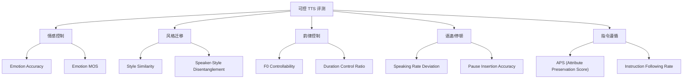
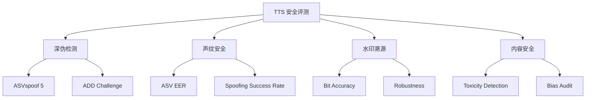

可控语音生成（Controllable TTS）和语音安全评测是 TTS 领域两个快速发展的方向。前者关注模型对情感、风格、语速、韵律等维度的精细控制能力；后者关注合成语音的安全性——防范深度伪造与声音滥用。

---

## 1. 可控语音生成评测总览

> [!important]
> 
> **核心问题**：模型能否按照用户指定的属性（情感、风格、语速、停顿等）精确控制合成语音？



---

## 2. 情感语音合成评测

### 2.1 情感分类体系

常用的情感分类标准：

- **Ekman 6 类**：Happy, Sad, Angry, Fear, Surprise, Disgust

- **扩展 8 类**：+ Neutral, Contempt

- **维度模型**（Valence-Arousal-Dominance, VAD）：连续空间表示

### 2.2 客观评测指标

|**指标**|**定义**|**计算方法**|**工具**|
|---|---|---|---|
|**Emotion Accuracy (EA)**|合成语音的情感分类准确率|SER 模型预测 → 与目标情感比对|emotion2vec / Wav2Vec2-SER|
|**Emotion F1**|多类情感的加权 F1|对每种情感计算 Precision/Recall/F1|同上|
|**VAD Distance**|VAD 空间中与目标情感的距离|$d = \sqrt{(V_{pred}-V_{tgt})^2 + (A_{pred}-A_{tgt})^2 + (D_{pred}-D_{tgt})^2}$|emotion2vec-base|
|**Emotion MOS**|人工评测情感表现力|5 分制，评价「该语音多大程度表达了 X 情感」|人工众测|

### 2.3 情感评测 Python 实现

```Python
import torch
from transformers import pipeline

# emotion2vec 或 Wav2Vec2 情感分类
ser_pipe = pipeline(
    "audio-classification",
    model="superb/wav2vec2-large-superb-er"
)

def evaluate_emotion_accuracy(
    gen_files: list[dict],  # [{"file": "xx.wav", "target_emotion": "happy"}]
) -> dict:
    """评测情感合成准确率"""
    correct = 0
    confusion = {}  # 混淆统计
    
    for item in gen_files:
        result = ser_pipe(item["file"])
        predicted = result[0]["label"].lower()
        target = item["target_emotion"].lower()
        
        key = f"{target}→{predicted}"
        confusion[key] = confusion.get(key, 0) + 1
        
        if predicted == target:
            correct += 1
    
    return {
        "Emotion_Accuracy": round(correct / len(gen_files) * 100, 2),
        "confusion_top10": dict(
            sorted(confusion.items(), key=lambda x: -x[1])[:10]
        )
    }
```

---

## 3. 风格迁移评测

### 3.1 评测维度

|维度|说明|指标|
|---|---|---|
|**风格一致性**|合成语音是否匹配目标风格|Style Similarity (S-SIM)|
|**说话人保持**|风格迁移时音色是否保真|Speaker SIM|
|**解耦程度**|能否独立改变风格而不影响音色|ΔStyle 与 ΔSIM 的解耦度|

### 3.2 Style Similarity 计算

```Python
def compute_style_similarity(
    ref_style_wav: str,   # 风格参考音频
    gen_wav: str,         # 合成音频
    style_encoder          # 风格编码器 (如 Meta-StyleSpeech)
) -> float:
    """计算风格相似度"""
    ref_emb = style_encoder.encode(ref_style_wav)
    gen_emb = style_encoder.encode(gen_wav)
    return cosine_similarity(ref_emb, gen_emb)
```

---

## 4. 韵律与语速控制评测

### 4.1 语速控制

- **Speaking Rate Deviation (SRD)**：实际语速与目标语速的相对偏差

$SRD = \frac{|SR_{actual} - SR_{target}|}{SR_{target}} \times 100\%$

其中 $SR$ = 每秒音节数（syllables/second），通过 forced alignment 计算。

### 4.2 停顿控制

- **Pause Insertion Accuracy**：模型在指定位置插入停顿的准确率

- **Pause Duration Error**：停顿时长与目标时长的 MAE

### 4.3 F0 控制

- **F0 Contour Correlation**：合成语音 F0 轮廓与目标 F0 的 Pearson 相关系数

- **F0 Range Control**：指定高/中/低音域时的 F0 范围命中率

```Python
import parselmouth
import numpy as np
from scipy.stats import pearsonr

def evaluate_f0_control(
    gen_wav: str,
    target_f0_contour: np.ndarray,  # 目标 F0 序列
    time_step: float = 0.01
) -> dict:
    """评测 F0 控制精度"""
    snd = parselmouth.Sound(gen_wav)
    pitch = snd.to_pitch(time_step=time_step)
    gen_f0 = pitch.selected_array["frequency"]
    
    # 对齐长度
    min_len = min(len(gen_f0), len(target_f0_contour))
    gen_f0 = gen_f0[:min_len]
    target = target_f0_contour[:min_len]
    
    # 只在有声段计算
    voiced = (gen_f0 > 0) & (target > 0)
    if voiced.sum() < 10:
        return {"error": "Too few voiced frames"}
    
    corr, _ = pearsonr(gen_f0[voiced], target[voiced])
    rmse = np.sqrt(np.mean((gen_f0[voiced] - target[voiced]) ** 2))
    
    return {
        "F0_Correlation": round(corr, 4),
        "F0_RMSE_Hz": round(rmse, 2),
        "Voiced_Ratio": round(voiced.mean(), 4)
    }
```

---

## 5. 指令遵循评测（Instruction-following TTS）

### 5.1 APS（Attribute Preservation Score）

> [!important]
> 
> **APS** 是 InstructTTS / CosyVoice 等可控 TTS 论文中的核心指标，衡量模型对自然语言指令中指定属性的保持程度。

评测流程：

1. 给定指令："用快速、开心的语气说以下内容"

1. 模型生成语音

1. 用分类器检测语音中的各项属性

1. 与指令中指定的属性对比，计算命中率

$APS = \frac{1}{K} \sum_{k=1}^{K} \mathbb{1}[\text{Classifier}_k(\text{audio}) = \text{Instruction}_k]$

其中 $K$ 为指令中指定的属性数量。

### 5.2 ChatTTS 风格评测

新一代对话式 TTS（如 ChatTTS、GPT-4o voice）支持更复杂的控制：

|**控制维度**|**指令示例**|**评测方法**|
|---|---|---|
|笑声插入|"说话时带点笑声"|检测 [laugh] token 是否出现|
|停顿|"在逗号处停顿 0.5 秒"|Forced alignment 检测停顿位置和时长|
|语速渐变|"从慢到快"|分段计算语速并验证递增趋势|
|情感渐变|"从平静到激动"|分段情感分类验证变化趋势|
|口头禅|"加入一些 'um' 和 'uh'"|ASR 检测填充词出现率|

### 5.3 ChatterBox 外显性控制

ChatterBox TTS 引入了 **Exaggeration** 参数（0.0-2.0），可连续控制表达的夸张程度：

```Python
# ChatterBox 风格的外显性控制评测
def evaluate_exaggeration_control(
    model,
    text: str,
    exag_levels: list[float] = [0.3, 0.5, 1.0, 1.5, 2.0]
) -> dict:
    """验证 exaggeration 参数是否单调影响表达强度"""
    energies = []
    f0_ranges = []
    
    for exag in exag_levels:
        wav = model.generate(text, exaggeration=exag)
        # 计算能量范围和 F0 范围作为表达强度代理
        energy = compute_energy_range(wav)
        f0_range = compute_f0_range(wav)
        energies.append(energy)
        f0_ranges.append(f0_range)
    
    # 检查单调性
    is_monotonic_energy = all(
        energies[i] <= energies[i+1] 
        for i in range(len(energies)-1)
    )
    is_monotonic_f0 = all(
        f0_ranges[i] <= f0_ranges[i+1] 
        for i in range(len(f0_ranges)-1)
    )
    
    return {
        "exag_levels": exag_levels,
        "energies": energies,
        "f0_ranges": f0_ranges,
        "monotonic_energy": is_monotonic_energy,
        "monotonic_f0": is_monotonic_f0
    }
```

---

## 6. TTS Arena 与众测评测

### 6.1 TTS Arena 机制

> [!important]
> 
> **TTS Arena** 是基于 ELO 排名的匿名 A/B 评测平台（类似 Chatbot Arena），用户听两段匿名合成语音后选择偏好，系统计算 ELO 分数。

**核心机制**：

- 匿名 A/B 对比（用户不知道模型身份）

- Bradley-Terry 模型计算 ELO

- 大规模众包评测（thousands of votes）

**ELO 计算**：

$P(A > B) = \frac{1}{1 + 10^{(R_B - R_A) / 400}}$

$R_A' = R_A + K \cdot (S_A - P(A > B))$

其中 $S_A = 1$（A 获胜）、$S_A = 0.5$（平局）、$S_A = 0$（A 失败）。

### 6.2 TTS Arena 排行榜（截至 2025）

|**排名**|**模型**|**ELO**|**开源**|
|---|---|---|---|
|1|ElevenLabs Turbo v2.5|~1380|❌|
|2|Fish Speech V1.5|~1339|✅|
|3|OpenAI TTS (GPT-4o)|~1320|❌|
|4|Azure Neural TTS|~1280|❌|
|5|Seed-TTS|~1260|❌|

### 6.3 Arena 评测的优劣

|优势|局限|
|---|---|
|消除评测者偏见（匿名）|文本覆盖有限|
|反映真实用户偏好|只评估整体偏好，无法诊断细分维度|
|大规模评测成本低|英语为主，其他语言覆盖不足|
|持续更新排名|缺乏标准化测试集|

---

## 7. 语音安全评测

### 7.1 深度伪造检测

> [!important]
> 
> **Audio Deepfake Detection**：随着零样本 TTS 质量飞速提升，合成语音的「真伪鉴别」成为关键安全问题。

**主要评测基准**：

|**基准**|**场景**|**指标**|**说明**|
|---|---|---|---|
|**ASVspoof 5 (2024)**|说话人验证反欺骗|EER, min t-DCF|最权威的语音反欺骗评测|
|**ADD (Audio Deepfake Detection)**|通用伪造检测|Accuracy, F1|ICASSP Challenge|
|**In-the-Wild**|野外真实伪造|EER|收集真实场景的伪造音频|
|**FakeAVCeleb**|音视频联合伪造|AUC, EER|多模态伪造检测|

### 7.2 TTS 模型的「可检测性」评测

从 TTS 模型开发者角度，需要评测合成语音是否「太真」以至于无法被检测：

```Python
from transformers import pipeline

# 使用预训练的伪造检测模型
detector = pipeline(
    "audio-classification",
    model="Jungjee/RawNet3-ASVspoof"
)

def evaluate_detectability(
    real_files: list[str],
    fake_files: list[str]
) -> dict:
    """评测合成语音的可检测性"""
    # 真实语音
    real_scores = []
    for f in real_files:
        result = detector(f)
        # 取 "bonafide" 类的概率
        bonafide_score = next(
            r["score"] for r in result 
            if "bonafide" in r["label"].lower()
        )
        real_scores.append(bonafide_score)
    
    # 合成语音
    fake_scores = []
    for f in fake_files:
        result = detector(f)
        bonafide_score = next(
            r["score"] for r in result 
            if "bonafide" in r["label"].lower()
        )
        fake_scores.append(bonafide_score)
    
    # 计算 EER
    from scipy.optimize import brentq
    from sklearn.metrics import roc_curve
    import numpy as np
    
    labels = [1]*len(real_scores) + [0]*len(fake_scores)
    scores = real_scores + fake_scores
    fpr, tpr, _ = roc_curve(labels, scores)
    eer = brentq(lambda x: 1 - x - np.interp(x, fpr, tpr), 0, 1)
    
    return {
        "EER": round(eer * 100, 2),
        "Real_mean_score": round(np.mean(real_scores), 4),
        "Fake_mean_score": round(np.mean(fake_scores), 4),
    }
```

### 7.3 声纹安全指标

|指标|说明|安全阈值|
|---|---|---|
|**ASV EER**|合成语音骗过说话人验证系统的等错误率|< 1% 为安全|
|**Spoofing Success Rate**|用合成语音冒充目标说话人的成功率|需 < 5%|
|**Watermark Detection Rate**|如果嵌入了水印，检测率应接近 100%|> 99%|

---

## 8. 音频水印评测

> [!important]
> 
> **Audio Watermarking** 是 TTS 安全防线的关键技术——在合成语音中嵌入不可听的水印，便于溯源。

### 8.1 水印评测指标

|**指标**|**定义**|**要求**|
|---|---|---|
|**Bit Accuracy**|水印信息提取的比特准确率|> 99%|
|**Imperceptibility (SNR)**|水印嵌入后的信噪比|> 30 dB|
|**Robustness**|经过压缩/重采样/加噪后水印存活率|> 95%|
|**PESQ Degradation**|水印嵌入对语音质量的影响|ΔPESQ < 0.1|
|**Capacity (bps)**|每秒可嵌入的水印比特数|取决于应用|

---

## 9. 综合安全评测框架



---

## 10. 相关页面

- [[DL/TTS/TTS 评测基准全景指南/2-主观评价方法详解]] — MOS/AB 测试等主观评测方法

- [[DL/TTS/TTS 评测基准全景指南/5-客观评价指标体系详解]] — 客观指标体系全览

- [[DL/TTS/TTS 评测基准全景指南/7-前沿TTS模型Benchmark横评]] — 各模型可控能力对比

- [[DL/TTS/TTS 评测基准全景指南/8-多语言与跨语言TTS评测]] — 多语言评测维度