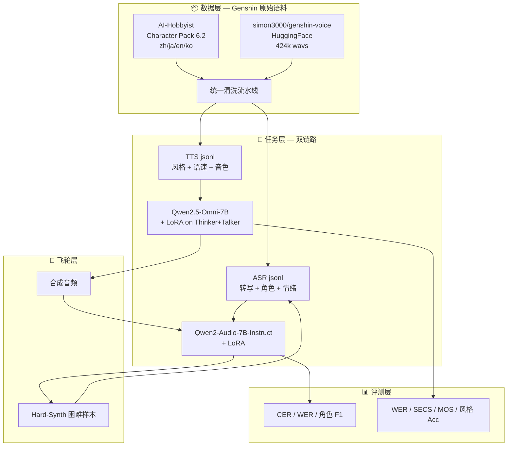

## 前置知识

> [!important]
> 
> 阅读本页前建议先读：[[私人与共享/ms-swift 后训练全栈总纲/17 ASR TTS 语音多模态/17.1 技术边界与 ms-swift 定位|17.1 技术边界与 ms-swift 定位]]、[[私人与共享/ms-swift 后训练全栈总纲/17 ASR TTS 语音多模态/17.4 推荐模型清单|17.4 推荐模型清单]]、[[私人与共享/ms-swift 后训练全栈总纲/17 ASR TTS 语音多模态/17.5 语音数据格式|17.5 语音数据格式]]。

---

## 0. 定位

> 一句话：以 **原神（Genshin Impact）角色语音多语种数据集** 为主轴，串联两条端到端 **ms-swift** 项目链路（**自动语音识别 ASR (Automatic Speech Recognition)** + **文本转语音 TTS (Text-to-Speech)**），给出从原始 wav 到生产部署的全栈蓝图。

本页为 L1 总纲，**不含代码与公式**，只负责：

1. 把 Genshin 数据集和两条项目链路放在一张全景图里

2. 给出「我该选 ASR 路线还是 TTS 路线」的决策树

3. 提供 5 个 L2 模块的导航与阅读顺序

4. 列出端到端的质量红线（Quality Gates）

---

## 1. 全景鸟瞰

---

## 2. 路线决策树

> [!important]
> 
> **决策原则**：先看「输入是什么、输出是什么」，再看「是否需要可控生成」，最后看「数据量 / 算力预算」。

![[Genshin 端到端 ASR + TTS 实战总纲 - 2. 路线决策树 - 图 02.excalidraw]]

---

## 3. 模块导航

|编号|模块|职责|关键产出|
|---|---|---|---|
|**L2-1**|Genshin 数据集解析与统一预处理|从 GitHub/HF 拉数据 → 清洗 → 输出 jsonl|cs_asr_train.jsonl、host_tts_train.jsonl|
|**L2-2**|项目 A — 角色台词 ASR|Qwen2-Audio + LoRA SFT，转写+角色+情绪三合一|out/genshin-asr/checkpoint-final|
|**L2-3**|项目 B — 角色音色 TTS|Qwen2.5-Omni + LoRA SFT，可控风格化合成|out/genshin-tts/checkpoint-final|
|**L2-4**|端到端联动飞轮|ASR 反推校验 / Hard-Synth 数据增强 / 灰度|data/v2_augmented.jsonl|
|**L2-5**|复现 Checklist 与避坑|环境、数据、训练、评测、部署五阶段红线|scripts/[preflight.sh](http://preflight.sh)|

---

## 4. 质量红线（Quality Gates）

> [!important]
> 
> 任何 checkpoint 上线前，**必须**通过下表所有红线，缺一不可。

|阶段|红线项|阈值|归属页面|
|---|---|---|---|
|**数据**|train/val/test 角色不重叠|0% 重叠|L3-5.2|
|**ASR 评测**|Genshin test CER|< 8%（zh/ja 各自）|L3-2.5|
|**TTS 训练**|显存 OOM 检查|4×A100 80G 跑通 BS=1×16|L4-3.4.2|
|**TTS 评测**|SECS 音色相似度|> 0.75|L4-3.5.2|
|**部署**|RTF 实时率|< 0.3|L4-3.5.5|

---

## 5. 阅读顺序

> [!important]
> 
> **首次阅读**：L2-1 → L2-2 → L2-3 → L2-4 → L2-5（按依赖顺序）。
> 
> **精读训练细节**：直接跳到 L3-2.4 / L3-3.4 看完整命令，再回溯 L4 的原理。
> 
> **只关心评测**：L3-2.5 + L3-3.5 + 各自 L4 子页。

---

## 常见误区

> [!important]
> 
> **误区 1**：「Qwen2-Audio 的 CER 一定比 FunASR/Paraformer 低」—— 错。在纯转写无指令场景下，Paraformer-zh 的中文 CER 通常更低，Qwen2-Audio 的优势在**指令式 ASR**（一次输出转写+槽位+角色）。

> [!important]
> 
> **误区 2**：「TTS 用 Qwen2.5-Omni 端到端就够了，不需要 CosyVoice」—— 错。Omni 的 Talker 在长文本、生僻字、跨语种 code-switch 上仍弱于 CosyVoice 2 的 flow-matching 声学模型。生产折中方案见 [[私人与共享/ms-swift 后训练全栈总纲/17 ASR TTS 语音多模态/17.3 经典工程方案与场景组合|17.3 经典工程方案与场景组合]]。

> [!important]
> 
> **误区 3**：「Genshin 数据可以商用」—— 错。Genshin 角色语音版权属于 miHoYo，仅用于**个人学习与研究**，禁止商用与公开发布合成音频做角色冒充。

---

## 延伸阅读

> [!important]
> 
> - [[私人与共享/ms-swift 后训练全栈总纲/17 ASR TTS 语音多模态/17.2 语音任务分层与两类架构|17.2 语音任务分层与两类架构]]
> 
> - [[私人与共享/ms-swift 后训练全栈总纲/17 ASR TTS 语音多模态/17.8 训练策略矩阵|17.8 训练策略矩阵]]
> 
> - [[私人与共享/ms-swift 后训练全栈总纲/17 ASR TTS 语音多模态/17.9 语音评测指标|17.9 语音评测指标]]
> 
> - [[私人与共享/ms-swift 后训练全栈总纲/17 ASR TTS 语音多模态/17.10 生产流程与避坑|17.10 生产流程与避坑]]

---

## 参考文献

1. AI-Hobbyist Genshin_Datasets：[https://github.com/AI-Hobbyist/Genshin_Datasets](https://github.com/AI-Hobbyist/Genshin_Datasets)

2. simon3000/genshin-voice (HuggingFace)：[https://huggingface.co/datasets/simon3000/genshin-voice](https://huggingface.co/datasets/simon3000/genshin-voice)

3. Qwen2.5-Omni Technical Report：[https://arxiv.org/abs/2503.20215](https://arxiv.org/abs/2503.20215)

4. ms-swift Multimodal Audio 示例：[https://github.com/modelscope/ms-swift/blob/main/examples/train/multimodal/audio.sh](https://github.com/modelscope/ms-swift/blob/main/examples/train/multimodal/audio.sh)

5. Hard-Synth: Synthesizing Diverse Hard Samples for ASR：[https://arxiv.org/html/2411.13159v1](https://arxiv.org/html/2411.13159v1)
