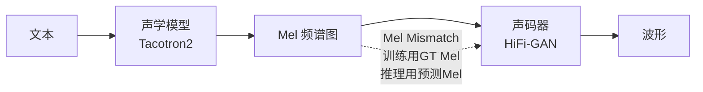
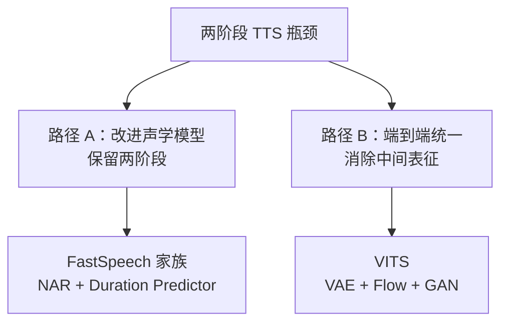

## 定位

> 两阶段管线（Tacotron2+HiFi-GAN）的瓶颈、端到端统一的动机、非自回归并行化的驱动力

---

## 1. 两阶段 TTS 的核心瓶颈

### 1.1 Mel Mismatch 问题

声码器用 ground truth Mel 训练，但推理时接收声学模型预测的 Mel（含误差）。这个**分布偏移**导致合成质量下降。

### 1.2 自回归瓶颈

Tacotron2 逐帧生成 Mel，无法并行，推理速度慢。

### 1.3 对齐不稳定

Attention-based 对齐在长句、罕见词上容易出错（跳帧、重复）。

---

## 2. 两条解决路径

> [!important]
> 
> **思辨：两条路径的哲学差异。** FastSpeech 选择「模块化改进」——用非自回归替代自回归、用显式 Duration 替代隐式 Attention，但保留了 Mel 中间表征和独立声码器。VITS 选择「端到端革命」——彻底消除 Mel 中间层，用 VAE 潜变量直接驱动声码器。**模块化的优势是可调试、可控制；端到端的优势是全局最优、无 mismatch**。

---

## 子页面

> [!important]
> 
> - -> 1.1 两阶段 TTS 管线回顾（Tacotron2 + 声码器）
> 
> - -> 1.2 端到端 TTS 的统一目标

[[1.1 两阶段 TTS 管线回顾]]

[[1.2 端到端 TTS 的统一目标]]