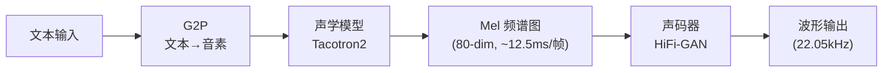
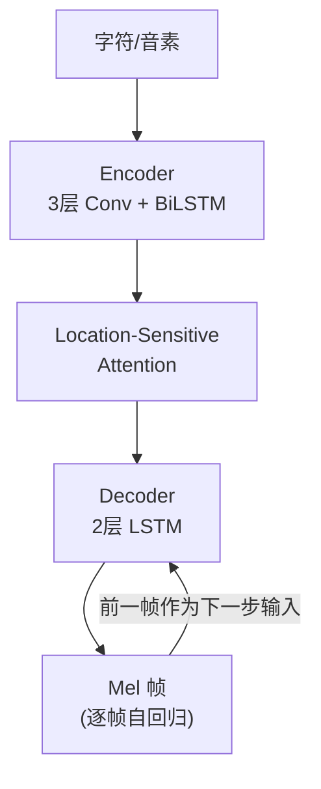

## 定位

> Tacotron2 + HiFi-GAN 的标准管线、各模块职责、固有局限

---

## 1. 两阶段 TTS 标准管线

---

## 2. Tacotron2 核心架构

**自回归的本质**：每生成一帧 Mel，都要等前一帧完成。一段 5 秒语音 ≈ 400 帧，意味着 400 步串行推理。

> [!important]
> 
> **思辨：Tacotron2 的 Attention 为什么不可靠？** Location-Sensitive Attention 是「软对齐」——每一步对所有音素都有权重。这意味着模型**可能跳过**某些音素（导致漏字）或**反复关注**同一音素（导致重复）。尤其在长句、罕见词、数字序列上问题严重。FastSpeech 和 VITS 分别用 Duration Predictor 和 MAS 解决了这个问题，本质上都是用**硬对齐**替代**软对齐**。