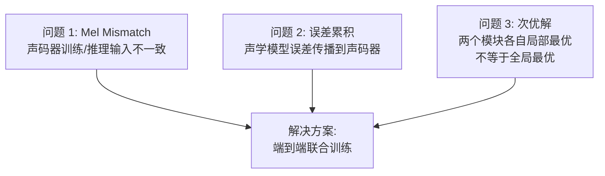

## 定位

> 端到端的动机、Mel mismatch 的数学分析、统一训练的优势

---

## 1. 为什么要端到端

两阶段系统的三个核心问题：

---

## 2. Mel Mismatch 的数学本质

声码器的训练目标：

$$\theta^* = \arg\min_\theta \mathbb{E}_{x \sim p_{\text{data}}} \left[ \mathcal{L}(G_\theta(\text{Mel}_{\text{GT}}(x)), x) \right]$$

但推理时的输入变了：

$$\hat{x} = G_\theta(\text{Mel}_{\text{pred}}(\text{text}))$$

$\text{Mel}_{\text{pred}} \neq \text{Mel}_{\text{GT}}$，这就是 mismatch。

> [!important]
> 
> **思辨：Fine-tuning 能解决 Mel mismatch 吗？** 有人尝试用声学模型的预测 Mel 来 fine-tune 声码器。这确实能缓解问题，但引入了新问题：(1) Fine-tune 需要额外步骤和超参调节；(2) 声学模型更新后声码器也要重新 fine-tune；(3) 不能根本消除问题。**VITS 的端到端方案彻底消除了 mismatch**——因为根本没有 Mel 中间表征。