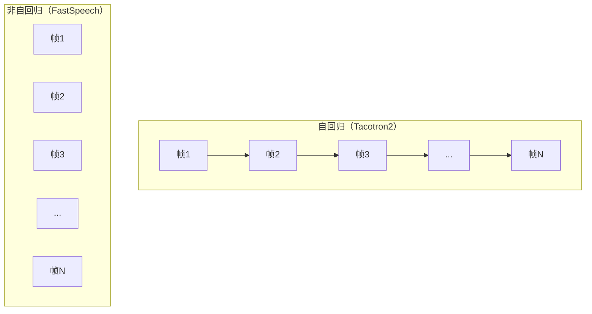

## 定位

> 从 FastSpeech -> FastSpeech2 -> FastSpeech2s 的演进、Duration Predictor 核心思想、Variance Adaptor

---

## 1. FastSpeech 家族演进

---

## 2. 核心创新：非自回归并行生成

**关键洞察**：语音合成的主要信息瓶颈在于**时长对齐**（哪个音素说多长）。一旦时长确定，频谱的生成可以完全并行化。

---

## 3. 三代架构对比

|**特性**|**FastSpeech v1**|**FastSpeech 2**|**FastSpeech 2s**|
|---|---|---|---|
|**训练依赖**|需要 AR Teacher 蒸馏|**直接用 GT**|直接用 GT|
|**Variance 建模**|仅 Duration|**Duration + Pitch + Energy**|Duration + Pitch + Energy|
|**输出**|Mel 频谱图|Mel 频谱图|**波形（端到端）**|
|**MOS**|3.84|**4.05**|3.56|

> [!important]
> 
> **思辨：FastSpeech2s 为什么没有成为主流？** FastSpeech2s 尝试端到端（文本直接到波形），但 MOS 仅 3.56，远低于 FastSpeech2 + HiFi-GAN 的组合。原因在于：**直接用 MSE 损失在波形域训练效果很差**——波形的相位信息极难用简单回归损失捕获。VITS 通过引入 GAN 对抗训练 + VAE 潜变量空间解决了这个问题。这说明**端到端不只是把两个模块拼在一起，还需要正确的训练范式**。

---

## 子页面

> [!important]
> 
> - -> 2.1 FastSpeech（v1）架构与原理
> 
> - -> 2.2 FastSpeech2 架构与原理
> 
> - -> 2.3 FastSpeech2s：端到端变体

[[2.1 FastSpeech（v1）架构与原理]]

[[2.2 FastSpeech2 架构与原理]]

[[2.3 FastSpeech2s：端到端变体]]