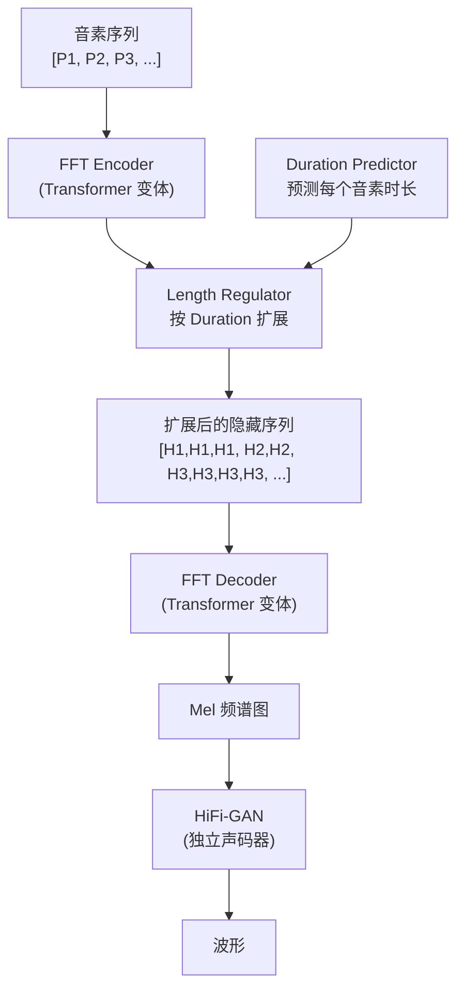
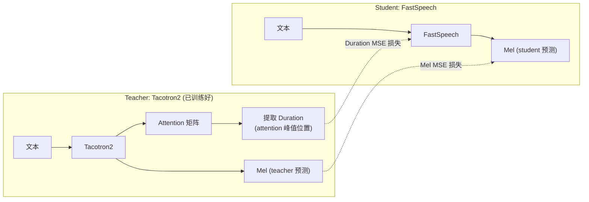

## 前置知识

> [!important]
> 
> 本页是 FastSpeech 家族的第一代。需要了解 Tacotron2 基本概念、Transformer 基础。

---

## 1. 核心思想

**FastSpeech v1** [Ren et al., NeurIPS 2019] 的核心洞察：**语音合成的串行瓶颈在于时长预测，而非频谱生成**。一旦知道每个音素说多长，Mel 帧的生成可以完全并行化。



---

## 2. FFT Block（Feed-Forward Transformer）

FastSpeech 使用改进的 Transformer 块，用 **1D Conv** 替代标准 FFN 中的全连接层：

```python
import torch
import torch.nn as nn

class FFTBlock(nn.Module):
    """Feed-Forward Transformer Block
    与标准 Transformer 的区别：FFN 用 1D Conv 替代全连接
    """
    def __init__(self, d_model=256, n_heads=2, d_ff=1024, kernel_size=9):
        super().__init__()
        # 多头自注意力
        self.self_attn = nn.MultiheadAttention(d_model, n_heads, batch_first=True)
        self.norm1 = nn.LayerNorm(d_model)
        
        # 1D Conv FFN（替代标准全连接 FFN）
        # 1D Conv 能捕获局部上下文，更适合序列建模
        self.conv_ffn = nn.Sequential(
            nn.Conv1d(d_model, d_ff, kernel_size, padding=kernel_size//2),
            nn.ReLU(),
            nn.Conv1d(d_ff, d_model, 1),  # 1x1 conv = pointwise
        )
        self.norm2 = nn.LayerNorm(d_model)
        self.dropout = nn.Dropout(0.2)
    
    def forward(self, x, mask=None):
        # x: [B, T, D]
        # 1. 自注意力 + 残差
        attn_out, _ = self.self_attn(x, x, x, key_padding_mask=mask)
        x = self.norm1(x + self.dropout(attn_out))
        
        # 2. Conv FFN + 残差
        # 注意：Conv1d 需要 [B, D, T] 格式
        ffn_out = self.conv_ffn(x.transpose(1, 2)).transpose(1, 2)
        x = self.norm2(x + self.dropout(ffn_out))
        return x
```

> [!important]
> 
> **思辨：为什么用 1D Conv 替代全连接 FFN？** 标准 Transformer 的 FFN 是逐位置独立处理的（每个位置单独过 Linear），完全依赖自注意力捕获上下文。但语音的**局部连续性**很强（相邻音素的声学特征平滑变化），1D Conv 的滑动窗口天然捕获这种局部模式。这是语音领域对 Transformer 的 domain-specific 改进。

---

## 3. Duration Predictor + Length Regulator

### 3.1 Duration Predictor

小型网络，预测每个音素对应的 Mel 帧数：

```python
class DurationPredictor(nn.Module):
    """预测每个音素的时长（帧数）"""
    def __init__(self, d_model=256, d_filter=256, kernel_size=3, n_layers=2):
        super().__init__()
        layers = []
        for i in range(n_layers):
            layers.extend([
                nn.Conv1d(d_model if i == 0 else d_filter, d_filter,
                         kernel_size, padding=kernel_size//2),
                nn.ReLU(),
                nn.LayerNorm(d_filter),
                nn.Dropout(0.1),
            ])
        self.conv_layers = nn.Sequential(*layers)
        self.linear = nn.Linear(d_filter, 1)  # 输出 1 维：时长
    
    def forward(self, x):
        # x: [B, T_text, D]
        out = self.conv_layers(x.transpose(1, 2)).transpose(1, 2)
        dur = self.linear(out).squeeze(-1)  # [B, T_text]
        return dur  # 对数域时长（训练时用 MSE 损失）
```

### 3.2 Length Regulator

按预测时长将音素级特征扩展为帧级特征：

```python
def length_regulate(hidden, durations):
    """将音素级隐藏序列按 duration 扩展为帧级序列
    
    Args:
        hidden: [B, T_text, D] 音素级特征
        durations: [B, T_text] 每个音素的帧数（整数）
    Returns:
        expanded: [B, T_mel, D] 帧级特征
    """
    outputs = []
    for h, d in zip(hidden, durations):
        # 对每个音素，重复 d[i] 次
        expanded = torch.repeat_interleave(h, d.long(), dim=0)
        outputs.append(expanded)
    # 补齐到相同长度
    return torch.nn.utils.rnn.pad_sequence(outputs, batch_first=True)

# 示例：
# hidden = [[h1, h2, h3]]  durations = [[3, 2, 4]]
# → expanded = [[h1,h1,h1, h2,h2, h3,h3,h3,h3]]
```

---

## 4. 训练：Knowledge Distillation

FastSpeech v1 的**最大局限**：需要一个预训练的 AR Teacher（Tacotron2）来提供 Duration 标注和 Mel 目标：



> [!important]
> 
> **思辨：蒸馏依赖是 FastSpeech v1 的最大弱点。** Teacher 的 Attention 质量直接决定了 Duration 标注质量。如果 Teacher 在某些句子上对齐不准（跳帧/重复），Student 也会学到错误的时长。FastSpeech2 通过直接使用 **MFA（Montreal Forced Aligner）提取的 GT Duration** 解决了这个问题——这是一个看似微小但影响深远的改进。

---

## 参考文献

- [1] Ren, Y. et al. (2019). "FastSpeech: Fast, Robust and Controllable Text to Speech." NeurIPS 2019.