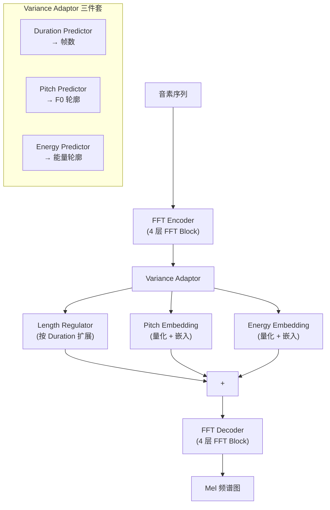

## 前置知识

> [!important]
> 
> 建议先读 2.1 FastSpeech（v1）。本页重点在 FastSpeech2 的改进：去蒸馏 + Variance Adaptor。

---

## 1. 两大核心改进

FastSpeech2 [Ren et al., ICLR 2021] 在 v1 基础上做了两个关键改进：

1. **去除蒸馏依赖**：用外部对齐工具（MFA）提取 GT Duration，直接训练

1. **Variance Adaptor**：引入 Pitch 和 Energy 预测器，显式建模声学变量



---

## 2. Variance Adaptor 详解

### 2.1 三个预测器的统一结构

三个预测器（Duration / Pitch / Energy）共享相同的网络结构，仅预测目标不同：

```python
import torch
import torch.nn as nn

class VariancePredictor(nn.Module):
    """Duration / Pitch / Energy 共用的预测器结构
    2层 Conv1D + LayerNorm + Dropout + Linear
    """
    def __init__(self, d_model=256, d_filter=256, kernel_size=3):
        super().__init__()
        self.conv1 = nn.Sequential(
            nn.Conv1d(d_model, d_filter, kernel_size, padding=kernel_size//2),
            nn.ReLU(),
            nn.LayerNorm(d_filter),
            nn.Dropout(0.5),
        )
        self.conv2 = nn.Sequential(
            nn.Conv1d(d_filter, d_filter, kernel_size, padding=kernel_size//2),
            nn.ReLU(),
            nn.LayerNorm(d_filter),
            nn.Dropout(0.5),
        )
        self.linear = nn.Linear(d_filter, 1)
    
    def forward(self, x, mask=None):
        # x: [B, T, D]
        out = self.conv1(x.transpose(1, 2))  # [B, D, T]
        out = self.conv2(out).transpose(1, 2)  # [B, T, D]
        pred = self.linear(out).squeeze(-1)    # [B, T]
        if mask is not None:
            pred = pred.masked_fill(mask, 0.0)
        return pred
```

### 2.2 Pitch 与 Energy 的量化嵌入

```python
class VarianceAdaptor(nn.Module):
    """FastSpeech2 Variance Adaptor: Duration + Pitch + Energy"""
    def __init__(self, d_model=256, n_bins=256):
        super().__init__()
        self.duration_predictor = VariancePredictor(d_model)
        self.pitch_predictor = VariancePredictor(d_model)
        self.energy_predictor = VariancePredictor(d_model)
        
        # Pitch/Energy 量化：连续值 → 离散 bin → 嵌入向量
        # 训练前统计数据集的 pitch/energy 范围，等距分 n_bins 个区间
        self.pitch_bins = nn.Parameter(torch.linspace(50, 600, n_bins), requires_grad=False)
        self.pitch_embedding = nn.Embedding(n_bins, d_model)
        self.energy_bins = nn.Parameter(torch.linspace(0, 100, n_bins), requires_grad=False)
        self.energy_embedding = nn.Embedding(n_bins, d_model)
    
    def forward(self, x, gt_duration=None, gt_pitch=None, gt_energy=None):
        # Duration
        dur_pred = self.duration_predictor(x)
        if gt_duration is not None:
            x = length_regulate(x, gt_duration)  # 训练用 GT
        else:
            x = length_regulate(x, torch.round(torch.exp(dur_pred)).long())  # 推理用预测
        
        # Pitch: 连续 F0 → 量化 bin → embedding
        pitch_pred = self.pitch_predictor(x)
        pitch_target = gt_pitch if gt_pitch is not None else pitch_pred
        pitch_bin = torch.bucketize(pitch_target, self.pitch_bins)
        x = x + self.pitch_embedding(pitch_bin)
        
        # Energy: 同理
        energy_pred = self.energy_predictor(x)
        energy_target = gt_energy if gt_energy is not None else energy_pred
        energy_bin = torch.bucketize(energy_target, self.energy_bins)
        x = x + self.energy_embedding(energy_bin)
        
        return x, dur_pred, pitch_pred, energy_pred
```

---

## 3. 训练目标

$$\mathcal{L} = \underbrace{\|\text{Mel}_{\text{pred}} - \text{Mel}_{\text{GT}}\|_1}_{\text{Mel 重建}} + \underbrace{\|d_{\text{pred}} - \log d_{\text{GT}}\|_2^2}_{\text{Duration MSE}} + \underbrace{\|p_{\text{pred}} - p_{\text{GT}}\|_2^2}_{\text{Pitch MSE}} + \underbrace{\|e_{\text{pred}} - e_{\text{GT}}\|_2^2}_{\text{Energy MSE}}$$

> [!important]
> 
> **思辨：显式 Variance 建模的代价与收益。**
> 
> **收益**：Pitch/Energy/Duration 独立可控，推理时可以手动调节音高、语速、音量，这在有声书朗读、情感语音等场景极有价值。
> 
> **代价**：(1) 需要外部工具提取 GT Duration（MFA）和 GT Pitch（如 pyworld）；(2) 量化嵌入引入了离散化误差；(3) 三个预测器各自独立预测，忽略了 Pitch-Duration-Energy 之间的**协同关系**（真实语音中这三者是耦合的——说话快时音高往往会升高）。
> 
> **VITS 的解决方案**：不显式建模 Variance，而是让 VAE 的潜变量 z **隐式编码**所有声学变量。这更「优雅」，但牺牲了可控性。**这是经典的可控性-质量 trade-off**。

---

## 4. FastSpeech2 vs FastSpeech v1

|**改进点**|**FastSpeech v1**|**FastSpeech 2**|**影响**|
|---|---|---|---|
|Duration 来源|AR Teacher Attention 提取|**MFA GT Duration**|消除 Teacher 依赖|
|Mel 目标|Teacher 预测的 Mel|**GT Mel**|消除 Teacher 误差传播|
|Pitch 建模|无|**显式 Pitch Predictor**|音高可控|
|Energy 建模|无|**显式 Energy Predictor**|音量可控|
|MOS|3.84|**4.05**|+0.21|

---

## 参考文献

- [1] Ren, Y. et al. (2020). "FastSpeech 2: Fast and High-Quality End-to-End Text to Speech." ICLR 2021.

- [2] McAuliffe, M. et al. (2017). "Montreal Forced Aligner."