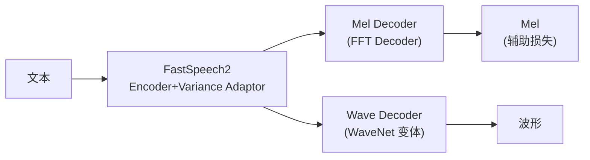

## 定位

> FastSpeech2s 的端到端尝试、WaveNet 解码器、为什么 MOS 不如两阶段

---

## 1. 核心思路

FastSpeech2s 在 FastSpeech2 基础上加入波形解码器，尝试直接文本→波形：

---

## 2. 失败分析：MOS 仅 3.56

|**系统**|**MOS**|
|---|---|
|FastSpeech2 + HiFi-GAN|**4.05**|
|FastSpeech2s|3.56|
|VITS|**4.43**|

> [!important]
> 
> **思辨：FastSpeech2s 和 VITS 都是端到端，为什么差距巨大？**
> 
> FastSpeech2s 用 **MSE 损失直接在波形域训练**，但波形的相位信息极难用简单回归损失捕获。MSE 会导致模型输出「所有可能波形的平均值」——听起来就是模糊噪声。
> 
> VITS 的解决方案：
> 
> 1. **VAE 潜变量空间**：不在波形域直接回归，而是在低维潜变量空间操作
> 
> 1. **GAN 对抗训练**：用判别器提供感知级质量信号，替代 MSE
> 
> 1. **Flow 增强**：让先验能拟合复杂语音分布
> 
> **教训：端到端不只是把两个模块拼在一起，更重要的是选择正确的训练范式。**