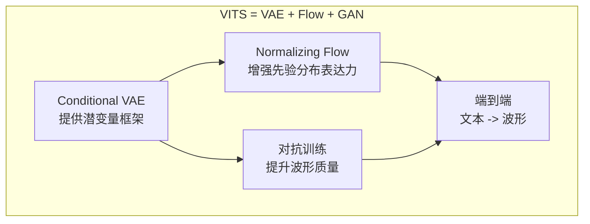
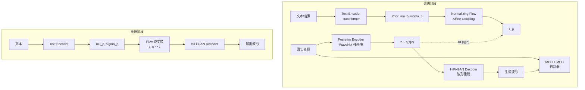

## 定位

> Conditional VAE 框架、Normalizing Flow 增强先验、HiFi-GAN Decoder 集成、Stochastic Duration Predictor

---

## 1. VITS 的核心创新

VITS [Kim et al., ICML 2021] 是首个在 MOS 上**超越两阶段系统**的端到端 TTS 模型。它的关键创新在于将三种生成模型技术融合为一个统一框架：



---

## 2. 整体架构



---

## 3. ELBO 目标函数

$$\log p_{\theta}(x|c) \geq \mathbb{E}_{q_{\phi}(z|x)}\left[\log p_{\theta}(x|z) - \log \frac{q_{\phi}(z|x)}{p_{\theta}(z|c)}\right]$$

其中：

- $p_{\theta}(x|z)$：**重建项**（HiFi-GAN Decoder 重建波形）

- $q_{\phi}(z|x)$：**后验编码器**（从真实音频编码潜变量）

- $p_{\theta}(z|c)$：**条件先验**（从文本预测潜变量分布）

- KL 散度项鼓励后验和先验分布对齐

实际训练中，重建损失被 **GAN 对抗损失**替代，显著提升了波形质量。

---

## 4. 关键组件一览

|**组件**|**作用**|**核心技术**|
|---|---|---|
|Posterior Encoder|从真实音频提取潜变量 z|Non-Causal WaveNet 残差块|
|Prior Encoder|从文本预测潜变量分布|Transformer + Linear|
|Normalizing Flow|增强先验分布表达力|Affine Coupling Layer x4|
|HiFi-GAN Decoder|从 z 生成波形|转置卷积 + MRF|
|Stochastic Duration Predictor|预测音素时长（随机）|Flow-based Duration Model|
|MAS|训练时对齐文本与音频|动态规划单调对齐|
|MPD + MSD|对抗判别|复用 HiFi-GAN 判别器|

```python
import torch
import torch.nn as nn

class VITSOverview(nn.Module):
    """VITS 整体架构概览（简化版）"""
    def __init__(self):
        super().__init__()
        self.text_encoder = TextEncoder()        # Transformer
        self.posterior_encoder = PosteriorEncoder()  # WaveNet
        self.flow = NormalizingFlow()             # Affine Coupling
        self.decoder = HiFiGANDecoder()           # 转置卷积 + MRF
        self.duration_predictor = StochasticDurationPredictor()
    
    def forward(self, text, text_lengths, audio, audio_lengths):
        # 1. 文本编码 -> 先验分布参数
        text_enc, mu_p, sigma_p = self.text_encoder(text, text_lengths)
        
        # 2. 音频编码 -> 后验分布参数
        mu_q, sigma_q = self.posterior_encoder(audio, audio_lengths)
        z = mu_q + torch.randn_like(mu_q) * sigma_q  # 重参数化采样
        
        # 3. Flow: z -> z_p (训练方向：后验 -> 先验)
        z_p = self.flow(z, reverse=False)
        
        # 4. MAS 对齐 (找最优单调路径)
        with torch.no_grad():
            attn = monotonic_alignment_search(mu_p, sigma_p, z_p)
        
        # 5. Decoder: z -> 波形
        audio_hat = self.decoder(z)
        
        # 6. Duration Predictor 损失
        dur_loss = self.duration_predictor.loss(text_enc, attn)
        
        return audio_hat, mu_p, sigma_p, mu_q, sigma_q, z_p, dur_loss
    
    @torch.no_grad()
    def infer(self, text, text_lengths, noise_scale=0.667):
        # 1. 文本编码
        text_enc, mu_p, sigma_p = self.text_encoder(text, text_lengths)
        
        # 2. Duration 预测 + Length Regulate
        durations = self.duration_predictor(text_enc)
        mu_p_expanded = regulate_length(mu_p, durations)
        sigma_p_expanded = regulate_length(sigma_p, durations)
        
        # 3. 从先验采样
        z_p = mu_p_expanded + torch.randn_like(mu_p_expanded) * sigma_p_expanded * noise_scale
        
        # 4. Flow 逆变换: z_p -> z
        z = self.flow(z_p, reverse=True)
        
        # 5. Decoder: z -> 波形
        audio = self.decoder(z)
        return audio
```

> [!important]
> 
> **思辨：为什么 VITS 需要三种生成模型？**
> 
> - **VAE 单独不够**：VAE 的重建损失（MSE/L1）会产生模糊输出，语音听起来「闷」
> 
> - **GAN 单独不够**：GAN 缺乏概率框架，无法自然地建模文本到语音的一对多映射
> 
> - **Flow 单独不够**：Flow 需要严格可逆架构，限制了网络容量
> 
> VITS 的天才在于**让三者各司其职**：VAE 提供潜变量框架和概率建模，Flow 增强先验表达力（弥合简单高斯与复杂语音分布的差距），GAN 提供感知级质量的对抗训练信号。这种**组合式设计**比任何单一生成模型都更强大。

---

## 子页面

> [!important]
> 
> - -> 3.1 VITS 整体架构总览
> 
> - -> 3.2 Conditional VAE 框架
> 
> - -> 3.3 Normalizing Flow 增强先验
> 
> - -> 3.4 HiFi-GAN Decoder 集成
> 
> - -> 3.5 Stochastic Duration Predictor（SDP）
> 
> - -> 3.6 VITS 训练目标与损失函数

[[3.2 Conditional VAE 框架]]

[[3.3 Normalizing Flow 增强先验]]

[[3.5 Stochastic Duration Predictor（SDP）]]

[[3.1 VITS 整体架构总览]]

[[3.4 HiFi-GAN Decoder 集成]]

[[3.6 VITS 训练目标与损失函数]]