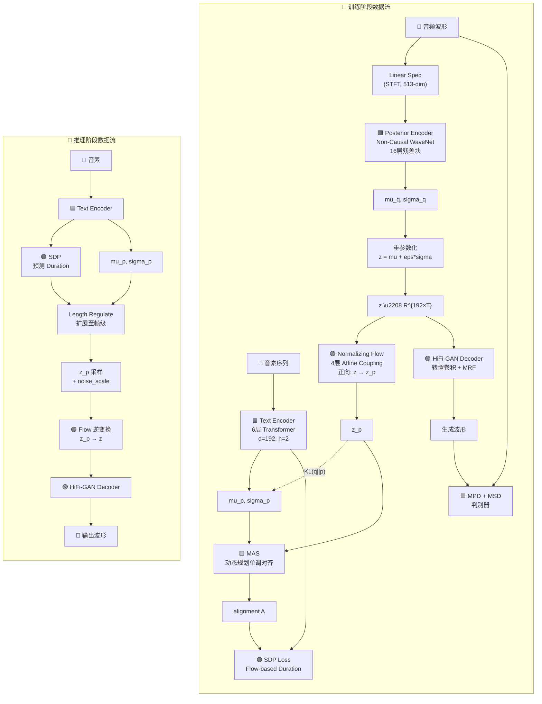

## 定位

> VITS 全组件拓扑、训练/推理数据流、参数量与计算量分析

---

## 1. 全组件架构图



---

## 2. 组件参数量分布

|**组件**|**参数量**|**训练时用**|**推理时用**|**核心技术**|
|---|---|---|---|---|
|Text Encoder|~4.5M|✅|✅|6层 Transformer, d=192|
|Posterior Encoder|~8.5M|✅|❌|16层 WaveNet 残差块|
|Normalizing Flow|~5.5M|✅ (正向)|✅ (逆向)|4层 Affine Coupling|
|HiFi-GAN Decoder|~13.5M|✅|✅|转置卷积 + MRF|
|SDP|~1.8M|✅|✅|Flow-based Duration|
|**MPD + MSD**|**~5M**|✅|❌|复用 HiFi-GAN 判别器|
|**总计**|**~38.8M**|**全部**|**~25M**||

> [!important]
> 
> **思辨：训练时和推理时的模型不同。** 训练时有 ~38.8M 参数，但推理时只用 ~25M（不需要 Posterior Encoder 和判别器）。这意味着 VITS 的**推理模型十分轻量**，只比单独的 HiFi-GAN 大一倍多。这是 VAE 框架的优势：后验编码器是「教师」，推理时不需要。

---

## 3. 损失函数组合

$$\mathcal{L}_{\text{total}} = \underbrace{\mathcal{L}_{\text{recon}}}_{\text{Mel L1}} + \underbrace{\mathcal{L}_{\text{kl}}}_{\text{KL 散度}} + \underbrace{\mathcal{L}_{\text{dur}}}_{\text{SDP NLL}} + \underbrace{\mathcal{L}_{\text{adv}}}_{\text{GAN 对抗}} + \underbrace{\mathcal{L}_{\text{fm}}}_{\text{Feature Matching}}$$

```python
def compute_vits_loss(model, batch):
    """计算 VITS 全部损失项"""
    text, text_len, audio, audio_len = batch
    
    # 前向传播
    outputs = model(text, text_len, audio, audio_len)
    audio_hat = outputs['audio_hat']     # 生成波形
    z_p = outputs['z_p']                 # Flow 变换后的潜变量
    mu_p = outputs['mu_p']               # 先验均值
    sigma_p = outputs['sigma_p']         # 先验标准差
    mu_q = outputs['mu_q']               # 后验均值
    sigma_q = outputs['sigma_q']         # 后验标准差
    
    # 1. KL 散度（先验 vs 后验）
    kl_loss = kl_divergence(mu_q, sigma_q, mu_p, sigma_p, z_p)
    
    # 2. Mel 重建损失（L1）
    mel_hat = mel_spectrogram(audio_hat)
    mel_gt = mel_spectrogram(audio)
    recon_loss = F.l1_loss(mel_hat, mel_gt)
    
    # 3. GAN 对抗损失
    disc_real = model.discriminator(audio)
    disc_fake = model.discriminator(audio_hat.detach())
    adv_loss_d = discriminator_loss(disc_real, disc_fake)  # 判别器
    adv_loss_g = generator_loss(model.discriminator(audio_hat))  # 生成器
    
    # 4. Feature Matching 损失
    fm_loss = feature_matching_loss(
        model.discriminator, audio, audio_hat
    )
    
    # 5. Duration 损失（SDP NLL）
    dur_loss = outputs['dur_loss']
    
    # 总损失
    loss_g = recon_loss * 45 + kl_loss + dur_loss + adv_loss_g + fm_loss * 2
    loss_d = adv_loss_d
    
    return loss_g, loss_d
```

---

## 子页面导航

> [!important]
> 
> - → 3.2 Conditional VAE 框架
> 
> - → 3.3 Normalizing Flow 增强先验
> 
> - → 3.4 HiFi-GAN Decoder 集成
> 
> - → 3.5 Stochastic Duration Predictor（SDP）
> 
> - → 3.6 VITS 训练目标与损失函数