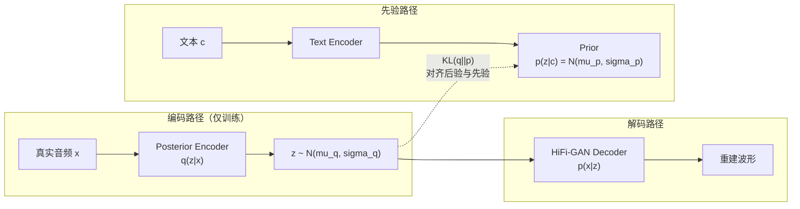

## 前置知识

> [!important]
> 
> 本页详解 VITS 的 VAE 核心框架。需要了解 VAE 基本概念、重参数化技巧。

---

## 1. VITS 中的 Conditional VAE

VITS 的核心是一个**条件 VAE**：给定文本条件 $c$，从潜变量 $z$ 生成波形 $x$。



---

## 2. ELBO 目标函数推导

$$\log p_\theta(x|c) \geq \underbrace{\mathbb{E}_{q_\phi(z|x)}[\log p_\theta(x|z)]}_{\text{重建项}} - \underbrace{D_{KL}(q_\phi(z|x) \| p_\theta(z|c))}_{\text{KL 散度项}}$$

- **重建项**：从 z 重建波形 x 的质量。在 VITS 中被 **GAN 对抗损失替代**

- **KL 散度项**：鼓励后验 $q(z|x)$ 接近先验 $p(z|c)$

由于 Normalizing Flow 增强了先验，KL 变为：

$$D_{KL} = \log q_\phi(z|x) - \log p_\theta(f^{-1}(z)|c) - \log\left|\det\frac{\partial f^{-1}}{\partial z}\right|$$

---

## 3. Posterior Encoder（后验编码器）

输入**线性频谱图**（非 Mel），使用 Non-Causal WaveNet 残差块：

```python
import torch
import torch.nn as nn

class PosteriorEncoder(nn.Module):
    """VITS 后验编码器：从音频提取潜变量分布参数
    使用 Non-Causal WaveNet 残差块
    """
    def __init__(self, in_channels=513, hidden=192, out_channels=192, n_layers=16):
        super().__init__()
        self.pre = nn.Conv1d(in_channels, hidden, 1)  # 线性频谱 → hidden
        
        # WaveNet 残差块（非因果 = 双向）
        self.wavenet = WaveNetResBlocks(
            hidden, n_layers=n_layers, 
            dilation_rate=1, kernel_size=5,
            causal=False  # 关键：非因果，双向可见
        )
        self.proj = nn.Conv1d(hidden, out_channels * 2, 1)  # 输出 mu + sigma
    
    def forward(self, x, x_lengths):
        # x: [B, 513, T] 线性频谱图
        x = self.pre(x)
        x = self.wavenet(x, x_lengths)
        stats = self.proj(x)  # [B, 2*D, T]
        mu, log_sigma = stats.split(stats.size(1) // 2, dim=1)
        # 重参数化采样
        z = mu + torch.randn_like(mu) * torch.exp(log_sigma)
        return z, mu, log_sigma
```

> [!important]
> 
> **思辨：为什么输入线性频谱而非 Mel？** Mel 频谱是有损压缩（513 bin → 80 band + 相位丢失），而 VITS 希望后验编码器尽可能多地保留原始音频信息，以便 Decoder 能高质量重建。线性频谱保留了完整的幅度信息。**但注意：推理时不需要后验编码器**——推理只走先验路径（文本 → Flow → z → Decoder）。后验编码器仅在训练时使用，提供「答案」让先验去逼近。

---

## 4. Prior Encoder（先验编码器）

```python
class TextEncoder(nn.Module):
    """VITS 先验编码器：从文本预测潜变量分布参数"""
    def __init__(self, n_vocab, d_model=192, n_layers=6, n_heads=2):
        super().__init__()
        self.emb = nn.Embedding(n_vocab, d_model)
        self.encoder = nn.TransformerEncoder(
            nn.TransformerEncoderLayer(
                d_model=d_model, nhead=n_heads,
                dim_feedforward=d_model * 4, batch_first=True
            ),
            num_layers=n_layers
        )
        self.proj = nn.Conv1d(d_model, d_model * 2, 1)  # mu_p + sigma_p
    
    def forward(self, text, text_lengths):
        x = self.emb(text)  # [B, T_text, D]
        x = self.encoder(x)  # Transformer 编码
        stats = self.proj(x.transpose(1, 2))  # [B, 2*D, T_text]
        mu_p, log_sigma_p = stats.split(stats.size(1) // 2, dim=1)
        return x.transpose(1, 2), mu_p, log_sigma_p
```

---

## 5. 训练 vs 推理路径对比

|**路径**|**训练**|**推理**|
|---|---|---|
|z 的来源|后验编码器 q(z\|x)|**先验编码器 p(z\|c) + Flow 逆变换**|
|Duration|MAS 对齐（GT）|**SDP 预测**|
|后验编码器|✅ 使用|❌ 不需要|
|判别器|✅ 使用|❌ 不需要|

---

## 参考文献

- [1] Kim, J. et al. (2021). "VITS." ICML 2021.

- [2] Kingma, D. & Welling, M. (2013). "Auto-Encoding Variational Bayes." ICLR 2014.