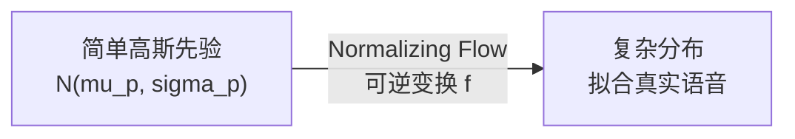
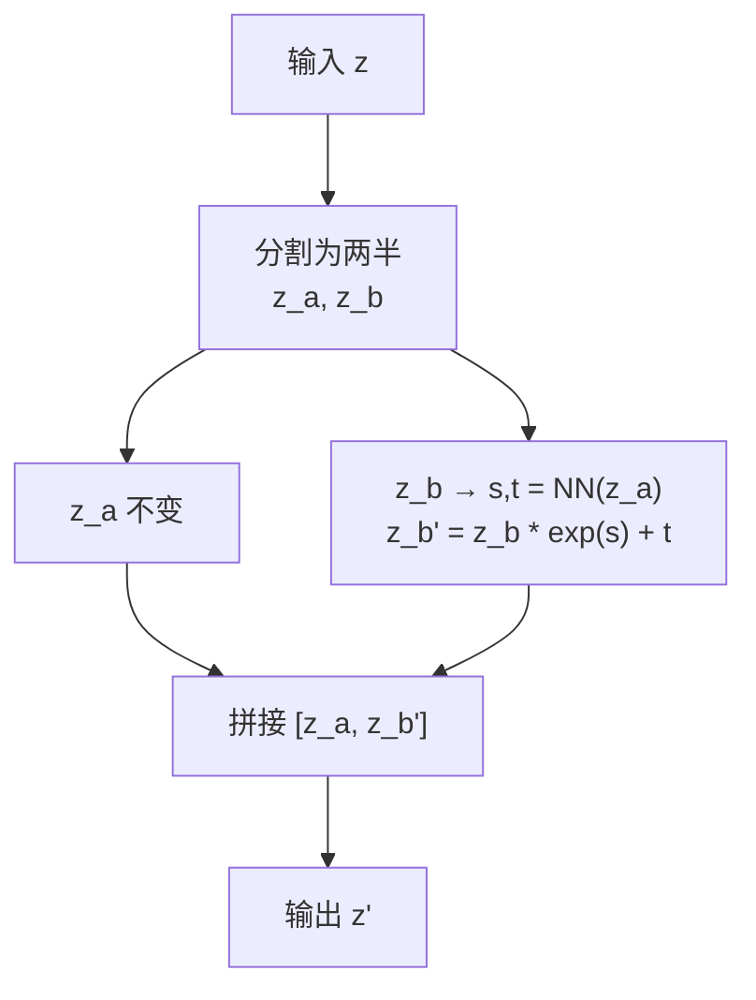

## 前置知识

> [!important]
> 
> 本页详解 VITS 中的 Normalizing Flow 模块。需要了解概率密度变换、Jacobian 行列式基础。

---

## 1. 为什么需要 Flow

文本编码器输出的先验分布 $p_\theta(z|c)$ 是**各向同性高斯**，但真实语音的分布是高度复杂的多模态分布。Flow 的作用是**增强先验表达力**，让简单高斯经过可逆变换后能拟合复杂的语音分布。



---

## 2. Affine Coupling Layer

VITS 使用 4 个 Affine Coupling Layer 组成 Flow：



$$\mathbf{z}_b' = \mathbf{z}_b \odot \exp(\mathbf{s}(\mathbf{z}_a)) + \mathbf{t}(\mathbf{z}_a)$$

$$\log |\det J| = \sum_i s_i(\mathbf{z}_a)$$

```python
import torch
import torch.nn as nn

class AffineCouplingLayer(nn.Module):
    """VITS 中的 Affine Coupling Layer
    将输入分成两半，一半不变，一半做仿射变换
    """
    def __init__(self, channels, hidden_channels=192):
        super().__init__()
        self.half_channels = channels // 2
        # 用 WaveNet 残差块作为变换网络
        self.nn = WaveNetResBlocks(
            self.half_channels, hidden_channels,
            n_layers=4, kernel_size=5
        )
        self.proj = nn.Conv1d(hidden_channels, self.half_channels * 2, 1)
    
    def forward(self, x, reverse=False):
        # x: [B, C, T]
        x_a, x_b = x.split(self.half_channels, dim=1)
        
        # 从 x_a 预测 scale 和 shift
        h = self.nn(x_a)
        stats = self.proj(h)
        log_s, t = stats.split(self.half_channels, dim=1)
        log_s = torch.clamp(log_s, -5, 5)  # 数值稳定性
        
        if not reverse:
            # 正向：训练时 z → z_p
            x_b = x_b * torch.exp(log_s) + t
            log_det = log_s.sum(dim=[1, 2])  # Jacobian 对数行列式
        else:
            # 逆向：推理时 z_p → z
            x_b = (x_b - t) * torch.exp(-log_s)
            log_det = -log_s.sum(dim=[1, 2])
        
        return torch.cat([x_a, x_b], dim=1), log_det
```

---

## 3. Flow 在 VITS 中的双向使用

|**阶段**|**方向**|**输入→输出**|**目的**|
|---|---|---|---|
|训练|**正向** $f(z) = z_p$|后验 z → 先验空间 z_p|计算 KL 散度|
|推理|**逆向** $f^{-1}(z_p) = z$|先验采样 z_p → 潜变量 z|生成波形|

> [!important]
> 
> **思辨：Flow 在 VITS 中的角色与 Glow-TTS 的异同。** 在 Glow-TTS 中，Flow 是核心生成模型（直接建模 Mel → 高斯的映射）。在 VITS 中，Flow 仅作为**辅助模块增强先验**，主要生成工作由 HiFi-GAN Decoder 完成。这意味着 VITS 的 Flow 可以更小（4 层 vs Glow-TTS 的 12 层），因为它不需要承担全部生成负担。**这是组合式设计的效率优势**——每个组件只需做「自己擅长的事」。

---

## 参考文献

- [1] Kim, J. et al. (2021). "VITS." ICML 2021.

- [2] Dinh, L. et al. (2017). "Density estimation using Real-NVP." ICLR 2017.