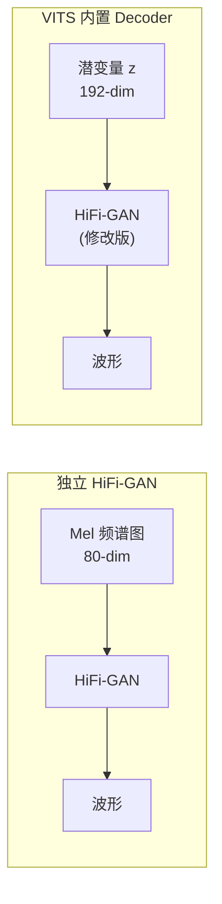

## 前置知识

> [!important]
> 
> 本页详解 VITS 如何集成 HiFi-GAN Decoder。建议先阅读 [📂2. HiFi-GAN 架构与原理](https://www.notion.so/2-HiFi-GAN-ea5c82f8d5a04f259208051e3e7bc360?pvs=21)。

---

## 1. 与独立 HiFi-GAN 的关键区别



|**维度**|**独立 HiFi-GAN**|**VITS Decoder**|
|---|---|---|
|输入|Mel 频谱图 (80-dim)|**潜变量 z (192-dim)**|
|训练信号|Mel L1 + GAN|**ELBO + GAN (联合训练)**|
|Mel mismatch|有（推理用预测 Mel）|**无（端到端）**|
|架构|转置卷积 + MRF|转置卷积 + MRF（基本相同）|

---

## 2. Decoder 实现

```python
import torch
import torch.nn as nn
import torch.nn.functional as F

class ResBlock(nn.Module):
    """多接受域融合（MRF）中的残差块
    使用多个不同 kernel 和 dilation 捕获不同尺度特征
    """
    def __init__(self, channels, kernel_size=3, dilations=(1, 3, 5)):
        super().__init__()
        self.convs1 = nn.ModuleList([
            nn.Conv1d(channels, channels, kernel_size,
                     dilation=d, padding=self.get_padding(kernel_size, d))
            for d in dilations
        ])
        self.convs2 = nn.ModuleList([
            nn.Conv1d(channels, channels, kernel_size,
                     dilation=1, padding=kernel_size//2)
            for _ in dilations
        ])
    
    @staticmethod
    def get_padding(k, d):
        return (k * d - d) // 2
    
    def forward(self, x):
        for c1, c2 in zip(self.convs1, self.convs2):
            xt = F.leaky_relu(x, 0.1)
            xt = c1(xt)
            xt = F.leaky_relu(xt, 0.1)
            xt = c2(xt)
            x = xt + x  # 残差连接
        return x


class HiFiGANDecoder(nn.Module):
    """VITS 中的 HiFi-GAN Decoder
    与独立 HiFi-GAN 基本相同，但输入从 Mel 变为潜变量 z
    """
    def __init__(self, initial_channels=192,
                 upsample_rates=(8, 8, 2, 2),
                 upsample_kernel_sizes=(16, 16, 4, 4),
                 resblock_kernel_sizes=(3, 7, 11),
                 resblock_dilation_sizes=((1,3,5), (1,3,5), (1,3,5))):
        super().__init__()
        self.num_upsamples = len(upsample_rates)
        
        # 初始卷积: z (192-dim) -> hidden
        ch = 512
        self.conv_pre = nn.Conv1d(initial_channels, ch, 7, padding=3)
        
        # 上采样层: 转置卷积逐步提升时间分辨率
        self.ups = nn.ModuleList()
        for i, (u, k) in enumerate(zip(upsample_rates, upsample_kernel_sizes)):
            self.ups.append(
                nn.ConvTranspose1d(ch // (2**i), ch // (2**(i+1)),
                                   k, stride=u, padding=(k-u)//2)
            )
        
        # MRF 残差块: 多尺度特征融合
        self.resblocks = nn.ModuleList()
        for i in range(self.num_upsamples):
            c = ch // (2**(i+1))
            for k, d in zip(resblock_kernel_sizes, resblock_dilation_sizes):
                self.resblocks.append(ResBlock(c, k, d))
        
        # 最终卷积: -> 1 channel (波形)
        self.conv_post = nn.Conv1d(ch // (2**self.num_upsamples), 1, 7, padding=3)
    
    def forward(self, z):
        # z: [B, 192, T/256]  (潜变量时间分辨率 = 音频/256)
        x = self.conv_pre(z)
        
        for i, up in enumerate(self.ups):
            x = F.leaky_relu(x, 0.1)
            x = up(x)  # 上采样: 时间分辨率 x upsample_rate
            
            # MRF: 融合多尺度特征
            xs = 0
            for j in range(len(self.resblocks) // self.num_upsamples * i,
                          len(self.resblocks) // self.num_upsamples * (i+1)):
                xs += self.resblocks[j](x)
            x = xs / len(self.resblocks) * self.num_upsamples
        
        x = F.leaky_relu(x, 0.1)
        x = self.conv_post(x)
        x = torch.tanh(x)  # 波形归一化到 [-1, 1]
        return x
```

> [!important]
> 
> **思辨：端到端集成为什么消除了 Mel mismatch？**
> 
> 在两阶段系统中，声码器用 GT Mel 训练，但推理时接收**声学模型预测的 Mel**（含误差）——这就是 Mel mismatch。
> 
> VITS 的解决方案很巧妙：**训练时 Decoder 的输入 z 来自后验编码器（从音频编码），推理时 z 来自先验编码器（从文本预测）。** KL 散度损失确保了这两个 z 的分布尽可能接近，从而消除了 mismatch。而且 z 是**连续潜变量**，比离散的 Mel 帧更容易对齐分布。