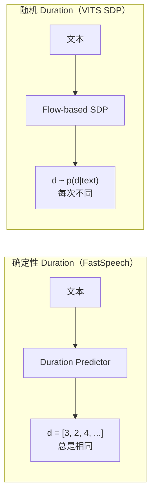
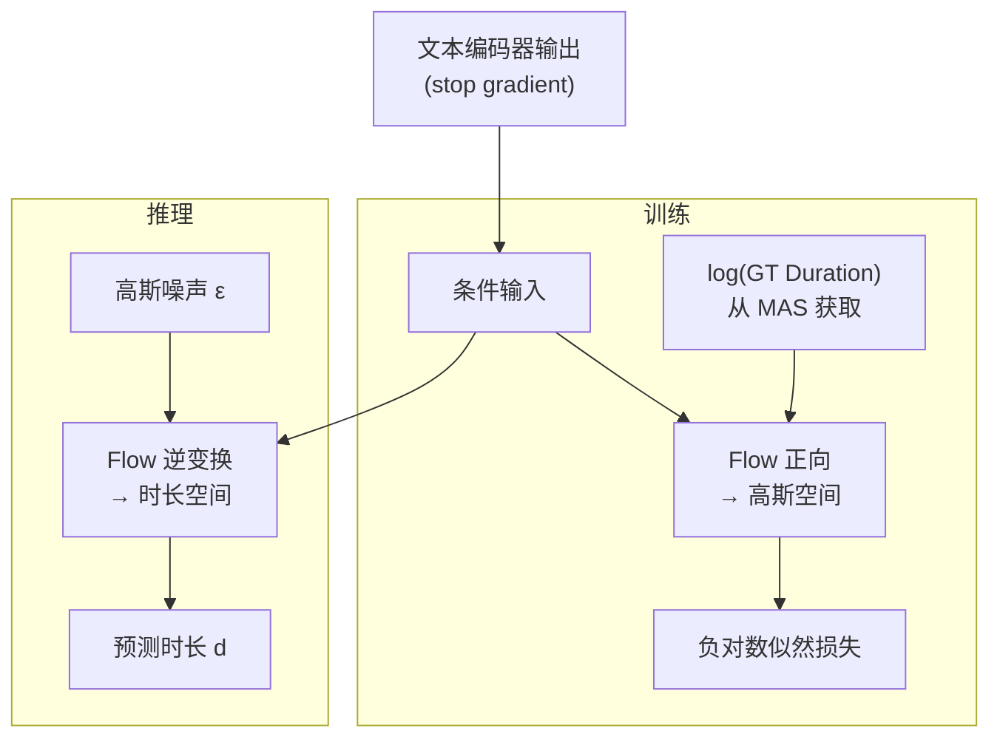

## 前置知识

> [!important]
> 
> 本页详解 VITS 的随机时长预测器。与 FastSpeech 的确定性 Duration Predictor 对比。

---

## 1. 为什么需要随机时长

FastSpeech 使用**确定性** Duration Predictor：同一文本永远产生相同时长。但人类说话是**一对多**的——同一句话可以用不同的节奏和速度说出来。

VITS 的 SDP 基于 Flow，将时长预测建模为**概率分布**：



---

## 2. SDP 架构

SDP 本身是一个小型 Flow 模型，用于对时长分布建模：



---

## 3. MAS（Monotonic Alignment Search）

SDP 的训练需要 GT Duration，VITS 通过 MAS 在训练时自动获取：

$$A^* = \arg\max_{A \in \mathcal{A}_{\text{monotonic}}} \sum_{j=1}^{T} \log \mathcal{N}(z_j; \mu_{A(j)}, \sigma_{A(j)})$$

```python
def monotonic_alignment_search(mu_p, sigma_p, z):
    """MAS: 动态规划求最优单调对齐路径
    
    找到使 z 在先验分布 N(mu_p, sigma_p) 下
    对数似然最大的单调对齐路径
    
    Args:
        mu_p: [B, D, T_text] 先验均值
        sigma_p: [B, D, T_text] 先验标准差
        z: [B, D, T_mel] 后验采样的潜变量
    Returns:
        attn: [B, T_text, T_mel] 单调对齐矩阵
    """
    # 计算对数似然矩阵
    # neg_log_p[i,j] = -log N(z_j; mu_p_i, sigma_p_i)
    neg_cent = -0.5 * ((z.unsqueeze(3) - mu_p.unsqueeze(2)) ** 2 
                       / (sigma_p.unsqueeze(2) ** 2 + 1e-6))
    log_p = neg_cent.sum(dim=1)  # [B, T_mel, T_text]
    
    # 动态规划：O(T_mel × T_text)
    B, T_mel, T_text = log_p.shape
    Q = torch.full((B, T_mel, T_text), -1e9, device=log_p.device)
    Q[:, 0, 0] = log_p[:, 0, 0]
    
    for j in range(1, T_mel):
        for i in range(T_text):
            # 要么从同一个音素延续，要么从上一个音素转移
            Q[:, j, i] = log_p[:, j, i] + torch.max(
                Q[:, j-1, i],           # 延续
                Q[:, j-1, max(0, i-1)]   # 转移
            )
    
    # 回溯找最优路径
    attn = backtrack(Q)  # [B, T_text, T_mel] 01矩阵
    return attn
```

> [!important]
> 
> **思辨：SDP vs 确定性 Duration Predictor 的本质区别。**
> 
> 确定性 Duration 将 TTS 建模为**函数映射**（text → speech 是一对一的），而 SDP 将其建模为**概率分布**（text → speech 是一对多的）。人类说话的本质就是一对多的——同一句话可以用不同的节奏说出来。
> 
> 但随机性也有代价：(1) **不可复现**——同一文本每次合成不同；(2) **不可精细控制**——无法直接指定某个音素说多长。FastSpeech2 的确定性 Duration 虽然牺牲了多样性，但换来了**可控性和可复现性**，在工程场景中往往更实用。
> 
> **VITS 通过 noise_scale 参数**部分缓解了这个问题：noise_scale=0 时退化为确定性，noise_scale=1 时完全随机。

---

## 参考文献

- [1] Kim, J. et al. (2021). "VITS." ICML 2021.

- [2] Kim, J. et al. (2020). "Glow-TTS: A Generative Flow for Text-to-Speech via Monotonic Alignment Search." NeurIPS 2020.