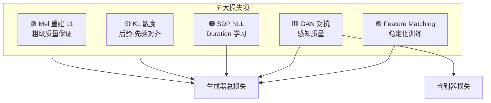

## 定位

> VITS 的 5 个损失项详解：重建、KL、对抗、Feature Matching、Duration

---

## 1. 损失全景

$$\mathcal{L}_{\text{total}} = \underbrace{\lambda_{\text{recon}} \cdot \mathcal{L}_{\text{recon}}}_{45} + \underbrace{\mathcal{L}_{\text{kl}}}_{1} + \underbrace{\mathcal{L}_{\text{dur}}}_{1} + \underbrace{\mathcal{L}_{\text{adv}}}_{1} + \underbrace{\lambda_{\text{fm}} \cdot \mathcal{L}_{\text{fm}}}_{2}$$



---

## 2. 各损失项详解

### 2.1 Mel 重建损失

$$\mathcal{L}_{\text{recon}} = \|\text{MelSpec}(\hat{x}) - \text{MelSpec}(x)\|_1$$

注意：这里是对**生成波形和真实波形分别做 STFT + Mel 滤波**后比较，不是直接在波形域比较。

### 2.2 KL 散度

$$\mathcal{L}_{\text{kl}} = D_{KL}(q_\phi(z|x) \| p_\theta(z|c)) = \sum_{i} \left[\log\frac{\sigma_{p,i}}{\sigma_{q,i}} + \frac{\sigma_{q,i}^2 + (\mu_{q,i} - \mu_{p,i})^2}{2\sigma_{p,i}^2} - \frac{1}{2}\right]$$

```python
def kl_divergence(mu_q, log_sigma_q, mu_p, log_sigma_p, z_p, log_det):
    """VITS 的 KL 散度（包含 Flow 的 log det Jacobian）
    
    注意：由于 Flow 增强了先验，KL 需要加上 log det 项
    """
    # 后验对数概率
    log_q = -0.5 * (log_sigma_q * 2 + ((z - mu_q) ** 2) / torch.exp(log_sigma_q * 2))
    
    # 先验对数概率（在 Flow 变换后的空间）
    log_p = -0.5 * (log_sigma_p * 2 + ((z_p - mu_p) ** 2) / torch.exp(log_sigma_p * 2))
    
    # KL = log q - log p - log|det J|
    kl = (log_q - log_p).sum(dim=1) - log_det
    return kl.mean()
```

### 2.3 GAN 对抗损失

$$\mathcal{L}_{\text{adv}}(D) = \mathbb{E}[(D(x)-1)^2 + D(\hat{x})^2]$$

$$\mathcal{L}_{\text{adv}}(G) = \mathbb{E}[(D(\hat{x})-1)^2]$$

### 2.4 Feature Matching

$$\mathcal{L}_{\text{fm}} = \sum_{l=1}^{L} \frac{1}{N_l} \|D^{(l)}(x) - D^{(l)}(\hat{x})\|_1$$

### 2.5 SDP Duration Loss

$$\mathcal{L}_{\text{dur}} = -\log p_{\text{SDP}}(d_{\text{MAS}} | \text{text})$$

---

## 3. 损失协同关系

> [!important]
> 
> **思辨：五个损失项如何协同工作？**
> 
> - **Mel L1** 提供粗级指导（频谱形状要对），但产生模糊输出
> 
> - **GAN 对抗** 提供细级质量（让波形听起来真实），但可能不稳定
> 
> - **Feature Matching** 稳定化 GAN 训练（中间层特征对齐）
> 
> - **KL 散度** 确保推理路径和训练路径一致（消除 mismatch）
> 
> - **SDP Loss** 学习时长分布（不直接影响音质，但影响节奏自然度）
> 
> **Mel L1 的权重为什么是 45？** 因为 GAN 损失值较小（~0.x），而 Mel L1 值较大（~1x），高权重确保在训练早期先学好频谱结构，再由 GAN 精修细节。这是一种**课程学习**思想。