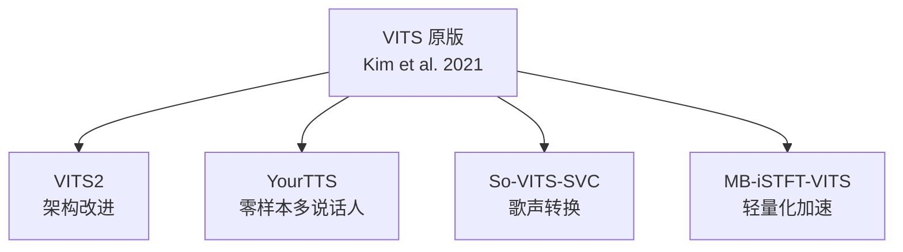

## 定位

> VITS2、YourTTS、So-VITS-SVC、MB-iSTFT-VITS 等 VITS 变体的核心改进与适用场景

---

## 1. VITS 变体全景

---

## 2. 变体对比矩阵

|**变体**|**核心改进**|**目标任务**|
|---|---|---|
|**VITS2**|Transformer Flow + Duration 改进|更高质量 TTS|
|**YourTTS**|Speaker Encoder + 多语言|零样本 TTS|
|**So-VITS-SVC**|HuBERT 替代 Text Encoder|歌声转换|
|**MB-iSTFT-VITS**|iSTFT Decoder|轻量化部署|

> [!important]
> 
> **思辨：为什么 VITS 能衍生出如此多变体？** VITS 的 VAE + Flow + GAN 框架具有极强的**可扩展性**：文本输入可替换为其他条件（HuBERT → SVC）、Speaker Embedding 可注入各组件（→ 多说话人）、Decoder 可替换为更高效架构（→ MB-iSTFT）。VITS 不仅是一个 TTS 模型，更是一个**通用语音生成框架**。

---

## 子页面

[[4.1 VITS2：架构改进与性能提升]]

[[4.2 YourTTS：多说话人多语言 TTS]]

[[4.3 So-VITS-SVC：歌声转换]]

[[4.4 MB-iSTFT-VITS：轻量化加速]]