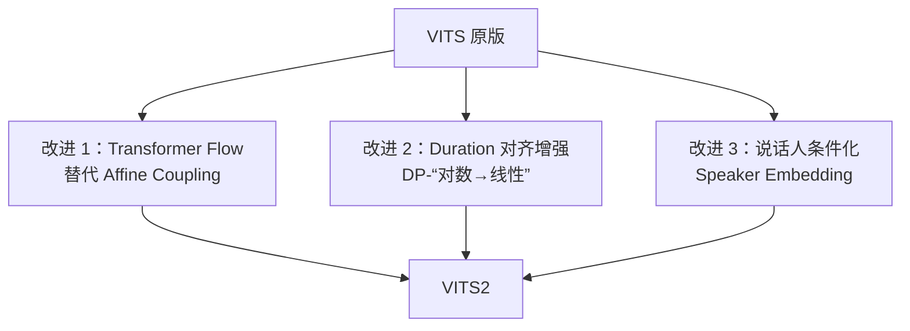

## 定位

> VITS2 的三大改进：改进先验、Duration 对齐、说话人条件

---

## 1. VITS2 vs VITS 对比

VITS2 [Kong et al., 2023] 在 VITS 基础上做了三个关键改进：

|**维度**|**VITS**|**VITS2**|
|---|---|---|
|Flow 类型|Affine Coupling|**Transformer-based Flow**|
|Duration 对齐|MAS 单次对齐|**MAS + Duration 正则化**|
|多说话人|基本支持|**增强的 Speaker Conditioning**|
|MOS (LJSpeech)|4.43|**4.49**|

> [!important]
> 
> **思辨：VITS2 的改进是渐进式的。** MOS 仅提升 0.06，说明 VITS 的原始设计已经相当优秀。VITS2 的主要价值在于**多说话人场景的改进**，而非单说话人音质。