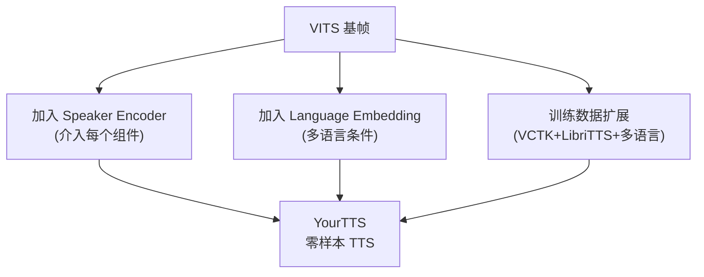

## 定位

> YourTTS 的零样本语音克隆、多语言支持、Speaker Encoder

---

## 1. YourTTS 核心创新

YourTTS [Casanova et al., 2022] 基于 VITS 架构，增加：

**零样本流程**：给定 5~10 秒参考音频 → Speaker Encoder 提取 speaker embedding → 条件化 VITS 生成目标说话人的语音。

> [!important]
> 
> **思辨：YourTTS vs VALL-E 的零样本路线。** YourTTS 用 Speaker Encoder + VITS 架构，零样本能力有限（音色相似度一般）。VALL-E 用 LLM + Codec 路线，零样本能力更强。但 YourTTS 的优势在于**轻量、快速、训练简单**。