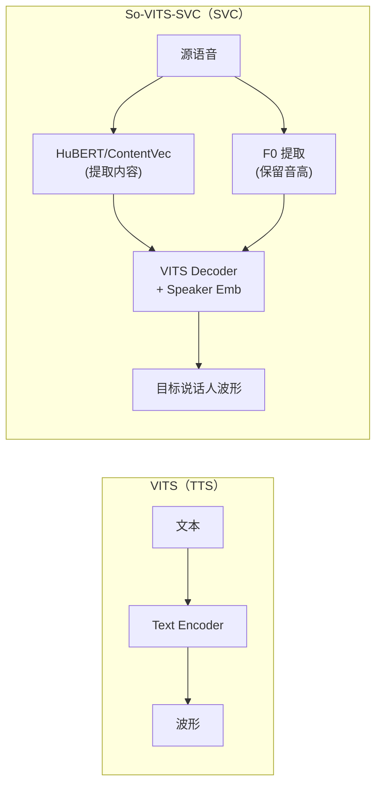

## 定位

> So-VITS-SVC 的 VITS 改造、歌声转换流程、工程实践

---

## 1. 核心思想

So-VITS-SVC 将 VITS 从 **TTS**（文本→语音）改造为 **SVC**（语音→语音）：

**关键改造：** 用 HuBERT 特征替代 Text Encoder，将「说什么」和「谁说的」解耦。

> [!important]
> 
> **思辨：为什么 VITS 架构适合 SVC？** VITS 的 VAE 潜变量空间天然分离了内容和说话人信息。只需要把内容输入从「文本」改为「HuBERT 特征」，再将 Speaker Embedding 注入 Decoder，就能实现「保留内容、转换音色」的效果。这说明 VITS 的架构设计具有很强的**可迁移性**。