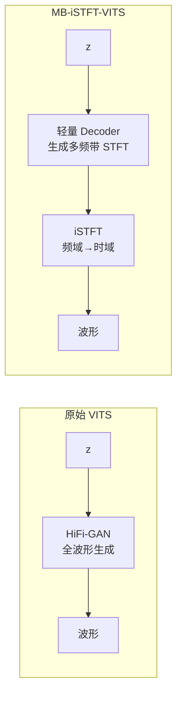

## 定位

> MB-iSTFT-VITS 的多频带 + iSTFT 加速策略、推理速度对比

---

## 1. 加速思路

标准 VITS 的 HiFi-GAN Decoder 是推理瓶颈。MB-iSTFT-VITS 的解决方案：

**核心创新**：不直接生成波形，而是生成 STFT 幅度和相位，再通过 iSTFT 还原。大幅减少上采样卷积计算量。

|**模型**|**推理速度 (RTF)**|**MOS**|
|---|---|---|
|VITS|1x|4.43|
|MB-iSTFT-VITS|**~3x faster**|4.36|

> [!important]
> 
> **思辨：MOS 下降 0.07 换 3 倍加速值不值？** 在生产部署中，0.07 MOS 几乎不可感知，但 3 倍加速意味着 GPU 成本降至 1/3。**这是工程中典型的质量-效率 trade-off**。MB-iSTFT-VITS 的思路也影响了后来的 Vocos 等频域声码器。